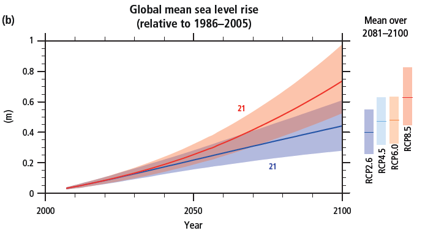

# Climate 101

## A Changing Climate

In recent decades, changes in the global climate impacted natural and human systems on all continents and across the oceans. Evidence of impacts from climate-change is strongest and most comprehensive for natural systems.

The main changes expected for North America include rising temperatures, regional increases or decreases in precipitation, rising sea levels, and changes in the frequency and severity of extreme weather events.

Increased knowledge of the risks of climate change can be a starting point for understanding the opportunities for possible solutions.

## Climate vs. Weather

Weather varies from hour to hour and from day to day. People generally think of weather as the combination of temperature, humidity, precipitation, cloudiness, visibility, and wind.

Climate is defined as the average of weather over several decades or longer. Scientists study the Earth's climate in a very similar way to weather, but with an emphasis on longer time scales. While climate can be considered at local or regional scales, scientists also study the global climate, averaging climate across the planet. Components of Earth’s climate system include the atmosphere and oceans, the land, ice, and biosphere (plant and animal life), as well as cities and other parts of the "built environment“. Scientists study climate to look for trends or cycles of variability, such as the changes in wind patterns, ocean surface temperatures and precipitation over the equatorial Pacific that result in El Niño and La Niña. Researchers also work to place cycles or other phenomena into the bigger picture of possible longer term or more permanent climate changes.

## Forecasts vs. Projections

Most weather forecasts are based on models, which incorporate observations of air pressure, temperature, humidity and winds to produce the best estimate of current and near-term future conditions in the atmosphere. Forecasts answer questions such as “What will the temperature be like this week?”, “Will it rain tomorrow?”, “How much rain will we have?”. The accuracy of weather forecasts depend on both the model and on the forecaster's skill. Seasonal forecasts, tend to use statistical relationships between large-scale climate signals such as El Niño and La Niña and precipitation and temperature to predict what the weather will be like in one to six months time.

Climate projections take a much longer-term view.  These projections try to answer questions like how much warmer will the Earth be 50 to 100 years from now? How much more precipitation will there be? How much will sea level rise? Climate projections are made using global climate models. Unlike weather forecast models, climate models are probabilistic, indicating areas with higher chances to be warmer or cooler and wetter or drier than usual. Climate models are based on global patterns in the ocean and atmosphere.

## Increasing Carbon Dioxide in the Atmosphere

One of the leading causes of climate change is increasing levels of atmospheric carbon dioxide (CO2). Carbon dioxide is a heat-trapping gas, which is released through natural processes such as respiration and volcanic eruptions, as well as through human activities such as deforestation and burning fossil fuels. Carbon dioxide causes about 20% of the Earth’s greenhouse (warming) effect; others include water vapor (50%), clouds (25%), and other small particles and gases (5%). The current concentration of carbon dioxide in the atmosphere is much higher than it has been at any other time, as far back as 400,000 years. Since 1970 carbon dioxide in the atmosphere has risen 24 percent. Carbon dioxide remains in the atmosphere for centuries so the impacts of emissions today will linger long into the future.

[More information on how increased levels of carbon dioxide are affecting ecosystems](/background/climate101/co2)

## Climate Models

Climate models, also known as general circulation models (GCMs), are very similar to weather forecast models, but with many added physical processes.

Climate models include elements such as ocean circulations, sea and glacial ice, land cover and soil moisture, and human emissions of greenhouse gases and other pollutants to better simulate long-term climate variability and change.

For climate projections over periods of decades to centuries and longer, the model is started from a statistical mean state and spontaneously develops its own weather and climate. The accuracy of equations that describe the behavior of the climate system are evaluated by putting them into models and evaluating the model results, validating them against past observations.

The predictive capability of any model will rely somewhat on the size of the grid cell. In general, the amount of detail and information increases as grid cells get smaller, thus increasing the predictive capability of the model. Over the last four decades, both increased grid resolution and more complexity has increased the skill and capabilities of climate models. However, finer grid resolution alone will not remove uncertainties in projected regional or global climate changes. Much of this uncertainty is driven by the many complicated processes that affect the climate, such as clouds or climate-biosphere interaction, which are difficult to perfectly simulate.

<figcaption>Figure 1: Resolution of the climate models presented in the first four IPCC reports.  National Academy of Sciences. 2012. Climate Modeling 101. 
<a href="http://nas-sites.org/climate-change/climatemodeling/page_3_2.php" target="_blank" rel="noopener noreferrer">http://nas-sites.org/climate-change/climatemodeling/page_3_2.php</a></figcaption>

[More information on emission models](/background/climate101/models)

## Temperature and Precipitation

Potential temperature and precipitation changes will not be uniform across the earth’s surface.

Various regions (e.g. high latitudes) are predicted to experience far more warming than others (e.g. tropical latitudes). Drier mid-latitude and subtropical regions are projected to receive less rainfall, while wetter mid-latitude regions are expected to have an increase in precipitation. Extreme precipitation events are expected to increase in frequency and intensity over most land masses.

It is virtually certain that as global mean temperatures increase there will be more frequent hot and fewer cold temperature extremes over most land areas on daily and seasonal timescales. It is also very likely that heat waves will occur with a higher frequency and duration while, occasional cold winter extremes will continue to occur (IPCC 2014).

<figcaption>
Figure 2: Change in average surface temperature (a) and change in average precipitation (b) based on multi-model mean projections for
2081–2100 relative to 1986–2005 under the RCP2.6 (left) and RCP8.5 (right) scenarios. The number of models used to calculate the multi-model mean is indicated in the upper right corner of each panel. Stippling (i.e., dots) shows regions where the projected change is large compared to natural internal variability and where at least 90% of models agree on the sign of change. Hatching (i.e., diagonal lines) shows regions where the projected change is less than one standard deviation of the natural internal variability.
IPCC AR5. 2014. Synthesis Report. Page 12, Figure SPM.7.
<a href="https://www.ipcc.ch/pdf/assessment-report/ar5/syr/SYR_AR5_FINAL_full.pdf"  target="_blank" rel="noopener noreferrer">https://www.ipcc.ch/pdf/assessment-report/ar5/syr/SYR_AR5_FINAL_full.pdf</a>
</figcaption>

## Ocean Warming and Sea Level Rise

Oceanic warming and sea level rise are expected as a result of rising green house gas (GHG) levels and temperatures. Ocean warming is projected to be most pronounced in the surface waters of tropical and Northern Hemisphere subtropical regions. Estimates of ocean warming by the end of the 21st century are 0.6°C (RCP2.6) to 2.0°C (RCP8.5) for the top one hundred meters (IPCC 2014).

<figcaption>Figure 3: Global mean sea level rise10 (b) from 2006 to 2100 as determined by multi-model simulations. All changes are relative to 1986–2005. Time series of projections and a measure of uncertainty (shading) are shown for scenarios RCP2.6 (blue) and RCP8.5 (red). The mean and associated uncertainties averaged over 2081–2100 are given for all RCP scenarios as coloured vertical bars at the right hand side of each panel. The number of Coupled Model Intercomparison Project Phase 5 (CMIP5) models used to calculate the multi-model mean is indicated. 
IPCC AR5. 2014. Summary for Policymakers Synthesis Report. Page 9, Figure SPM.6.
<a href="https://www.ipcc.ch/pdf/assessment-report/ar5/syr/SYR_AR5_FINAL_full.pdf"  target="_blank" rel="noopener noreferrer">https://www.ipcc.ch/pdf/assessment-report/ar5/syr/SYR_AR5_FINAL_full.pdf</a>
</figcaption>

## Is the climate already changing?

While the global temperatures have been increasing over the past several decades, there is regional and local variation. Models of the US, comparing averages from 1901-1960 with averages from 1986-2016, show changes in both annual and seasonal measurements of precipitation and temperature.

<figcaption>Figure 4: Observed changes in annual, winter, and summer temperature (°F). Changes are the difference between the average for present-day (1986–2016) and the average for the first half of the last century (1901–1960 for the contiguous United States, 1925–1960 for Alaska and Hawai‘i). Estimates are derived from the nClimDiv dataset.1, 2 (Figure source: NOAA/NCEI, Figure 6.1).Images from: USGCRP, 2017: Climate Science Special Report: Fourth National Climate Assessment, Volume I [Wuebbles, D.J., D.W. Fahey, K.A. Hibbard, D.J. Dokken, B.C. Stewart, and T.K. Maycock (eds.)]. U.S. Global Change Research Program, Washington, DC, USA, 470 pp., doi: 10.7930/J0J964J6.</figcaption>

<figcaption>
Figure 5: Annual and seasonal changes in precipitation over the United States. Changes are the average for present-day (1986–2015) minus the average for the first half of the last century (1901–1960 for the contiguous United States, 1925–1960 for Alaska and Hawai‘i) divided by the average for the first half of the century. (Figure source: [top panel] adapted from Peterson et al. 2013,78 © American Meteorological Society. Used with permission; [bottom four panels] NOAA NCEI, data source: nCLIMDiv].  Figure 7.1.
</figcaption>
