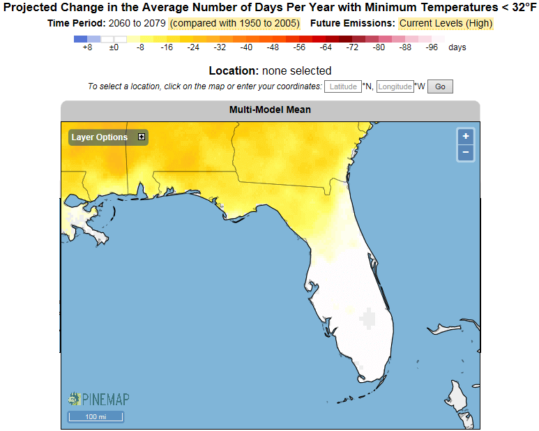

# Changes in Temperature

All areas of Florida are expected to see increases in temperature by the 2080s. The mean departure from average temperatures is greater in north Florida (more change) than in south Florida. The mean departure is greater in the summer and fall than winter for all regions of the state.

Based on available emission scenarios and the ensemble of climatic circulation models, annual average temperatures across the state are projected to markedly increase toward the end of the century. These departures from the 1961-1990 average temperatures are projected to be more severe in the northern portions of the state, gradually decreasing in severity to the south.

Impacts caused by changes in temperature will vary based on ecosystem type; Coastal and Terrestrial, Freshwater, and Estuarine/Marine.

**TODO: table of regions and projections**

The following graphics display potential changes in the average temperature (colored by mean temperature departure) annually and seasonally. Two scenarios, A1B and A2, are included in the graphics for annual and seasonal changes in temperature for projected changes by the 2080s. The A1B is similar to the AR5 RCP 6.0 and the A2 is similar to the AR5 RCP 8.5. These model graphics were developed using the Climate Wizard (http://climatewizard.org/) tools, which have not been updated to include the AR5 RCPs.

**TODO: Climate wizard graphics (iframe??)**

Changes such as the number of extremely hot days or fewer days with below freezing temperatures are likely to be more important than average temperature changes and will cause impacts to species and habitats.

### More Hot Days

By mid- to late-century most of Florida will experience an increase of more than 40 additional days with temperatures over 95˚F.

### Fewer Cold Days

By mid- to late-century the Florida panhandle and northern peninsula will experience a decrease in the number of days with minimum temperatures < 32˚F under a high emission scenario. This could lead to a northward of expansion of both native and exotic species of plants and animals.

<figcaption>
Figure N: Number of days below 32˚F.  Graphic derived on the PINEMAP DSS site. 
<a href="http://www.nc-climate.ncsu.edu/pinemap/index.php"target="_blank" rel="noopener noreferrer">http://www.nc-climate.ncsu.edu/pinemap/index.php</a>
</figcaption>
