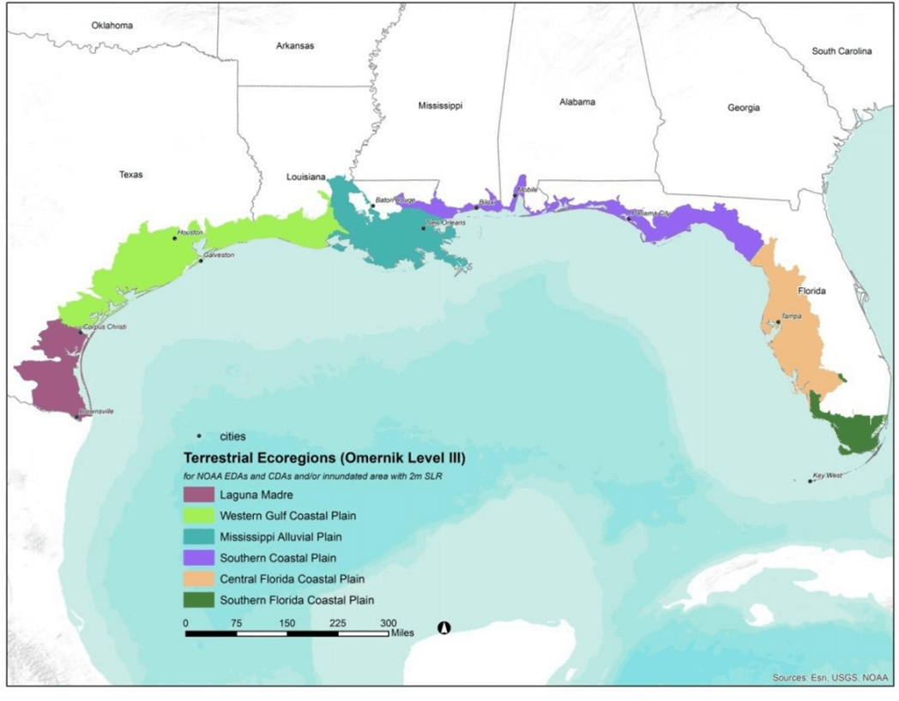

# Gulf Coast Vulnerability Assessment
The Gulf coast Vulnerability Assessment (GCVA) evaluated four habitats and 11 species in six ecoregions across the Gulf coast utilizing SIVVA and SIVVA-NatCom (**TODO:define**).  See the SIVVA section for more information on this type of assessment. Habitats were selected based on data availability and models. Species that have a distribution throughout the Gulf and would be representative of other species were selected. 

For more information, please read the [full report](https://gulfcoastprairielcc.org/media/28948/gcva_11162015_final-2.pdf).

Three of the Gulf Coast ecoregions defined for the study include portions of Florida; the Coastal Florida Coastal Plain (CFCP), South Florida Coastal Plain (SFCP) and the Southern Coastal Plain (SCP) ecoregions.

## Habitats and Species

Each of the four evaluated habitats were scored using SIVVA-NatCom.  Results are shown for each of the three ecoregions that include Florida. The species evaluations are compiled in a similar manner with each ecoregion’s assessment for that particular species shown.

Coastal Florida Coastal Plain (CFCP), South Florida Coastal Plain (SFCP), Southern Coastal Plain (SCP) ecoregions.

**TODO: habitats table**

**TODO: species table**

 