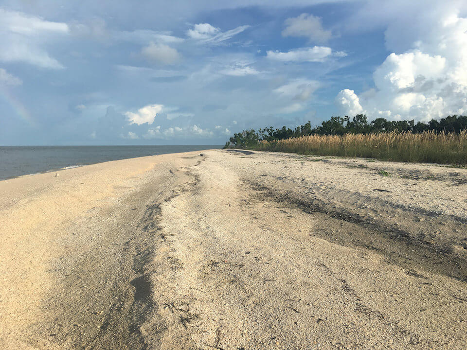

# Coastal Uplands

<figcaption>Photo: NPS</figcaption>

### Overall vulnerability:

This conservation asset was not assessed for vulnerability.

### Area:

-   30,197 hectares within Florida (modeled)

-   20,625 hectares (68%) is located on public lands

**TODO: map (if exists)**

## General Information

Coastal uplands are dynamic systems, with the coastline constantly changing. Beaches may be washed away during a storm, new inlets may appear between, old inlets may close, widen, or migrate, sand dunes may build or erode, and sandbars may form seaward of the existing beach to create a new string of barrier islands.  Coastal vegetation usually grows in zones that reflect each plant's adaptability to marine influences and a shifting substrate.  Coastal uplands extend from the beach/surf zone inland to maritime hammock before transitioning to the dominant inland vegetation type.  

The beach dune community is a predominantly herbaceous community of wide-ranging coastal specialists.  The beach dune community occurs on the first dunes above the beach.  

Coastal strand, coastal grasslands, and keys cactus barrens are immediately inland from the beach dune.   Coastal strand is the most commonly encountered community behind the herbaceous dune zone. Plants species found in coastal strand vary by coast and by distance inland.

Maritime hammocks are oak-dominated forests, with tropical species in the understory on Florida's southeast coast and on calcareous substrates, such as shell mounds, as far north as Levy and Volusia counties on the west and east coasts of Florida, respectively.

This conservation asset includes Beach Dune, Coastal Berm, Coastal Grassland, Coastal Strand, Maritime Hammock, Shell Mound, and Sand Beach.

### Habitats

- [Beach Dune](/habitats/coastal/1610)- [Coastal Berm](/habitats/coastal/1620)- [Coastal Grassland](/habitats/coastal/1630)- [Coastal Strand](/habitats/coastal/1640)- [Maritime Hammock](/habitats/coastal/1650)- [Beach and Surf Zone](/habitats/coastal/1670)- [Keys Cactus Barren](/habitats/coastal/1740)

### Species

American oystercatcher, Beach mice, Cedar Key mole skink, Florida prairie warbler, Painted bunting, Roseate tern, Sea turtles

## Impacts of Climate Change

The biggest threat from climate change to coastal uplands is sea level rise and the impacts from storms.  Overall, 62% of coastal uplands are likely to be inundated with a 1 m rise in sea level and 91% at 3 m.  

Coastal berm and keys cactus barren will likely have close to 100% inundation with only a 1 m rise in sea level.   

Barrier island systems will be impacted by the combination of climate change and human development.  These two factors can lead to irreversible changes to these islands, including rapid landward migration, decreased island width and height, island breaching and inlet formation, and island segmentation and disintegration.  

Storm events, along with sea level rise, will lead to changes in the structure (geomorphology) of many of the coastal upland systems as wind and storm surge shift sediment and cause increased erosion.  

Increased soil salinity in coastal uplands will lead to changes in species composition as salt intolerant plants decline and plants with higher salt tolerances increase. 

Cabbage palm mortality on coastal islands and along the marsh/upland transition zone has already impacted coastal areas along the Big Bend region of Florida. Cabbage palm seedling mortality is correlated with tidal flooding, suggesting that salinity, flooding or the combination may be responsible for the regeneration failure of cabbage palms in low-lying coastal areas.

[More information about general climate impacts to ecosystems and habitats in Florida](/impacts/habitats).

### Impacts to Species

Shorebirds, including American oystercatcher, Snowy plover, Wilson's plover, Least tern and Black skimmer, depend on Florida's coastal systems for nesting and foraging sites.  As habitat is lost due to climate and non-climate factors, nesting shorebirds will be constrained in their ability to move between sites and may become more concentrated in remaining suitable habitat.  This may lead to increased threats from predators as they may be able to find nests more efficiently.  

Sea turtle nesting habitat will be impacted due to loss of dunes, increased erosion, and other geomorphological changes.  Beach mice will be impacted by habitat degradation as dune plant species composition changes (potential loss of food plants), habitat fragmentation as dunes become more disjunct from one another due to inundation, and habitat loss from inundation.

[More information about general climate impacts to species in Florida](/impacts/species).

## Other Non-climate Threats

-	Coastal development
-	Conversion to commercial and industrial development
-	Conversion to housing and urban development
-	Conversion to recreation areas
-	Disruption of longshore transport of sediments
-	Fishing gear impacts
-	Incompatible fire
-	Incompatible recreational activities
-	Industrial spills
-	Invasive animals
-	Invasive plants
-	Roads
-	bridges and causeways
-	Shipping lanes
-	Shoreline hardening

