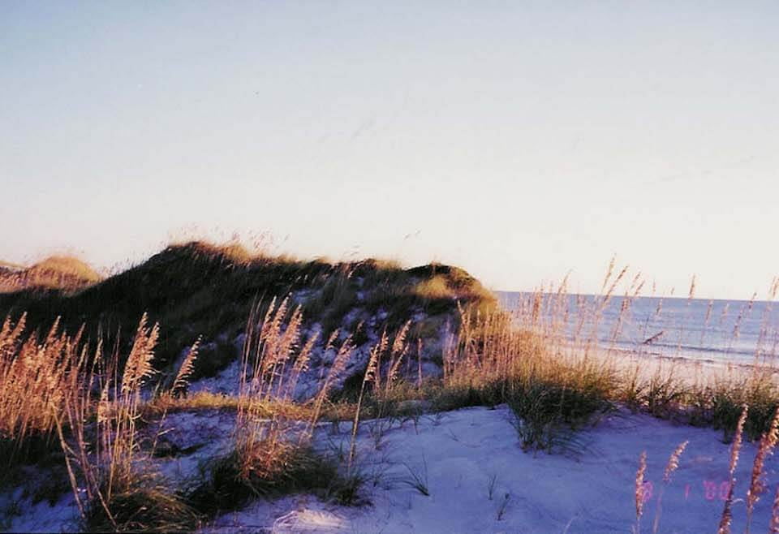

<content-header icon="coastal_uplands" title="Beach Dune" subtitle="within Coastal Uplands">
</content-header>

<figcaption>Photo: FWC</figcaption>

### Overall vulnerability:

Moderate

Note: Assessed in combination with Coastal Grassland

<h3>Habitat area: 
<a href="/habitats/coastal/1610/map" style="float:right;font-size:smaller;margin-right: 2rem;">
<fa-icon name="map"></fa-icon>
explore on map
</a>
</h3>

-   4,040 hectares within Florida (modeled)
-   2,614 hectares (65%) is located on public lands

## General Information

Beach dunes are very dynamic communities with the wind continually moving the sand inland from the beach until trapped by vegetation. Beach dunes are characterized as wind-deposited, foredune and wave-deposited upper beach that are sparsely to densely vegetated with pioneer species, especially sea oats.  Vegetation on beach dunes varies regionally in Florida but is restricted to a few highly specialized terrestrial plants.   Typical plants include beach cordgrass, sand spur, railroad vine, beach morning glory, dune sunflower, sea purslane, and sea rocket.  The dune vegetation must be able to tolerate loose, dry, unstable, nutrient poor soils, as well as exposure to wind, salt spray, sand abrasions, intense sunlight, and storms.  

Beach dunes are  periodically inundated by seawater during extreme high tides and storms. This community is subject to drastic topographic alterations during winter storms and hurricanes.  

Florida beaches are important nesting sites for several species of shorebirds and wintering grounds for others.

**TODO: map (if exists)**

### Species

American oystercatcher, Beach mice, Cuban Snowy plover, Sea turtles

## Impacts of Climate Change

Florida's beach dune habitat is likely to have 53% of the current area inundated by 1 m of sea level rise and 82% inundated by 3 m of sea level rise.  Inundation and impacts from storm events will lead to increased fragmentation and changes in the structure (geomorphology) of the dunes.   Increased soil salinity will lead to changes in species composition as salt intolerant plants decline and plants with higher salt tolerances increase.  Increased temperatures, as well as extreme events  will enhance invasive species processes, from introduction through establishment and expansion.

#### This habitat is expected to be impacted by sea level rise:

- 3 meters of sea level rise: 82% of area (3,310 ha)
- 1 meter of sea level rise: 53% of area (2,137 ha)

[Explore sea level rise impacts map](/habitats/coastal/1610/map).

[More information about general climate impacts to ecosystems and habitats in Florida](/impacts/habitats).

### Impacts to Species

Sea turtle nesting habitat will be impacted due to loss of dunes, increased erosion, and other geomorphological changes.  It is estimated that over 40% of loggerhead turtle beach nesting habitat will be lost with a 50 cm increase in sea level rise. Increased temperatures may impact sex rations of sea turtle hatchlings. Sea turtles have temperature-dependent sex determination, where the sex of the hatchlings is determined by the nest temperature, with warmer temperatures producing more females.    Additionally, sea turtle embryo development and hatching success are influenced by temperature and rainfall at nesting beaches.   

Beach mice will be impacted by habitat degradation as dune plant species composition changes (potential loss of food plants), habitat fragmentation as dunes become more disjunct from one another due to inundation, and habitat loss from inundation.  

Many shorebirds use beach dune habitat for nesting or wintering, including piping plover, snowy plover, American oystercatcher, least tern, and black skimmers.  Loss of beach dune habitat will result in a reduction of nesting habitat for many of these species.

[More information about general climate impacts to species in Florida](/impacts/species).

## Other Non-climate Threats

-	Coastal development
-	Conversion to housing and urban development
-	Conversion to recreation areas
-	Disruption of longshore transport of sediments
-	Fishing gear impacts
-	Incompatible recreational activities
-	Industrial spills
-	Invasive animals
-	Invasive plants
-	Roads
-	bridges and causeways
-	Shoreline hardening

## Adaptation Strategies

#### Restoration

- Create dunes along backshore of beach; includes planting dune grasses and sand fencing to induce settling of wind-blown sands.
- Replace impervious surfaces with permeable pavement to allow runoff to flow through and be temporarily stored prior to discharge, in areas adjacent to wetlands.
- Reduce impacts from points of access (e.g., paths, boardwalks).
- Remove shoreline hardening structures such as bulkheads, dikes, and other engineered structures to allow for shoreline migration.
- Develop corridors and linkages between undeveloped areas.
- Replace shoreline armoring with living shorelines – through beach nourishment, planting vegetation, etc.
- Restore coastal vegetation to reduce the impact of increased disturbance events (intense storms, increased erosion) and encourage aeolian sand capture.
- Restore coastal vegetation to improve habitat for species that require early successional habitat.
- Remove invasive plants.

#### Planning

- Coordinate with County staff to incorporate sea level rise adaptation strategies into comprehensive plans and post-storm redevelopment activities.
- Incorporate climate change considerations into new and future revisions of species and area management plans.
- Modify conservation management priorities to include species and habitat adaptation to the effects of climate change.
- Incorporate altered or restricted points of access into plans to accommodate impacts from climate change.

#### Protection

- Preserve undeveloped and vulnerable shoreline.
- Maintain corridors and linkages between undeveloped areas.
- Identify and protect locations where native species may shift or lose habitat due to climate change impacts.
- Develop conservation easements  to protect climate-vulnerable areas.
- Protect coastal vegetation to reduce the impact of increased disturbance events (intense storms, increased erosion) and encourage aeolian sand capture. Create setbacks or rolling easements.

#### Monitoring

- Monitor and correct for any point source or non-point source pollution.
- Monitor phenology.
- Encourage periodic bioblitz events to capture comprehensive inventories, repeat periodically (5 to 10 years).
- Monitor, map  and research shifts in communities; identify sensitive and resilient species.
- Develop a monitoring program to track dune health.

#### Policy

- Centralize recreation impacts to easy-access areas.
- Identify overused areas and limit recreational trails/roads and OHV use.
- Institute or strengthen building codes in flood- and erosion-prone areas to reduce erosion to the dunes.
- Implement restrictions on the use of hardened shoreline protection structures.
- Zone development away from sensitive and hazard-prone areas.
- Provide greater regulation and enforcement of recreational use and access restrictions.

#### Education/Outreach

- Promote “keeping cats indoors” to protect beach nesting activities.
- Educate landowners and planners on benefits of structural walkways over a dune rather than pedestrian pathways through dunes.
- Educate planners on importance of a healthy resilient coastal systems to protect against coastal hazards.
- Work with communities and landowners to choose native vegetation in favor of non-native vegetation.
- Provide education on the benefits of soft shoreline stabilization methods.
- Work with local communities to remove dumped and washed up debris and garbage.
- Work with communities and landowners to choose vegetation, living shorelines, oyster reef restoration, or hybrid approaches in favor of traditional hard armoring.

[More information about adaptation strategies](/strategies).

## Additional Resources

 - [Florida Natural Areas Inventory Profile](http://www.fnai.org/PDF/NC/Beach_Dune_Final_2010.pdf)
