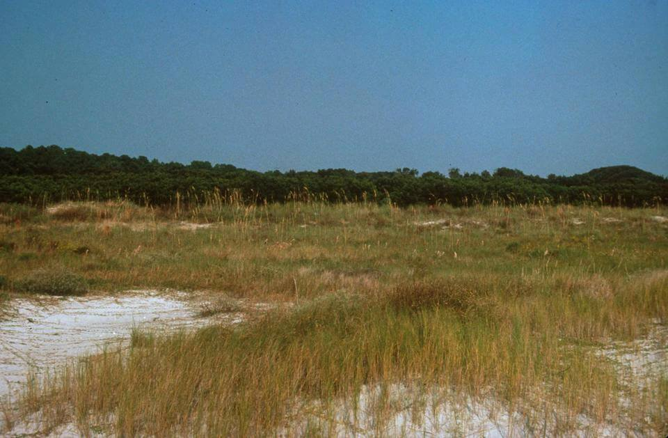

<content-header icon="coastal_uplands" title="Coastal Grassland" subtitle="within Coastal Uplands"></content-header>

<figcaption>Photo: Karen Parker, FWC</figcaption>

### Overall vulnerability:

Moderate

Note: Assessed in combination with Beach Dune

<h3>Habitat area: 
<a href="/habitats/coastal/1630/map" style="float:right;font-size:smaller;margin-right: 2rem;">
<fa-icon name="map"></fa-icon>
explore on map
</a>
</h3>

-   1,151 hectares within Florida (modeled)
-   1,065 hectares (93%) is located on public lands

## General Information

Coastal grasslands are characterized as treeless flatlands with barren sand or a sparse to dense ground cover of grasses, prostrate vines, and other herbaceous species that are adapted to harsh maritime conditions.  The coastal grassland community generally occurs as one of two types; on newer sand deposits, typically composed of a variety of tall grasses (Muhly grass, Saltmeadow cordgrass, Bushy bluestem, Tall threeawn, plus occasional remnant patches of sea oats) or on older, more stable portions of the broad barrier islands consisting of short, dense stands of hairy grama grass.

**TODO: map (if exists)**

### Species

Beach mice, Cuban snowy plover, Wilson's plover, Gopher tortoise

## Impacts of Climate Change

Coastal grassland habitat is likely to have 63% of the current area inundated by 1 m of sea level rise and 96% inundated by 3 m of sea level rise.  Inundation and impacts from storm events will lead to increased fragmentation and changes in the structure (geomorphology) of the system.   Increased soil salinity will lead to changes in species composition as salt intolerant plants decline and plants with higher salt tolerances increase.   Increased temperatures, as well as extreme events  will enhance invasive species processes, from introduction through establishment and expansion.

#### This habitat is expected to be impacted by sea level rise:

- 3 meters of sea level rise: 96% of area (1,104 ha)
- 1 meter of sea level rise: 63% of area (724 ha)

[Explore sea level rise impacts map](/habitat/coastal/1630/map).

[More information about general climate impacts to ecosystems and habitats in Florida](/impacts/habitats).

### Impacts to Species

Beach mice will be impacted by habitat degradation as dune plant species composition changes (potential loss of food plants), habitat fragmentation as dunes become more disjunct from one another due to inundation, and habitat loss from inundation.  

Gopher tortoises utilize areas of coastal grasslands and will be impacted as these grasslands become inundated due to sea level rise.

[More information about general climate impacts to species in Florida](/impacts/species).

## Other Non-climate Threats

-	Coastal development
-	Conversion to housing and urban development
-	Conversion to recreation areas
-	Disruption of longshore transport of sediments
-	Incompatible fire
-	Incompatible recreational activities
-	Industrial spills
-	Invasive animals
-	Invasive plants
-	Roads
-	bridges and causeways
-	Shoreline hardening

## Adaptation Strategies

#### Monitoring

- Monitor and correct for any point source or non-point source pollution.
- Monitor phenology.
- Monitor, map  and research shifts in communities; identify sensitive and resilient species.
- Encourage periodic bioblitz events to capture comprehensive inventories, repeat periodically (5 to 10 years).

#### Education/Outreach

- Educate landowners and planners on benefits of structural walkways over vegetation rather than pedestrian pathways through vegetation/dunes.
- Educate planners on importance of a healthy resilient coastal systems to protect against coastal hazards.
- Work with communities and landowners to choose native vegetation in favor of non-native vegetation.
- Work with communities and landowners to choose vegetation, living shorelines, oyster reef restoration, or hybrid approaches in favor of traditional hard armoring.
- Promote “keeping cats indoors” to protect beach nesting activities .

#### Protection

- Protect potential refugia, corridors, and relocation sites.
- Protect coastal vegetation to reduce the impact of increased disturbance events (intense storms, increased erosion) and encourage aeolian sand capture.
- Create setbacks or rolling easements.
- Develop conservation easements  to protect climate-vulnerable areas.
- Preserve undeveloped and vulnerable shoreline.
- Identify and protect locations where native species may shift or lose habitat due to climate change impacts.
- Maintain corridors and linkages between undeveloped areas.

#### Restoration

- Restore coastal vegetation to improve habitat for species that require early successional habitat.
- Restore and/or protect coastal vegetation to reduce the impact of increased disturbance events (intense storms, increased erosion) and encourage aeolian sand capture
- Develop corridors and linkages between undeveloped areas.
- Reduce impacts from points of access (e.g., paths, boardwalks).
- Remove invasive plants and prevent new species from becoming established.
- Restore native plant communities, using stock that is more likely to persist in future climatic conditions.
- Redesign or mitigate existing physical barriers or structures that impede movement and dispersal within and among habitats.

#### Planning

- Coordinate with County staff to incorporate sea level rise adaptation strategies into comprehensive plans and post-storm redevelopment activities
- Identify areas particularly vulnerable to loss or transition under climate change and develop management strategies and approaches for adaptation.
- Modify conservation management priorities to include species and habitat adaptation to the effects of climate change.
- Incorporate altered or restricted points of access into plans to accommodate impacts from climate change.

#### Policy

- Consider restrictions on other human activities (e.g., mechanical beach cleaning, armoring) that pose a threat to species through disturbance and/or habitat degradation
- Restrict development and other land uses that alter disturbance processes in sensitive areas
- Identify overused areas and limit recreational trails/roads and OHV use.
- Centralize recreation impacts to easy-access areas.
- Provide greater regulation and enforcement of recreational use and access restrictions.
- Zone development away from sensitive and hazard-prone areas.
- Institute or strengthen building codes in flood- and erosion-prone areas to reduce erosion.

[More information about adaptation strategies](/strategies).

## Additional Resources

 - [Florida Natural Areas Inventory Profile](http://www.fnai.org/PDF/NC/Coastal_Grassland_Final_2010.pdf)
