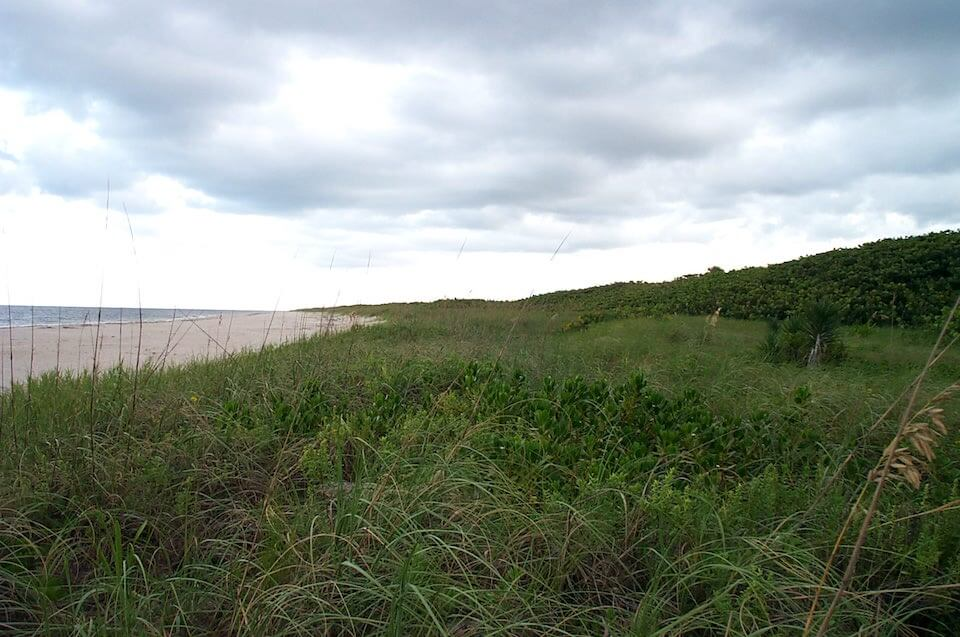

# Coastal Strand

### within Coastal Uplands

<figcaption>Photo: Randy Kautz</figcaption>

### Overall vulnerability:

Moderate

### Area:

-   2,713 hectares within Florida (modeled)

-   2,316 hectares (85%) is located on public lands

## General Information

Coastal strand is the vegetated zone that typically occurs between open beach and maritime hammock habitats. It occurs on deep, well-drained, sandy soils that are largely wind-deposited and washed or sorted by wave action to some extent.  Vegetation in this habitat is strongly affected by wind, wave action, and salt spray and consists of low-growing vines, grasses, and other herbaceous plants and salt-tolerant shrub species that, in some areas, may form dense thickets. Pioneer or early successional herbaceous vegetation characterizes foredune and upper beach areas with a gradual change to woody shrub species on the more protected and stabilized areas farther landward. Typical plant species include beach morning glory, railroad vine, sea oats, saw palmetto, Spanish bayonet, yaupon holly, wax myrtle, and sea grape; in southern Florida, cocoplum, nickerbean, and other more tropical species are present.

**TODO: map (if exists)**

### Species

Beach mice, Black skimmer, Gopher tortoise, Painted bunting

## Impacts of Climate Change

Coastal strand habitat is likely to have 40% of the current area inundated by 1 m of sea level rise and 84% inundated by 3 m of sea level rise.   Increased soil salinity will lead to changes in species composition and structure as salt intolerant plants decline and plants with higher salt tolerances increase.  Increased temperatures, as well as extreme events  will enhance invasive species processes, from introduction through establishment and expansion.

#### This habitat is expected to be impacted by sea level rise:

- 3 meters of sea level rise: 84% of area (2,267 ha)
- 1 meter of sea level rise: 40% of area (1,073 ha)
    

[More information about general climate impacts to ecosystems and habitats in Florida](/impacts/habitats).

### Impacts to Species

Beach mice will be impacted by habitat degradation as plant species composition changes (potential loss of food plants). 

Gopher tortoises utilize areas of coastal strand and will be impacted as these areas become inundated due to sea level rise. 

Expansion of invasive plant species, such as the Australian pine, due to changes in temperature regimes will lead to compositional and structural changes in the community, impacting the suitability to multiple species.  Australian pine can tolerate inundation by seawater and deposition of salt spray better than many native woody species, allowing it to displace native coastal strand species.

[More information about general climate impacts to species in Florida](/impacts/species).

## Other Non-climate Threats

-	Coastal development
-	Conversion to commercial and industrial development
-	Conversion to housing and urban development
-	Conversion to recreation areas
-	Incompatible fire
-	Incompatible recreational activities
-	Industrial spills
-	Invasive animals
-	Invasive plants
-	Roads

## Adaptation Strategies

#### Education/Outreach

- Work with communities and landowners to choose native vegetation in favor of non-native vegetation.
- Work with communities and landowners to choose vegetation, living shorelines, oyster reef restoration, or hybrid approaches in favor of traditional hard armoring.
- Promote “keeping cats indoors” to protect beach nesting activities .
- Educate planners on importance of a healthy resilient coastal systems to protect against coastal hazards.
- Educate landowners and planners on benefits of structural walkways over vegetation rather than pedestrian pathways through vegetation/dunes.

#### Monitoring

- Monitor and correct for any point source or non-point source pollution.
- Monitor phenology.
- Encourage periodic bioblitz events to capture comprehensive inventories, repeat periodically (5 to 10 years).
- Monitor, map  and research shifts in communities; identify sensitive and resilient species.

#### Restoration

- Reduce impacts from points of access (e.g., paths, boardwalks).
- Restore native plant communities, using stock that is more likely to persist in future climatic conditions.
- Redesign or mitigate existing physical barriers or structures that impede movement and dispersal within and among habitats.
- Develop corridors and linkages between undeveloped areas.
- Remove shoreline hardening structures such as bulkheads, dikes, and other engineered structures to allow for shoreline migration.
- Restore and/or protect coastal vegetation to reduce the impact of increased disturbance events (intense storms, increased erosion) and encourage aeolian sand capture.
- Replace shoreline armoring with living shorelines – through beach nourishment, planting vegetation, etc.
- Restore coastal vegetation to improve habitat for species that require early successional habitat.

#### Planning

- Coordinate with County staff to incorporate sea level rise adaptation strategies into comprehensive plans and post-storm redevelopment activities
- Identify areas particularly vulnerable to loss or transition under climate change and develop management strategies and approaches for adaptation.
- Modify conservation management priorities to include species and habitat adaptation to the effects of climate change.
- Incorporate altered or restricted points of access into plans to accommodate impacts from climate change.

#### Policy

- Consider restrictions on other human activities (e.g., mechanical beach cleaning, armoring) that pose a threat to species through disturbance and/or habitat degradation
- Restrict development and other land uses that alter disturbance processes in sensitive areas
- Identify overused areas and limit recreational trails/roads and OHV use.
- Centralize recreation impacts to easy-access areas.
- Provide greater regulation and enforcement of recreational use and access restrictions.
- Zone development away from sensitive and hazard-prone areas.
- Implement restrictions on the use of hardened shoreline protection structures.
- Institute or strengthen building codes in flood- and erosion-prone areas to reduce erosion.

#### Protection

- Identify areas connected to coastal terrestrial habitats that could receive protection through Florida forever and similar funding mechanisms.
- Protect coastal vegetation to reduce the impact of increased disturbance events (intense storms, increased erosion) and encourage aeolian sand capture.
- Create setbacks or rolling easements.
- Develop conservation easements  to protect climate-vulnerable areas.
- Preserve undeveloped and vulnerable shoreline.
- Identify and protect locations where native species may shift or lose habitat due to climate change impacts.
- Maintain corridors and linkages between undeveloped areas.
- Protect potential refugia, corridors, and relocation sites.

[More information about adaptation strategies](/strategies).

## Additional Resources

 - [Florida Natural Areas Inventory Profile](http://fnai.org/PDF/NC/Coastal_Strand_Final_2010.pdf)
