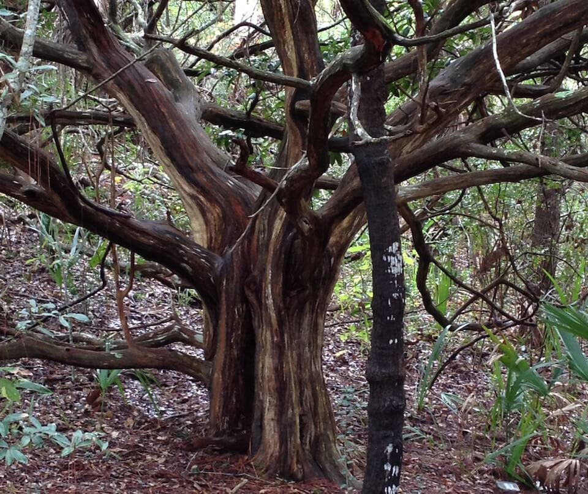

<content-header icon="coastal_uplands" title="Maritime Hammock" subtitle="within Coastal Uplands">
</content-header>

<figcaption>Photo: Jessica Therriault, FWC</figcaption>

### Overall vulnerability:

Very High

<h3>Habitat area: 
<a href="/habitats/coastal/1650/map" style="float:right;font-size:smaller;margin-right: 2rem;">
<fa-icon name="map"></fa-icon>
explore on map
</a>
</h3>

-   11,996 hectares within Florida (modeled)
-   10,174 hectares (85%) is located on public lands

## General Information

Maritime hammock is characterized as a narrow band of hardwood forest lying just inland of the coastal strand community.  Typical plants include live oak, cabbage palm redbay, red cedar, sea grape, lancewood, gumbo-limbo, strangler fig, poisonwood, saw palmetto, beautyberry, poison ivy, prickly ash, wild coffee, marlberry and ferns.   

In South Florida, maritime hammocks extend south on the sandy barrier islands to Cape Florida, Miami-Dade County on the Atlantic side, and Cape Romano, Collier County, on the Gulf side. They may also occasionally be found along the mainland shores of the lagoons and bays. In Monroe County they are also found in scattered locations on Ten Thousand Islands and Cape Sable. In the Florida Keys they are replaced by the more diverse rockland hammock community.  Fire is rare in this community.   

Maritime hammock is reasonably resilient as long as the canopy remains intact and the landform is stable.

**TODO: map (if exists)**

### Species

Atlantic salt marsh snake, Painted bunting, Florida prairie warbler

## Impacts of Climate Change

Maritime hammock is likely to have 61% of the current area inundated by 1 m of sea level rise and 94% inundated by 3 m of sea level rise.  Increased soil salinity will lead to changes in species composition and structure as salt intolerant plants decline and plants with higher salt tolerances increase.  Coastal forests are already being impacted by saltwater intrusion, longer periods of root inundation, salt spray, and coastal erosion.   Increased temperatures, as well as extreme events  will enhance invasive species processes, from introduction through establishment and expansion.  These systems are also at higher risk of future development as people move out of more vulnerable waterfront areas.

#### This habitat is expected to be impacted by sea level rise:

- 3 meters of sea level rise: 94% of area (11,233 ha)
- 1 meter of sea level rise: 61% of area (7,332 ha)

[Explore sea level rise impacts map](/habitat/coastal/1650/map).

[More information about general climate impacts to ecosystems and habitats in Florida](/impacts/habitats).

### Impacts to Species

Species dependent upon maritime hammock will be impacted by the direct loss of the habitat due to sea level rise, particularly in those areas where there is limited potential for inland migration of the habitat.  The loss of these hammocks will impact both nesting and foraging habitats of migratory and resident bird species.  

Migrating songbirds that travel along the Atlantic coast use maritime hammocks for food and shelter.  Higher abundance of painted buntings is associated with maritime forest and hammock.  Conservation of the remaining maritime hammock is critical in maintaining breeding populations of the painted bunting in Florida. 

Expansion of invasive plant species, such as the Australian pine, due to changes in temperature regimes will lead to compositional and structural changes in the community, impacting the suitability to multiple species.

[More information about general climate impacts to species in Florida](/impacts/species).

## Other Non-climate Threats

-	Coastal development
-	Conversion to commercial and industrial development
-	Conversion to housing and urban development
-	Conversion to recreation areas
-	Incompatible fire
-	Incompatible recreational activities
-	Invasive animals
-	Invasive plants
-	Roads

## Adaptation Strategies

#### Restoration

- Plant with a mix of species that can survive in a diverse range of future climate conditions.
- Improve habitat quality to enhance the resilience of maritime hammocks to changing conditions.
- Cultivate multiple age classes of tree and understory species to protect stands from pests or diseases that may be more virulent to specific life stages or specific species.
- Implement management practices that accommodate shifts in the timing of the rainy season and eliminate or reduce application of pesticides during this period.
- Implement best management practices to reduce sources of land-based pollutant and nutrient loads.
- Eliminate hydrologic barriers/conveyances.
- Replace culverts with those designed to accommodate future flow conditions and allow for fish and wildlife passage.
- Remove new species of invasive plants before they become established.
- Control invasive plants and animals including feral cats.
- Remove ditches to deter saltwater intrusion and restore natural water flow.
- Redesign or mitigate existing physical barriers or structures that impede movement and dispersal within and among habitats.
- Select native plant species for restoration efforts that are expected to be better adapted to future climate conditions.

#### Planning

- Identify areas particularly vulnerable to loss or transition under climate change and develop management strategies and approaches for adaptation.
- Incorporate climate change considerations into new and future revisions of area management plans.
- Assess and take steps to reduce risks of facilitating movement of “new” undesirable non-native species, pests, and pathogens.
- Reduce roadway and paved area construction near sensitive systems to maintain natural hydrology.
- Collaborate with other agencies to ensure new water control structures have consideration for future conditions.

#### Policy

- Encourage the passage of state regulations to strengthen protection of maritime hammock.
- Develop policies and incentives for decreasing impervious surfaces.
- Identify overused areas and limit recreational trails/roads and OHV use.
- Review and update Best Management Practices to accommodate current and future conditions.
- Provide greater regulation and enforcement of recreational use and access restrictions.
- Centralize recreation impacts to easy-access areas.

#### Education/Outreach

- Work with counties, local municipalities and regional planning councils to incorporate natural resources adaptation strategies in comprehensive plans and hazard planning efforts.
- Actively engage with communities to minimize urban encroachment.
- Work with communities to reduce stormwater runoff and improve water quality.
- Implement outreach to increase public understanding of the increased wildfire risks due to climate change.
- Develop educational materials for private landowners on appropriate use fertilizers and pesticides and impacts on water quality, include potential incentives to reduce use.
- Develop training on the use of existing and emerging tools for managing systems under climate change (e.g., vulnerability and risk assessments, scenario planning, decision support tools, and adaptive management).
- Work with volunteers to control invasive species.

#### Monitoring

- Establish early detection and rapid response to potentially invasive species.
- Monitor species diversity and habitat transition over time in response to sea level rise and changing climatological conditions.
- Monitor disease prevalence and occurrence (spatially and temporally).
- Monitor vegetation as density and distributions shift with environmental changes.
- Monitor natural community range shifts.
- Monitor pollutants.
- Inventory culverts and other barriers to flow.
- Monitor status of indicator species to guide or inform adaptive management.

#### Protection

- Encourage landowner cost share programs and enrollment in conservation easements to increase habitat base.
- Preserve maritime hammock and their buffers that are not yet impacted by human development.
- Maintain habitat quality to enhance the resilience of hydric hammocks to changing conditions.
- Identify and prioritize protection of corridors between maritime hammock and adjacent natural areas to enhance species movement and migration.
- Protect critical areas that are naturally positioned to be more resistant to climate change.
- Purchase inland development rights or property rights.
- Preserve the structural complexity and biodiversity of vegetation.
- Protect buffer zones to allow for future inland migration.
- Establish protections for transitional habitats that will provide for range shifts and serve as potential climate refugia.

[More information about adaptation strategies](/strategies).

## Additional Resources

 - [Florida Natural Areas Inventory Profile](http://www.fnai.org/PDF/NC/Maritime_Hammock_Final_2010.pdf)
