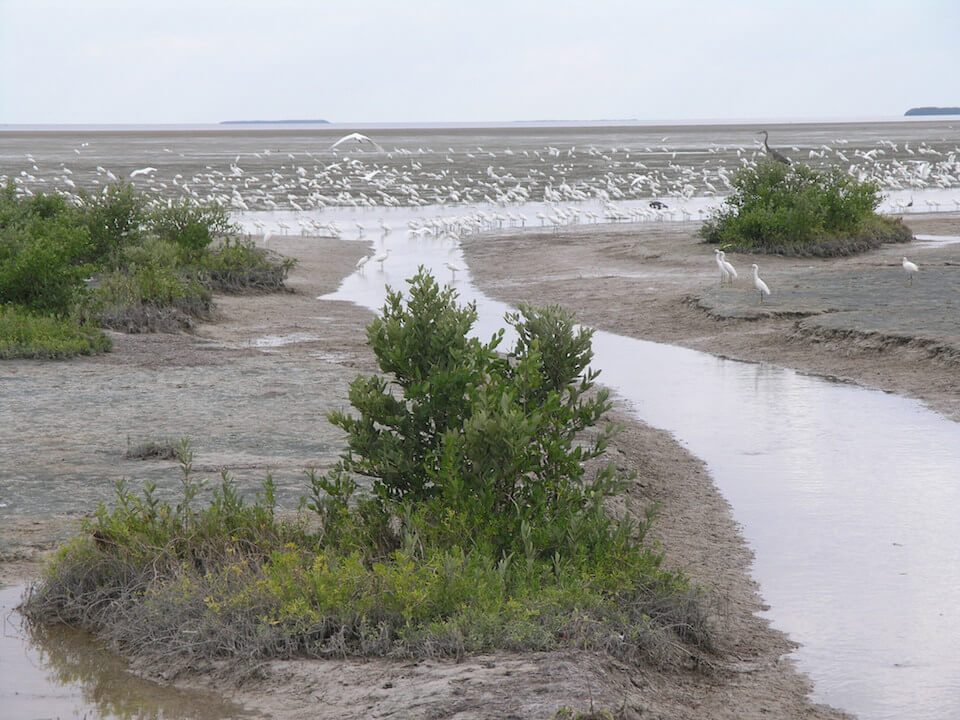

<content-header icon="coastal_ecosystems" title="Coastal Ecosystems">
</content-header>

<figcaption>Photo: NPS</figcaption>

Coastal ecosystems are the foundation upon which much of Florida's natural beauty and economy are based. Beaches, dunes, and coastal grasslands and forests are important components of the coastal ecosystem, providing breeding and foraging grounds, and cover for a wide variety of wildlife. 

Beaches and dunes are home to threatened species, such as beach mice, snowy plovers, and gopher tortoises, and provide nesting sites for shorebirds and sea turtles. 

Dunes are created by wind, but are held in place by grasses that trap sand grains as they are being moved across the beach. Dunes stabilized by grasses protect the coast against winds and pounding waves. The vegetation found within Florida's dunes varies and is dependent upon many factors, including storm waves, windblown sand, salt spray, soil type, and climate.

## Impacts of Climate Change

Coastal systems have the natural ability to adapt to the dynamic conditions that formed and maintains them; however, these capacities are being overwhelmed by sea level rise, particularly in areas that have already been damaged by development, coastal armoring, and other activities.  

Changes in wind circulation patterns and increases in wave actions due to storms will impact the interactions of sand with the pioneer grasses that build dunes. Loss of pioneer grass species and other dune vegetation likely will increase dune erosion and degradation, especially given the predicted increase in storm events.  

Increased soil salinity in coastal uplands will lead to changes in species composition as salt-intolerant plants decline and plants with higher salt tolerances increase. Coastal forests are already being impacted by saltwater intrusion, longer periods of root inundation, salt spray, and coastal erosion.  

The sustainability of some natural coastal systems and the species that depend upon them will be impacted by increases in storm surge associated with hurricanes.

[More information about general climate impacts to ecosystems and habitats in Florida](/impacts/habitats).

### Impacts to Species

Many species are dependent upon coastal areas for all or part of their life cycle. Habitat loss and degradation due to recreational and commercial activities have already led to declining wildlife populations.  Additional impacts from climate change will only exacerbate these threats.  

Coastal systems provide critical habitat for species such as sea turtles, beach mice, nesting and wintering shorebirds and neo-tropical migrants. As habitat is lost due to climate and non-climate factors, nesting shorebirds will be constrained in their ability to move between sites and may become more concentrated in remaining suitable habitat.  This may lead to increased threats from predators as they may be able to find nests more efficiently.  

Sea turtle nesting habitat will be impacted due to loss of dunes, increased erosion, and other geomorphological changes.  Increased temperatures may impact sex rations of sea turtle hatchlings.  

Beach mice will be impacted by habitat degradation as dune plant species composition changes (potential loss of food plants), habitat fragmentation as dunes become more disjunct from one another due to inundation, and habitat loss from inundation.

[More information about general climate impacts to species in Florida](/impacts/species).
