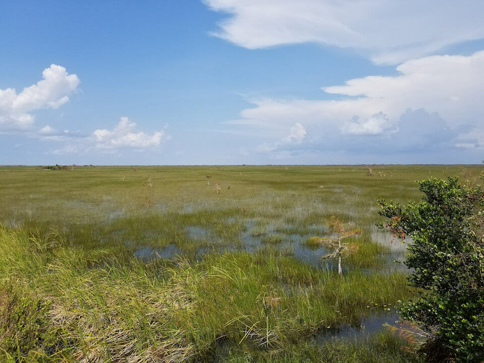

# Freshwater Non-forested Wetlands

<figcaption>Photo: NPS</figcaption>

### Overall vulnerability:

Low

### Area:

-   1,882,358 hectares within Florida (modeled)

-   1,160,338 hectares (62%) is located on public lands

**TODO: map (if exists)**

## General Information

These wetland communities are dominated by a wide assortment of herbaceous plant species growing on sand, clay, marl, and organic soils in areas of variable water depths and inundation regimes. Generally, freshwater marshes occur in deeper, more strongly inundated situations and are characterized by tall emergent and floating-leaved species. Freshwater marshes also occur within flatwoods depressions, along broad, shallow lake and river shorelines, and scattered in open areas within hardwood systems, dry prairies, and cypress swamps.   Wet prairies occur as scattered, shallow depressions within dry prairies and flatwoods and on marl prairie areas in south Florida.   

Wet prairies are periodically inundated and are usually dominated by aquatic grasses, sedges, and their associates.  Areas in southwest Florida with scattered dwarf cypress having less than 20% canopy coverage and a dense ground cover of freshwater marsh plants are also included. Various combinations of pickerel weed, sawgrass, maidencane, arrowhead, fire flag, cattail, spike rush, bulrush, white water lily, water shield, and various sedges dominate freshwater marshes and wet prairies.

This conservation asset includes Prairies and Bogs, Marshes, and Floating/Emergent Aquatic Vegetation.

### Habitats

- [Wet Prairie](/habitats/freshwater/2111)- [Marl Prairie](/habitats/freshwater/2113)- [Coastal Interdunal Swale](/habitats/freshwater/2122)- [Floodplain Marsh](/habitats/freshwater/2123)- [Glades Marsh](/habitats/freshwater/2125)- [Ephemeral Ponds and Wetlands](/habitats/freshwater/2160)

### Species

Everglade snail kite, Florida sandhill crane, Limpkin, Southern bald eagle, Striped newt, Tiger salamander, Wading birds

## Impacts of Climate Change

Altered hydrology is the greatest anticipated impact to non-forested wetlands (marshes) from climate change.  Increased extreme precipitation events will cause increased erosion and sedimentation, as well as nutrient run-off, leading to the transportation and growth of invasive species.   

Decreased precipitation coupled with increased temperature will likely alter species composition and increase fragmentation of larger systems through reduced flow and connectivity.  Decreases in water quantity and quality will continue to stress the system and cause degradation. 

Factors in aquatic systems, such as changes in thermal regimes, flow regimes, or salinity could alter the competitive interactions or predator–prey relations among species, leading to altered species composition.  

Increased precipitation and floods will cause increased run-off, erosion, siltation, and pollutants, all contributing to habitat degradation and loss.  In some circumstances these impacts could cause decreased reproductive success, increased stress and mortality.

#### This conservation asset is expected to be impacted by sea level rise:

- 3 meters of sea level rise: 42% of area (790,385 ha)
- 1 meter of sea level rise: 16% of area (303,450 ha)
    

[More information about general climate impacts to ecosystems and habitats in Florida](/impacts/habitats).

### Impacts to Species

Florida has a significant number of species that are dependent upon freshwater non-forested wetlands (marshes), providing both foraging and breeding habitat. The suitability of these sites is intimately linked with the timing, amount and duration of precipitation.  As precipitation patterns change, along with increasing temperatures, the suitability of these wetlands will also change.  

Increased temperatures and decreased precipitation will lead to loss of suitable foraging sites for wading birds as the timing and duration of dry periods change.  

Florida sandhill cranes use shallow herbaceous wetlands as nesting habitat.  The suitability of the shallow wetlands for nesting will be impacted if timing and amount of precipitation changes, leading to a decrease in reproductive success.  If wetlands are too dry during nesting they would not provide adequate habitat or if they dry during the incubation period it would allow for increased nest predation by terrestrial predators.  If precipitation increases during the nesting season the nest will flood, leading to nest failure.   Similarly, many species of amphibians are dependent upon these wetlands for breeding habitat.  

Decreased water quality due to changes in the level and types of runoff entering the systems from increased precipitation and floods will negatively impact species health, reproductive success, and survival.

[More information about general climate impacts to species in Florida](/impacts/species).

## Other Non-climate Threats

-	Chemicals and toxins
-	Conversion to agriculture
-	Conversion to housing and urban development
-	Dam operations/incompatible release of water
-	Groundwater withdrawal
-	Incompatible fire
-	Incompatible recreational activities
-	Incompatible resource extraction
-	Invasive animals
-	Invasive plants
-	Management of nature
-	Nutrient loads - agriculture and urban
-	Roads
-	Surface water withdrawal and diversion

