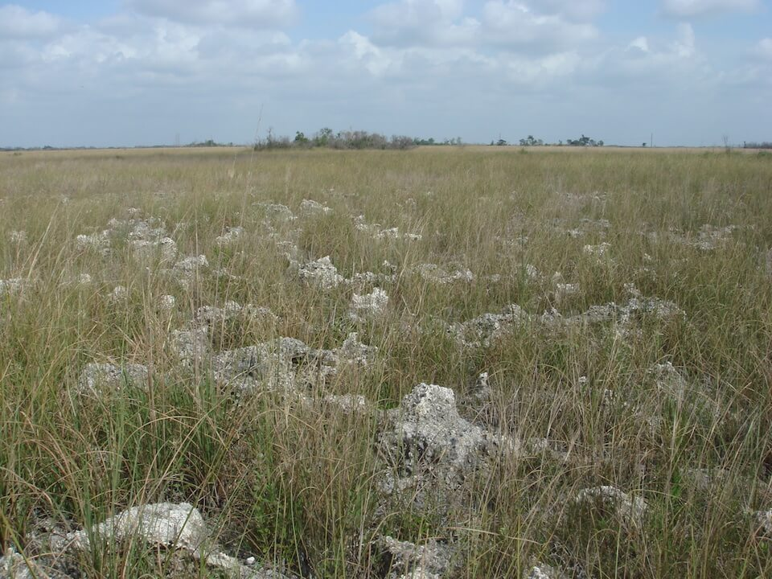

<content-header icon="freshwater_nonforested_wetlands" title="Marl Prairie" subtitle="within Freshwater Non-forested Wetlands">
</content-header>

<figcaption>Photo: Amy Jenkins, FNAI</figcaption>

### Overall vulnerability:

High

<h3>Habitat area: 
<a href="/habitats/freshwater/2113/map" style="float:right;font-size:smaller;margin-right: 2rem;">
<fa-icon name="map"></fa-icon>
explore on map
</a>
</h3>

-   8,932 hectares within Florida (modeled)
-   8,931 hectares (100%) is located on public lands

## General Information

Marl prairies are supported by thin, calcareous soils also referred to as "marl" underlain by limestone bedrock. Marl prairies are on flatlands along the interface between deeper wetlands and coastal or upland communities where limestone is near the surface. Dominant plants include muhly grass, sawgrass, spikerush, bluestem, beakrush and pond cypress.  

Marl prairie is a diverse community which may contain over 100 species, whereas most marsh types have fewer than 20 species.  Widely scattered stunted cypress or mangrove trees are often present.  

Within the U.S., marl prairies are limited to south Florida, with several large examples occurring in the Everglades National Park and in Big Cypress National Preserve.

### Species

Everglades mink, Wading birds, Cape Sable seaside sparrow

## Impacts of Climate Change

Marl prairie is likely to have 47% of the current area inundated by 1 m of sea level rise and 100% inundated by 3 m of sea level rise. Decreased precipitation coupled with increased temperature will likely alter species composition and increase fragmentation of larger systems through reduced flow and connectivity.  Decreases in water quantity and quality will continue to stress the system and cause degradation.   Increased precipitation and floods will cause increased run-off, erosion, siltation, and pollutants, all contributing to habitat degradation and loss.  In some circumstances these impacts could cause decreased reproductive success, increased stress and increased mortality.   For species whose reproductive cycle is linked to wet/dry cycles, changes in the timing and amount of precipitation could affect these life cycle events, potentially causing mismatches of phenological processes, leading to reduced reproductive success, reduced recruitment and increased mortality.

#### This habitat is expected to be impacted by sea level rise:

- 3 meters of sea level rise: 100% of area (8,929 ha)
- 1 meter of sea level rise: 47% of area (4,220 ha)

[Explore sea level rise impacts map](/habitats/freshwater/2113/map).

[More information about general climate impacts to ecosystems and habitats in Florida](/impacts/habitats).

### Impacts to Species

Many species of wading birds, including great egret, little blue heron, snowy egret, tricolored heron, and white ibis use marl prairies for foraging.  Increased temperatures and decreased precipitation will lead to loss of suitable foraging sites for wading birds as the timing and duration of dry spells change.   

The Cape Sable seaside sparrow, a federally endangered species, is dependent on marl prairie as their primary habitat.  It is sensitive to changes in the timing and amount of water within the prairies, with high water levels causing delay or termination of nesting. Salt water inundation caused by sea level rise will create unsuitable habitat for the Cape Sable seaside sparrow as water depth increases and vegetation composition shifts from freshwater plants to salt tolerant plants.  

Changes in fire regime will also impact species dependent upon marl prairie as the loss of fire will lead to hardwood species invading.

[More information about general climate impacts to species in Florida](/impacts/species).

## Other Non-climate Threats

-	Chemicals and toxins
-	Groundwater withdrawal
-	Incompatible fire
-	Incompatible recreational activities
-	Invasive animals
-	Invasive plants
-	Management of nature
-	Nutrient loads - agriculture and urban
-	Roads
-	Surface water withdrawal and diversion

## Adaptation Strategies

#### Restoration

- Restore hydrologic connections, implementing designs that will accommodate both increased and decreased flow.
- Implement management practices that accommodate shifts in the timing of the rainy season and eliminate or reduce application of pesticides during this period.
- Develop adaptive stormwater management practices (e.g., promoting natural buffers, adequate culvert sizing).
- Review and revise techniques to maintain or mimic natural disturbance regimes (e.g., what techniques should be used when prescribed fire is no longer feasible).
- Practice prescribed fire management to maintain natural conditions.
- Control invasive species in climate-stressed wetlands.
- Promote restoration to fill gaps in wetland corridors.
- Replicate habitat types in multiple areas to spread risks associated with climate change.
- Replace impervious surfaces with permeable pavement to allow runoff to flow through and be temporarily stored prior to discharge, in areas adjacent to wetlands.
- Replace culverts with those designed to accommodate future flow conditions and allow for fish and wildlife passage.

#### Protection

- Facilitate wetland migration through setbacks, easements, or purchase.
- Acquire and protect wetlands with the largest carbon stores.
- Protect aquatic corridors.
- Protect areas that are naturally positioned to be more resistant/resilient to climate change.
- Preserve the structural complexity and biodiversity of vegetation.
- Protect buffer zones to allow for future system shifts/migration through easements, acquisition or purchase of development rights.
- Identify and protect ecologically significant areas such as breeding/nesting sites, wintering sites, and areas of high species diversity that will continue to serve these functions under climate change.
- Install water control structures at the outlets of freshwater wetlands to better manage water levels during dry periods.

#### Planning

- Identify (map, identify through GIS) wetlands and wetland species most at risk from climate change within a locality, state, or particular region.
- Beginning with existing management plans, determine the processes and actions needed to increase the resiliency of wetlands and watersheds in the face of climate change.
- Expand the planning horizons of land use planning to incorporate longer climate predictions.
- Incorporate wetland and climate change ecosystem protection goals into watershed management, water planning, and comprehensive land planning including smart growth, and infrastructure development programs.
- Develop adaptive stormwater management plans (e.g., promoting natural buffers, adequate culvert sizing, remove impervious surfaces).
- Study and better understand and address invasive species in climate-stressed wetlands.

#### Monitoring

- Monitor for introductions/increases in invasive species.
- Monitor disease prevalence and occurrence (spatially and temporally).
- Monitor groundwater table.
- Monitor water quality.
- Evaluate the effectiveness of various land and water management practices in reducing the impact of climate change on wetlands, adapting wetlands to such impacts, or compensating for losses of  acreage or function.
- Establish wetland reference sites to track changes in wetlands due to climate change.

#### Education/Outreach: 

- Collaborate with EPA, Corps of Engineers, Water Management Districts, Department of Environmental Protection to define and address regulatory concerns. Some wetlands may need added protection in light of climate change.
- Collaborate with water managers, including floodplain programs, drinking water programs, and drain engineers and others to consider wetland options for climate strategies.
- Develop focused outreach efforts and materials aimed at local, state, tribal, and federal government authorities involved in water management.
- Develop training on the use of existing and emerging tools for managing wetlands under climate change (e.g., vulnerability and risk assessments, scenario planning, decision support tools, and adaptive management).

#### Policy

- Strengthen control of drainage of wetlands.
- Increase regulatory protection for wetlands most threatened by climate change to reduce stresses, provide opportunity for wetlands to migrate, and protect carbon stores.
- Prevent or limit groundwater extraction from aquifers during periods of drought.
- Manage water demand (through water reuse, recycling, rainwater harvesting, desalination, etc.).
- Create permitting rules that constrain locations for landfills, hazardous waste dumps, mine tailings, and toxic chemical facilities.

[More information about adaptation strategies](/strategies).

## Additional Resources

 - [Florida Natural Areas Inventory Profile](http://www.fnai.org/PDF/NC/Marl_Prairie_Final_2010.pdf)
