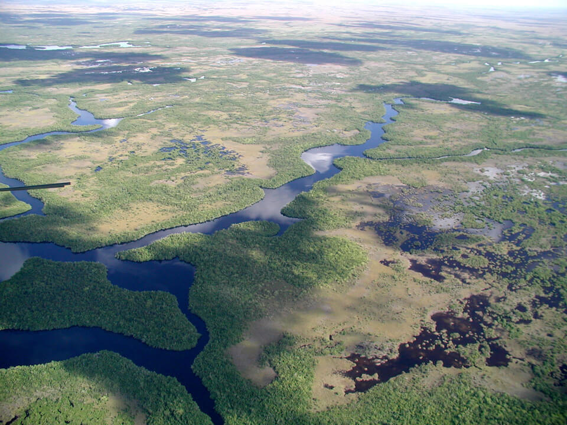

<content-header icon="freshwater_nonforested_wetlands" title="Floodplain Marsh" subtitle="within Freshwater Non-forested Wetlands">
</content-header>

<figcaption>Photo: NPS</figcaption>

### Overall vulnerability:

Low

<h3>Habitat area: 
<a href="/habitats/freshwater/2123/map" style="float:right;font-size:smaller;margin-right: 2rem;">
<fa-icon name="map"></fa-icon>
explore on map
</a>
</h3>

-   20,218 hectares within Florida (modeled)
-   0 hectares (<1%) is located on public lands

## General Information

Floodplain marshes are comprised of herbaceous vegetation and low shrubs that occur in river floodplains.  Emergent grasses, herbs, and shrubs that dominate floodplain marshes include sawgrass, maidencane, and buttonbush.  Other typical plans include sand cordgrass, dotted smartweed, arrowheads, pickerelweed, spikerush, glasswort, sea purslane, and water primrose.  They are maintained by regimes of fire and water.  Fires maintain the open herbaceous community by restricting shrub invasion, burning on a one to five year basis under natural conditions.  

Floodplain marshes are directly influenced by river flooding on an annual or semi-annual basis where most of the marsh is inundated from approximately 120 to 350 days per year.

This conservation asset includes Freshwater Tidal Marsh.

### Species

Limpkin, Florida sandhill crane, River otter, Wading birds, Waterfowl

## Impacts of Climate Change

Floodplain marsh is likely to have 28% of the current area inundated by 1 m of sea level rise and 46% inundated by 3 m of sea level rise.   Decreased precipitation coupled with increased temperature will likely alter species composition and increase fragmentation of larger systems through reduced flow and connectivity.  Decreases in water quantity and quality will continue to stress the system and cause degradation.  Increased precipitation and floods will cause increased run-off, erosion, siltation, and pollutants, all contributing to habitat degradation and loss.  In some circumstances these impacts could cause decreased reproductive success, increased stress and increased mortality.   For species whose reproductive cycle is linked to wet/dry cycles, changes in the timing and amount of precipitation could affect these life cycle events, potentially causing mismatches of phenological processes, leading to reduced reproductive success, reduced recruitment and increased mortality.

#### This habitat is expected to be impacted by sea level rise:

- 3 meters of sea level rise: 46% of area (9,279 ha)
- 1 meter of sea level rise: 28% of area (5,706 ha)

[Explore sea level rise impacts map](/habitats/freshwater/2123/map).

[More information about general climate impacts to ecosystems and habitats in Florida](/impacts/habitats).

### Impacts to Species

Many species of wading birds, including great egret, little blue heron, snowy egret, tricolored heron, and white ibis use floodplain marshes for foraging.  

Changes in hydrology due to increased temperatures and decreased precipitation will lead to loss of suitable foraging sites for wading birds.  

Reduced ability to use prescribed fire within floodplain marshes could alter species composition as woody vegetation and exotic plants encroach into the community, impacting species such as limpkin, Florida sandhill crane and waterfowl.  

Decreased water quality due to changes in the level and types of runoff entering the system from increased precipitation and floods will negatively impact species health, reproductive success, and survival.

[More information about general climate impacts to species in Florida](/impacts/species).

## Other Non-climate Threats

-	Chemicals and toxins
-	Conversion to agriculture
-	Dam operations/incompatible release of water
-	Groundwater withdrawal
-	Incompatible fire
-	Incompatible recreational activities
-	Incompatible resource extraction
-	Invasive animals
-	Invasive plants
-	Management of nature
-	Nutrient loads - agriculture and urban
-	Roads
-	Surface water withdrawal and diversion

## Adaptation Strategies

#### Protection

- Establish rolling easements, especially in those areas that will allow for plant migration.
- Protect buffer zones to allow for future system shifts/migration through easements, acquisition or purchase of development rights.
- Identify and protect ecologically significant areas such as breeding/nesting sites, wintering sites, and areas of high species diversity that will continue to serve these functions under climate change.
- Preserve the structural complexity and biodiversity of vegetation.
- Install water control structures at the outlets of freshwater wetlands to better manage water levels during dry periods.
- Protect areas that are naturally positioned to be more resistant/resilient to climate change.
- Facilitate wetland migration through setbacks, easements, or purchase.
- Protect aquatic corridors.
- Acquire and protect wetlands with the largest carbon stores.

#### Education/Outreach: 

- Collaborate with EPA, Corps of Engineers, Water Management Districts, Department of Environmental Protection to define and address regulatory concerns. Some wetlands may need added protection in light of climate change.
- Collaborate with water managers, including floodplain programs, drinking water programs, and drain engineers and others to consider wetland options for climate strategies.
- Develop focused outreach efforts and materials aimed at local, state, tribal, and federal government authorities involved in water management.
- Develop training on the use of existing and emerging tools for managing wetlands under climate change (e.g., vulnerability and risk assessments, scenario planning, decision support tools, and adaptive management).

#### Restoration

- Remove non-native species.
- Select native plant species for restoration efforts that are expected to be better adapted to future climate conditions.
- Improve connectivity by removing restrictions between rivers and  floodplain marshes (e.g., removing dams and culvert modification).
- Improve habitat quality to enhance the resilience of floodplain marsh to changing conditions.
- Replicate habitat types in multiple areas to spread risks associated with climate change.
- Promote restoration to fill gaps in wetland corridors.
- Review and revise techniques to maintain or mimic natural disturbance regimes (e.g., what techniques should be used when prescribed fire is no longer feasible).
- Replace culverts with those designed to accommodate future flow conditions and allow for fish and wildlife passage.
- Restore hydrologic connections, implementing designs that will accommodate both increased and decreased flow.
- Replace impervious surfaces with permeable pavement to allow runoff to flow through and be temporarily stored prior to discharge, in areas adjacent to wetlands.
- Implement best management practices to reduce sources of land-based pollutant and nutrient loads.
- Implement management practices that accommodate shifts in the timing of the rainy season and eliminate or reduce application of pesticides during this period.
- Practice prescribed fire management to maintain natural conditions.

#### Planning

- Study and better understand and address invasive species in climate-stressed wetlands.
- Beginning with existing management plans, determine the processes and actions needed to increase the resiliency of wetlands and watersheds in the face of climate change.
- Develop adaptive stormwater management plans (e.g., promoting natural buffers, adequate culvert sizing, remove impervious surfaces).
- Incorporate wetland and climate change ecosystem protection goals into watershed management, water planning, and comprehensive land planning including smart growth, and infrastructure development programs.
- Expand the planning horizons of land use planning to incorporate longer climate predictions.

#### Policy

- Create permitting rules that constrain locations for landfills, hazardous waste dumps, mine tailings, and toxic chemical facilities.
- Manage water demand (through water reuse, recycling, rainwater harvesting, desalination, etc.).
- Strengthen control of drainage of wetlands.
- Increase regulatory protection for wetlands most threatened by climate change to reduce stresses, provide opportunity for wetlands to migrate, and protect carbon stores.
- Prevent or limit groundwater extraction from aquifers during periods of drought.

#### Monitoring

- Monitor disease prevalence and occurrence (spatially and temporally).
- Monitor for introductions/increases in invasive species.
- Monitor water quality.
- Evaluate the effectiveness of various land and water management practices in reducing the impact of climate change on wetlands, adapting wetlands to such impacts, or compensating for losses of  acreage or function.
- Establish wetland reference sites to track changes in wetlands due to climate change.
- Monitor groundwater table.

[More information about adaptation strategies](/strategies).

## Additional Resources

 - [Florida Natural Areas Inventory Profile](http://www.fnai.org/PDF/NC/Floodplain_Marsh_Final_2010.pdf)
