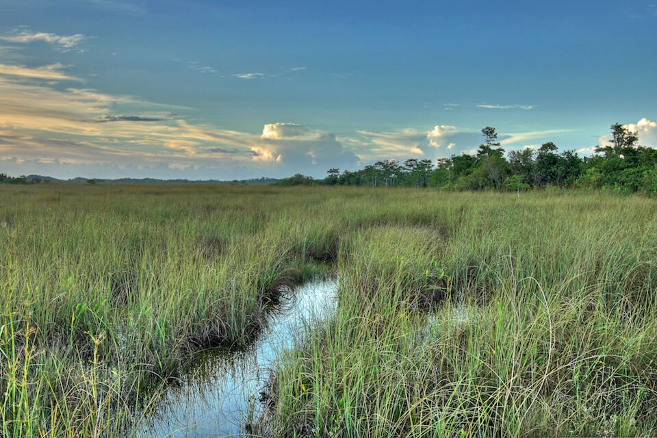

<content-header icon="freshwater_nonforested_wetlands" title="Glades Marsh" subtitle="within Freshwater Non-forested Wetlands">
</content-header>

<figcaption>Photo: NPS</figcaption>

### Overall vulnerability:

Very High

<h3>Habitat area: 
<a href="/habitats/freshwater/2125/map" style="float:right;font-size:smaller;margin-right: 2rem;">
<fa-icon name="map"></fa-icon>
explore on map
</a>
</h3>

-   559,833 hectares within Florida (modeled)
-   546,933 hectares (98%) is located on public lands

## General Information

Glades marshes area primarily herbaceous wetlands in South Florida, especially in the Everglades basin.  Glades marshes are situated in broad shallow channels with flowing water and characterized by emergent grasses, sedges and herbs.  The dominant species is sawgrass.  Other typical plants include buttonbush, coastal plain willow, arrowheads, pickerelweed, cutthroat grass, water primrose, bladderwort and muhly grass.  Soils are peat, unless removed by severe fire, or sands, and are generally located over linear depressions in the underlying limestone.  The natural hydrology consists of sheet flow that may be maintained on the order of 250 days per year.  

Natural, light fires occur every 1-5 years.  The majority of this community in the U.S. is in south Florida and the Everglades - Big Cypress region.

**TODO: map (if exists)**

### Species

American alligator, Everglade snail kite, Everglades mink, Marsh rabbit, Wading birds

## Impacts of Climate Change

Glades marsh is likely to have 30% of the current area inundated by 1 m of sea level rise and 92% inundated by 3 m of sea level rise.  Decreased precipitation coupled with increased temperature will likely alter species composition and increase fragmentation of larger systems through reduced flow and connectivity.  Decreases in water quantity and quality will continue to stress the system and cause degradation.     Increased precipitation and floods will cause increased run-off, erosion, siltation, and pollutants, all contributing to habitat degradation and loss.  In some circumstances these impacts could cause decreased reproductive success, increased stress and increased mortality.   For species whose reproductive cycle is linked to wet/dry cycles, changes in the timing and amount of precipitation could affect these life cycle events, potentially causing mismatches of phenological processes, leading to reduced reproductive success, reduced recruitment and increased mortality.

#### This habitat is expected to be impacted by sea level rise:

- 3 meters of sea level rise: 92% of area (515,112 ha)
- 1 meter of sea level rise: 30% of area (168,981 ha)

[Explore sea level rise impacts map](/habitat/freshwater/2125/map).

[More information about general climate impacts to ecosystems and habitats in Florida](/impacts/habitats).

### Impacts to Species

The Glades marsh is important habitat for the American alligator.  The alligator is considered a keystone species in this community, creating small ponds (alligator holes) that provide habitat for other species during periods of drought.  Changes in the amount and timing of precipitation will impact the abundance, distribution and reproductive success of the alligator, which in turn, will impact multiple other species.  

Many species of wading birds, including great egret, little blue heron, snowy egret, tricolored heron, and white ibis use Glades marsh for foraging.  Changes in hydrology due to increased temperatures and decreased precipitation will lead to loss of suitable foraging sites for wading birds.  

Glades marsh provides critical habitat for the federally endangered snail kite.  Changes to timing, amount, and duration of precipitation will impact the suitability of this community for snail kites and apples snails (the kites main prey item).  Changes in the amount and type of chemicals in runoff will impact many of the food items (e.g., invertebrates, fish) that wading birds and snail kites depend upon.  

Sea level rise will impact a significant portion of this community, leading to alterations in habitat suitability for many of these species as freshwater plants shift to more salt tolerant species and replacement of herbaceous vegetation by woody mangrove species.

[More information about general climate impacts to species in Florida](/impacts/species).

## Other Non-climate Threats

-	Chemicals and toxins
-	Conversion to agriculture
-	Dam operations/incompatible release of water
-	Groundwater withdrawal
-	Incompatible fire
-	Incompatible recreational activities
-	Incompatible resource extraction
-	Invasive animals
-	Invasive plants
-	Management of nature
-	Nutrient loads - agriculture and urban
-	Roads
-	Surface water withdrawal and diversion

## Adaptation Strategies

#### Monitoring

- Monitor disease prevalence and occurrence (spatially and temporally).
- Monitor for introductions/increases in invasive species.
- Monitor groundwater table.
- Monitor water quality.
- Evaluate the effectiveness of various land and water management practices in reducing the impact of climate change on wetlands, adapting wetlands to such impacts, or compensating for losses of  acreage or function.
- Establish wetland reference sites to track changes in wetlands due to climate change.

#### Education/Outreach: 

- Collaborate with water managers, including floodplain programs, drinking water programs, and drain engineers and others to consider wetland options for climate strategies.
- Develop focused outreach efforts and materials aimed at local, state, tribal, and federal government authorities involved in water management.
- Develop training on the use of existing and emerging tools for managing wetlands under climate change (e.g., vulnerability and risk assessments, scenario planning, decision support tools, and adaptive management).
- Collaborate with EPA, Corps of Engineers, Water Management Districts, Department of Environmental Protection to define and address regulatory concerns. Some wetlands may need added protection in light of climate change.

#### Protection

- Identify and protect ecologically significant areas such as breeding/nesting sites, wintering sites, and areas of high species diversity that will continue to serve these functions under climate change.
- Protect buffer zones to allow for future system shifts/migration through easements, acquisition or purchase of development rights.
- Preserve the structural complexity and biodiversity of vegetation.
- Protect areas that are naturally positioned to be more resistant/resilient to climate change.
- Facilitate wetland migration through setbacks, easements, or purchase.
- Protect aquatic corridors.
- Acquire and protect wetlands with the largest carbon stores.
- Install water control structures at the outlets of freshwater wetlands to better manage water levels during dry periods.

#### Restoration

- Replicate habitat types in multiple areas to spread risks associated with climate change.
- Promote restoration to fill gaps in wetland corridors.
- Control invasive species in climate-stressed wetlands.
- Practice prescribed fire management to maintain natural conditions.
- Review and revise techniques to maintain or mimic natural disturbance regimes (e.g., what techniques should be used when prescribed fire is no longer feasible).
- Replace culverts with those designed to accommodate future flow conditions and allow for fish and wildlife passage.
- Implement management practices that accommodate shifts in the timing of the rainy season and eliminate or reduce application of pesticides during this period.
- Restore hydrologic connections, implementing designs that will accommodate both increased and decreased flow.
- Replace impervious surfaces with permeable pavement to allow runoff to flow through and be temporarily stored prior to discharge, in areas adjacent to wetlands.
- Develop adaptive stormwater management practices (e.g., promoting natural buffers, adequate culvert sizing).

#### Planning

- Study and better understand and address invasive species in climate-stressed wetlands.
- Beginning with existing management plans, determine the processes and actions needed to increase the resiliency of wetlands and watersheds in the face of climate change.
- Develop adaptive stormwater management plans (e.g., promoting natural buffers, adequate culvert sizing, remove impervious surfaces).
- Incorporate wetland and climate change ecosystem protection goals into watershed management, water planning, and comprehensive land planning including smart growth, and infrastructure development programs.
- Expand the planning horizons of land use planning to incorporate longer climate predictions.

#### Policy

- Create permitting rules that constrain locations for landfills, hazardous waste dumps, mine tailings, and toxic chemical facilities.
- Manage water demand (through water reuse, recycling, rainwater harvesting, desalination, etc.).
- Prevent or limit groundwater extraction from aquifers during periods of drought.
- Increase regulatory protection for wetlands most threatened by climate change to reduce stresses, provide opportunity for wetlands to migrate, and protect carbon stores.
- Strengthen control of drainage of wetlands.

[More information about adaptation strategies](/strategies).

## Additional Resources

 - [Florida Natural Areas Inventory Profile](http://www.fnai.org/PDF/NC/Glades_Marsh_Final_2010.pdf)
