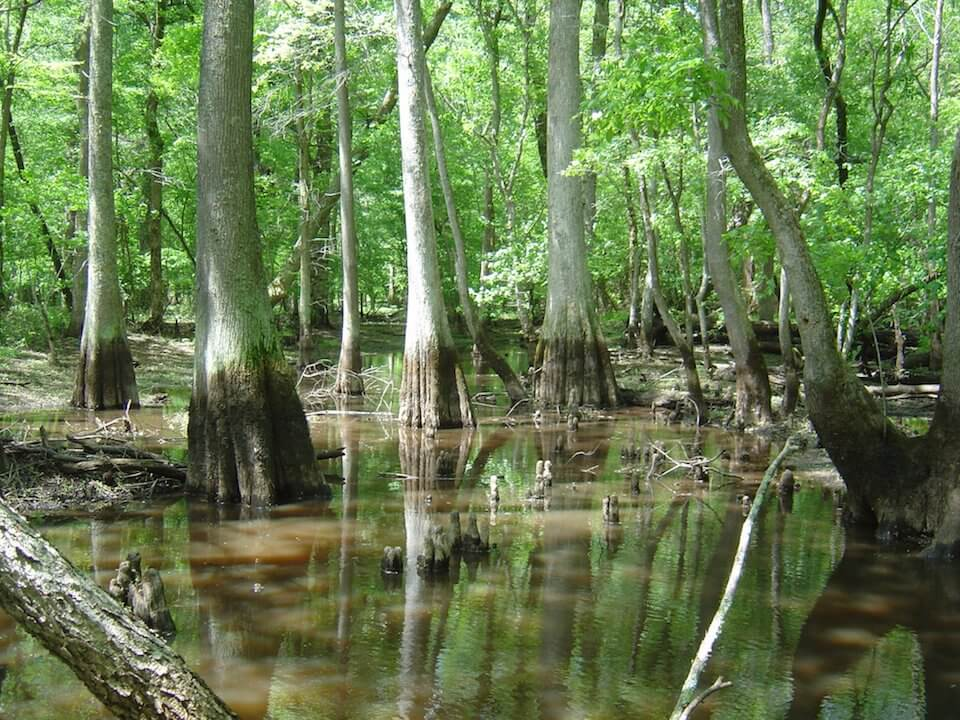

<content-header icon="freshwater_forested_wetlands" title="Freshwater Forested Wetlands"></content-header>

<figcaption>Photo: USFWS</figcaption>

### Overall vulnerability:

This conservation asset was not assessed for vulnerability.

### Area:

-   2,165,811 hectares within Florida (modeled)

-   981,720 hectares (45%) is located on public lands

**TODO: map (if exists)**

## General Information

Florida has a diversity of forested wetlands (swamps).  The type of swamp found in any particular place is the result of topography, soils, length of inundation and association with rivers and streams.  Floodplain swamps are seasonally flooded wetland forests composed of a diverse assortment of hydric hardwoods which occur on the rich alluvial soils of silt and clay deposited along river floodplains, particularly several Panhandle rivers including the Apalachicola, Choctawhatchee, and Escambia. 

The most common type of swamp in Florida is the cypress swamp, which occurs in all parts of Florida except the Keys.  These regularly inundated wetlands form a forested border along large rivers, creeks, and lakes, or occur in depressions as circular domes or linear strands.  

Wet flatwoods are found in flatlands with sand substrate and are seasonally inundated.   They have a pine canopy with a sparse or absent midstory and a dense groundcover of grasses, herbs, and low shrubs. Hydric hammock occurs on soils that are poorly drained or have high water tables. This association is a still-water wetland, flooded less frequently and for shorter periods of time than mixed hardwood and cypress swamps.

This conservation asset includes  Cypress/Tupelo Swamp, Coniferous Wetlands, Hardwood Wetlands, and Mixed Wetland Forest.

### Habitats

- [Cypress Swamp](/habitats/freshwater/2210)- [Strand Swamp](/habitats/freshwater/2214)- [Floodplain Swamp](/habitats/freshwater/2215)- [Wet Flatwoods](/habitats/freshwater/2221)- [Hydric Hammock](/habitats/freshwater/2232)

### Species

Big Cypress fox squirrel, Florida black bear, Florida panther, Louisiana waterthrush, Short-tailed hawk, Southern bald eagle, Swallow-tailed kite, Wading birds

## Impacts of Climate Change

The projected warming and potential drying will lead to increased threat of drought and wildfire in forested wetland systems.  Plant distributions may change due to drought, leading to compositional and structural changes within the wetland systems.  Drier conditions could lead to an increase in mesophytic shrubs and hardwoods.  

As trees become stressed due to heat and drought they may become more susceptible to attack by pests and pathogens.  The forested wetland systems will become fragmented as some areas dry, creating disconnected wetland systems.  

An increase in flooding or longer wet periods (permanent standing water) may adversely impact cypress and tupelo growth, as these species require some dry periods for seedling growth.  

Sea level rise will impact forested wetlands as length of inundation and salinity levels increase.  Some tree species (e.g., oaks) are highly susceptible to the combination of flooding and salinity stress and will not survive, being replaced by other more salt tolerant species. In some areas, invasive species such as the Chinese tallow may become even more prominent in areas undergoing stress due to sea level rise or storm surges.  

Some areas of coastal forested wetland may be displaced by mangrove forests as sea levels rise and winter temperatures warm.

#### This conservation asset is expected to be impacted by sea level rise:

- 3 meters of sea level rise: 21% of area (451,697 ha)
- 1 meter of sea level rise: 10% of area (207,335 ha)
    

[More information about general climate impacts to ecosystems and habitats in Florida](/impacts/habitats).

### Impacts to Species

Long-term drying of forested wetlands may greatly impact species diversity and population dynamics.  Fragmentation of the habitat will impact species' ability to disperse/move between isolated wet areas.  

For species whose reproductive cycle is linked to wet/dry cycles, changes in the timing and amount of precipitation could affect these life cycle events, potentially causing mismatches of phenological processes, leading to reduced reproductive success, reduced recruitment and increased mortality.  

Many species such as white-tailed deer, black bear, and fox squirrels depend on the availability of soft and hard mast produced within forested wetlands.  Changes in precipitation, temperature, salinity and fire regimes which would lead to a loss of these mast producing species would negatively affect the suitability of these systems to provide an adequate supply of food.

[More information about general climate impacts to species in Florida](/impacts/species).

## Other Non-climate Threats

-	Conversion to agriculture
-	Conversion to housing and urban development
-	Groundwater withdrawal
-	Incompatible fire
-	Incompatible forestry practices
-	Incompatible recreational activities
-	Incompatible resource extraction
-	Invasive animals
-	Invasive plants
-	Nutrient loads - agriculture and urban
-	Roads
-	Surface water withdrawal and diversion

