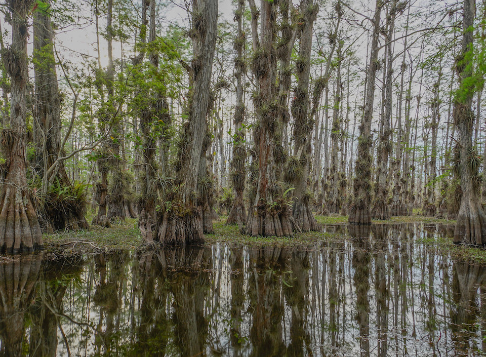

<content-header icon="freshwater_forested_wetlands" title="Cypress Swamp" subtitle="within Freshwater Forested Wetlands"></content-header>

<figcaption>Photo: NPS</figcaption>

### Overall vulnerability:

Low

<h3>Habitat area: 
<a href="/habitats/freshwater/2210/map" style="float:right;font-size:smaller;margin-right: 2rem;">
<fa-icon name="map"></fa-icon>
explore on map
</a>
</h3>

-   611,502 hectares within Florida (modeled)
-   257,464 hectares (42%) is located on public lands

## General Information

Cypress swamps are strongly dominated by either bald cypress or pond cypress, with very low numbers of scattered black gum, red maple, and sweetbay.  These regularly inundated wetlands form a forested border along large rivers, creeks, and lakes, or occur in depressions as circular domes or linear strands.  Understory and ground cover are usually sparse due to frequent flooding but sometimes include such species as buttonbush, lizard's-tail, and various ferns.

This conservation asset includes Cypress, Tupelo, Isolated Freshwater Swamp, Strand Swamp, and Floodplain Swamp.

**TODO: map (if exists)**

### Species

Big Cypress fox squirrel, Short-tailed hawk, Southern bald eagle, Wading birds

## Impacts of Climate Change

Cypress swamp is expected to have only minimal impacts (6%) from 1 m of sea level rise, but could have up to 26% of the current area inundated by 3 m of sea level rise.  Some species, such as bald cypress have some tolerance to increased saltwater inundation and may persist longer than other species found within this community; however, with longer durations and more frequent inundations, even these species will not persist.   An increase in flooding or longer wet periods (permanent standing water) may adversely impact cypress and tupelo growth, as these species require some dry periods for seedling growth.    Decreased precipitation coupled with increased temperature will likely alter species composition and increase fragmentation of larger systems.  Decreases in water quantity and quality will stress the system and cause degradation.   Increased precipitation and floods will cause increased run-off, erosion, siltation, and pollutants, all contributing to habitat degradation and loss.  In some circumstances these impacts could cause decreased reproductive success, increased stress and increased mortality.  Fire is essential for maintaining the structure and species composition of cypress dome swamps, with reduced periodic fires cypress could become less dominant as hardwood species increase.  Drier conditions could lead to catastrophic wildfires, burning the muck fuels and killing the cypress trees, which can lead to the swamp transforming into a pond, wet prairie or shrub bog.

#### This habitat is expected to be impacted by sea level rise:

- 3 meters of sea level rise: 26% of area (159,488 ha)
- 1 meter of sea level rise: 6% of area (36,583 ha)

[Explore sea level rise impacts map](/habitat/freshwater/2210/map).

[More information about general climate impacts to ecosystems and habitats in Florida](/impacts/habitats).

### Impacts to Species

Cypress swamps provide important roosting sites for wading birds such as white ibis and wood stork.  Alterations of structure of these swamps due to changes in precipitation patterns could result in a loss of suitable roosting sites.  

Reduced fire would cause understory vegetation to grow and lead to the habitat becoming unsuitable for Big Cypress fox squirrels, which is a primarily ground-dwelling species that needs a more open understory.  Additionally, the Big Cypress fox squirrel would be impacted by changes in the plant composition if there was a reduction in hard and soft mast producing species.  

For species whose reproductive cycle is linked to wet/dry cycles, changes in the timing and amount of precipitation could affect these life cycle events, potentially causing mismatches of phenological processes, leading to reduced reproductive success, reduced recruitment and increased mortality.

[More information about general climate impacts to species in Florida](/impacts/species).

## Other Non-climate Threats

-	Conversion to agriculture
-	Conversion to housing and urban development
-	Groundwater withdrawal
-	Incompatible fire
-	Incompatible forestry practices
-	Incompatible resource extraction
-	Invasive animals
-	Invasive plants
-	Nutrient loads - agriculture and urban
-	Roads
-	Surface water withdrawal and diversion

## Adaptation Strategies

#### Education/Outreach

- Work with communities to reduce stormwater runoff and improve water quality.
- Implement outreach to increase public understanding of the increased wildfire risks due to climate change.
- Work with counties, local municipalities and regional planning councils to incorporate natural resources adaptation strategies in comprehensive plans and hazard planning efforts.
- Develop educational materials for private landowners on appropriate use fertilizers and pesticides and impacts on water quality, include potential incentives to reduce use.
- Enhance outreach efforts to correlate water quality and habitat health to improve public stewardship and support actions to improve water quality.
- Work with volunteers to control invasive species.
- Actively engage with communities to minimize urban encroachment.

#### Policy

- Review and update Best Management Practices to accommodate current and future conditions.
- Identify overused areas and limit recreational trails/roads and OHV use.
- Centralize recreation impacts to easy-access areas.
- Provide greater regulation and enforcement of recreational use and access restrictions.
- Develop policies and incentives for decreasing impervious surfaces.
- Encourage the passage of state regulations to strengthen protection of forested wetlands.

#### Monitoring

- Monitor vegetation as density and distributions shift with environmental changes.
- Inventory culverts and other barriers to flow.
- Monitor pollutants.
- Monitor natural community range shifts.
- Monitor for introductions/increases in invasive species.
- Monitor disease prevalence and occurrence (spatially and temporally).

#### Planning

- Reduce roadway and paved area construction near sensitive systems to maintain natural hydrology.
- Collaborate with other agencies to ensure new water control structures have consideration for future conditions.

#### Protection

- Maintain habitat quality to enhance the resilience of cypress swamps to changing conditions.
- Maintain floodplains as undeveloped areas.
- Protect interior forested wetlands for floodwater storage.
- Identify and prioritize protection of corridors between forested wetland areas and associated upland habitats to enhance species movement and migration.
- Identify important (and potentially resilient) cypress swamps to serve as refugia and provide opportunities for range shifts, prioritize inclusion in land protection planning efforts.
- Preserve cypress swamps and their buffers that are not yet impacted by human development.
- Encourage landowner cost share programs and enrollment in conservation easements to increase habitat base.
- Land exchange programs – owners exchange property in the floodplain for land outside of the floodplain.

#### Restoration

- Remove non-native species.
- Restore riparian areas to increase water retention and uptake of soil retention and reduce impacts of flood events, erosion, and sedimentation.
- Replace culverts with those designed to accommodate future flow conditions and allow for fish and wildlife passage.
- Implement best management practices to reduce sources of land-based pollutant and nutrient loads.
- Implement management practices that eliminate or reduce application of pesticides in the rainy season.
- Remove ditches to deter saltwater intrusion and restore natural water flow.
- Improve habitat quality to enhance the resilience of cypress swamp to changing conditions.
- Improve connectivity by removing restrictions between rivers and floodplains (e.g., removing dams and culvert modification).
- Select native plant species for restoration efforts that are expected to be better adapted to future climate conditions.
- Practice prescribed fire management to maintain fuel loads and natural conditions.
- Remove barriers to allow inland shifts of coastal forested wetland habitats affected by increased salinity and sea level rise.

[More information about adaptation strategies](/strategies).

