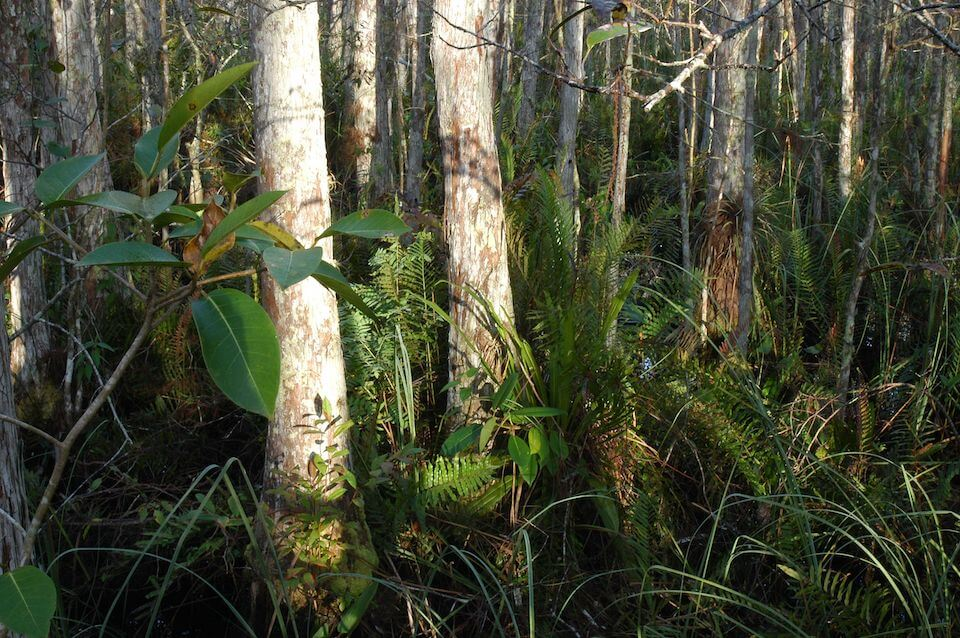

<content-header icon="freshwater_forested_wetlands" title="Strand Swamp" subtitle="within Freshwater Forested Wetlands">
</content-header>

<figcaption>Photo: Gary Knight, FNAI</figcaption>

### Overall vulnerability:

Low

<h3>Habitat area: 
<a href="/habitats/freshwater/2214/map" style="float:right;font-size:smaller;margin-right: 2rem;">
<fa-icon name="map"></fa-icon>
explore on map
</a>
</h3>

-   17,900 hectares within Florida (modeled)
-   16,494 hectares (92%) is located on public lands

## General Information

Strand swamps are shallow, forested, usually elongated depressions or channels dominated by bald cypress.  They are seasonally inundated, with slow flowing water.  Typical plants include red maple, laurel oak, cabbage palm, strangler fig, red bay, sweet bay, wax myrtle, leather fern, royal fern, sawgrass, swamp primrose, and dotted smartweed.  Canopy plants are mainly temperate, while understory and epiphytic plants are mainly tropical. They are found in the vicinity of Lake Okeechobee southward in the central and southern peninsula.  

Fire occurs only occasionally or rarely.

### Species

Big Cypress fox squirrel, Florida black bear, Southern bald eagle, Wading birds

## Impacts of Climate Change

Decreased precipitation coupled with increased temperature will likely alter species composition and increase fragmentation of larger strand swamp systems. Droughts could increase the risk of wildfires, leading to fires burning into the peat and killing cypress trees and lowering the ground surface, transforming a strand swamp into a slough.  Without occasional fires, hardwood species would invade the strand swamp.   Decreases in water quantity and quality will stress the system and cause degradation.   Increased precipitation and floods will cause increased run-off, erosion, siltation, and pollutants, all contributing to habitat degradation and loss.  In some circumstances these impacts could cause decreased reproductive success, increased stress and increased mortality.   For species whose reproductive cycle is linked to wet/dry cycles, changes in the timing and amount of precipitation could affect these life cycle events, potentially causing mismatches of phenological processes, leading to reduced reproductive success, reduced recruitment and increased mortality.

#### This habitat is expected to be impacted by sea level rise:

- 3 meters of sea level rise: 19% of area (3,393 ha)
- 1 meter of sea level rise: 6% of area (1,082 ha)

[Explore sea level rise impacts map](/habitats/freshwater/2214/map).

[More information about general climate impacts to ecosystems and habitats in Florida](/impacts/habitats).

### Impacts to Species

Many species of wading birds depend on the mosaic of habitat found in strand swamps for foraging and nesting, especially wood storks.  Alterations to the hydrology and species composition of strand swamps could create unsuitable foraging or nesting conditions for wading birds.    

For species whose reproductive cycle is linked to wet/dry cycles, changes in the timing and amount of precipitation could affect these life cycle events, potentially causing mismatches of phenological processes, leading to reduced reproductive success, reduced recruitment and increased mortality.  Species such as the Big Cypress fox squirrel and black bear would be impacted by changes in the plant composition if there was a reduction in hard and soft mast producing species.

[More information about general climate impacts to species in Florida](/impacts/species).

## Other Non-climate Threats

-	Conversion to agriculture
-	Conversion to housing and urban development
-	Groundwater withdrawal
-	Incompatible fire
-	Incompatible forestry practices
-	Incompatible resource extraction
-	Invasive animals
-	Invasive plants
-	Nutrient loads - agriculture and urban
-	Roads
-	Surface water withdrawal and diversion

## Adaptation Strategies

#### Education/Outreach

- Enhance outreach efforts to correlate water quality and habitat health to improve public stewardship and support actions to improve water quality.
- Implement outreach to increase public understanding of the increased wildfire risks due to climate change.
- Work with communities to reduce stormwater runoff and improve water quality.
- Work with counties, local municipalities and regional planning councils to incorporate natural resources adaptation strategies in comprehensive plans and hazard planning efforts.
- Actively engage with communities to minimize urban encroachment.
- Develop educational materials for private landowners on appropriate use fertilizers and pesticides and impacts on water quality, include potential incentives to reduce use.
- Work with volunteers to control invasive species.

#### Planning

- Reduce roadway and paved area construction near sensitive systems to maintain natural hydrology.
- Collaborate with other agencies to ensure new water control structures have consideration for future conditions.

#### Policy

- Encourage the passage of state regulations with supporting local level zoning and planning ordinances to strengthen protection of forested wetlands.
- Review and update Best Management Practices to accommodate current and future conditions.
- Develop policies and incentives for decreasing impervious surfaces.

#### Monitoring

- Inventory culverts and other barriers to flow.
- Monitor pollutants.
- Monitor natural community range shifts.
- Monitor for introductions/increases in invasive species.
- Monitor vegetation as density and distributions shift with environmental changes.
- Monitor disease prevalence and occurrence (spatially and temporally).

#### Restoration

- Remove non-native species.
- Improve connectivity by removing restrictions between rivers and floodplains (e.g., removing dams and culvert modification).
- Select native plant species for restoration efforts that are expected to be better adapted to future climate conditions.
- Practice prescribed fire management to maintain fuel loads and natural conditions.
- Replace culverts with those designed to accommodate future flow conditions and allow for fish and wildlife passage.
- Implement best management practices to reduce sources of land-based pollutant and nutrient loads.
- Implement management practices that eliminate or reduce application of pesticides in the rainy season.
- Remove ditches to deter saltwater intrusion and restore natural water flow.
- Remove barriers to allow inland shifts of coastal forested wetland habitats affected by increased salinity and sea level rise.
- Improve habitat quality to enhance the resilience of strand swamp to changing conditions.
- Restore riparian areas to increase water retention and uptake of soil retention and reduce impacts of flood events, erosion, and sedimentation.

#### Protection: 

- Maintain floodplains as undeveloped areas.
- Protect interior forested wetlands for floodwater storage.
- Identify and prioritize protection of corridors between forested wetland areas and associated upland habitats to enhance species movement and migration.
- Identify important (and potentially resilient) strand swamps to serve as refugia and provide opportunities for range shifts, prioritize inclusion in land protection planning efforts.
- Preserve strand swamps and their buffers that are not yet impacted by human development.
- Encourage landowner cost share programs and enrollment in conservation easements to increase habitat base.
- Land exchange programs – owners exchange property in the floodplain for land outside of the floodplain.
- Maintain habitat quality to enhance the resilience of strand swamps to changing conditions.

[More information about adaptation strategies](/strategies).

## Additional Resources

 - [Florida Natural Areas Inventory Profile](http://www.fnai.org/PDF/NC/Strand_Swamp_Final_2010.pdf)
