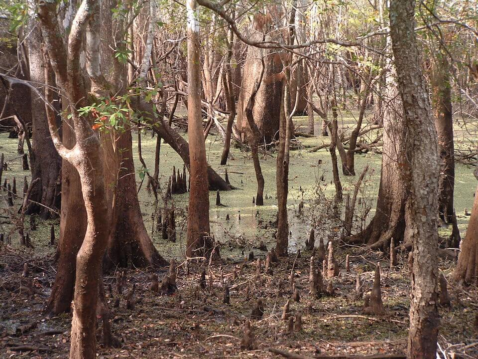

<content-header icon="freshwater_forested_wetlands" title="Floodplain Swamp" subtitle="within Freshwater Forested Wetlands">
</content-header>

<figcaption>Photo: FWC</figcaption>

### Overall vulnerability:

This habitat was not assessed for vulnerability.

<h3>Habitat area: 
<a href="/habitats/freshwater/2215/map" style="float:right;font-size:smaller;margin-right: 2rem;">
<fa-icon name="map"></fa-icon>
explore on map
</a>
</h3>

-   170,480 hectares within Florida (modeled)
-   128,825 hectares (76%) is located on public lands

## General Information

Floodplain swamps are seasonally flooded wetland forests composed of a diverse assortment of hydric hardwoods which occur on the rich alluvial soils of silt and clay deposited along river floodplains, particularly several Panhandle rivers including the Apalachicola, Choctawhatchee, and Escambia. These communities are characterized by an overstory that includes water hickory, overcup oak, swamp chestnut oak, river birch, American sycamore, red maple, Florida elm, bald cypress, blue beech, and swamp ash. 

The understory can range from open and park-like to dense and nearly impenetrable. Understory plants can include bluestem palmetto, hackberry, swamp azalea, pink azalea, lanceleaf greenbrier, poison ivy, peppervine, rattanvine, indigo bush, white grass, plume grass, redtop panicum, caric sedges, silverbells, crossvine, American wisteria, and wood grass.  Soils and hydroperiods primarily determine the diverse temporary and permanent species composition along with community structure.

This conservation asset includes Freshwater Tidal Swamp.

**TODO: map (if exists)**

### Species

Cooper's hawk, Louisiana waterthrush, Short-tailed hawk, River otter, Alligator snapping turtle, Wading birds

## Impacts of Climate Change

Floodplain swamp is likely to have 30% of the current area inundated by 1 m of sea level rise and 40% inundated by 3 m of sea level rise.  Longer periods of drought will lead to extensive drying of portions of the swamp, particularly those areas isolated from the river such as meanders and backswamps. Fire does not usually occur in this system; however, frequency of fire may increase if extensive droughts become more common.  Fires may contribute to dominance by cypress, which are somewhat fire-resistant, and lead to damage of the understory species that are not adapted to withstand fires.   Freshwater tidal swamps are already experiencing mortality and retreat due to increasing saltwater intrusion due to storm surge, drought, and inundation from rising sea levels.  Species composition is changing in these forests as less salt tolerant species die and more salt tolerant species and/or marsh and mangrove species advance.

#### This habitat is expected to be impacted by sea level rise:

- 3 meters of sea level rise: 40% of area (68,833 ha)
- 1 meter of sea level rise: 29% of area (49,781 ha)

[Explore sea level rise impacts map](/habitat/freshwater/2215/map).

[More information about general climate impacts to ecosystems and habitats in Florida](/impacts/habitats).

### Impacts to Species

Many species of wading birds depend on the mosaic of habitat found in strand swamps for foraging and nesting.  Alterations to the hydrology and species composition of floodplain swamps could create unsuitable foraging or nesting conditions for wading birds. Fish dependent on the oxbows and back swamps for breeding grounds will be impacted during periods of drought when these areas remain disconnected from the river.  Species such as the river otter and alligator snapping turtle may lose habitat as areas of deeper water are reduced or eliminated due to decreased precipitation, longer dry periods and drought.  

Increased temperatures could impact the reproductive success and sex ratios of Alligator snapping turtle hatchlings.  The upper pivotal temperature is approximately 27.5 C, with higher temperatures producing female-biased hatchlings and extreme high incubation temperatures negatively affecting embryo survival.

[More information about general climate impacts to species in Florida](/impacts/species).

## Other Non-climate Threats

-	Conversion to agriculture
-	Conversion to housing and urban development
-	Groundwater withdrawal
-	Incompatible fire
-	Incompatible forestry practices
-	Incompatible resource extraction
-	Invasive animals
-	Invasive plants
-	Nutrient loads - agriculture and urban
-	Roads
-	Surface water withdrawal and diversion

## Adaptation Strategies

#### Restoration

- Remove ditches to deter saltwater intrusion and restore natural water flow.
- Remove barriers to allow inland shifts of coastal forested wetland habitats affected by increased salinity and sea level rise.
- Improve habitat quality to enhance the resilience of floodplain swamp to changing conditions.
- Select native plant species for restoration efforts that are expected to be better adapted to future climate conditions.
- Implement management practices that eliminate or reduce application of pesticides in the rainy season.
- Remove non-native species.
- Implement best management practices to reduce sources of land-based pollutant and nutrient loads.
- Improve connectivity by removing restrictions between rivers and floodplains (e.g., removing dams and culvert modification).
- Practice prescribed fire management to maintain fuel loads and natural conditions.
- Restore riparian areas to increase water retention and uptake of soil retention and reduce impacts of flood events, erosion, and sedimentation.
- Replace culverts with those designed to accommodate future flow conditions and allow for fish and wildlife passage.

#### Policy

- Encourage the passage of state regulations with supporting local level zoning and planning ordinances to strengthen protection of forested wetlands.
- Develop policies and incentives for decreasing impervious surfaces.
- Identify overused areas and limit recreational trails/roads and OHV use.
- Centralize recreation impacts to easy-access areas.
- Review and update Best Management Practices to accommodate current and future conditions.
- Provide greater regulation and enforcement of recreational use and access restrictions.

#### Planning

- Collaborate with other agencies to ensure new water control structures have consideration for future conditions.
- Reduce roadway and paved area construction near sensitive systems to maintain natural hydrology.

#### Protection: 

- Land exchange programs – owners exchange property in the floodplain for land outside of the floodplain.
- Encourage landowner cost share programs and enrollment in conservation easements to increase habitat base.
- Preserve floodplain swamps and their buffers that are not yet impacted by human development.
- Maintain habitat quality to enhance the resilience of floodplain swamps to changing conditions.
- Identify important (and potentially resilient) floodplain swamps to serve as refugia and provide opportunities for range shifts, prioritize inclusion in land protection planning efforts.
- Identify and prioritize protection of corridors between forested wetland areas and associated upland habitats to enhance species movement and migration.
- Protect interior forested wetlands for floodwater storage.
- Maintain floodplains as undeveloped areas.

#### Education/Outreach

- Implement outreach to increase public understanding of the increased wildfire risks due to climate change.
- Work with volunteers to control invasive species.
- Develop educational materials for private landowners on appropriate use fertilizers and pesticides and impacts on water quality, include potential incentives to reduce use.
- Actively engage with communities to minimize urban encroachment.
- Work with counties, local municipalities and regional planning councils to incorporate natural resources adaptation strategies in comprehensive plans and hazard planning efforts.
- Work with communities to reduce stormwater runoff and improve water quality.
- Enhance outreach efforts to correlate water quality and habitat health to improve public stewardship and support actions to improve water quality.

#### Monitoring

- Monitor disease prevalence and occurrence (spatially and temporally).
- Monitor vegetation as density and distributions shift with environmental changes.
- Monitor for introductions/increases in invasive species.
- Monitor pollutants.
- Inventory culverts and other barriers to flow.
- Monitor natural community range shifts.

[More information about adaptation strategies](/strategies).

## Additional Resources

 - [Florida Natural Areas Inventory Profile](http://www.fnai.org/PDF/NC/Floodplain_Swamp_Final_2010.pdf)
