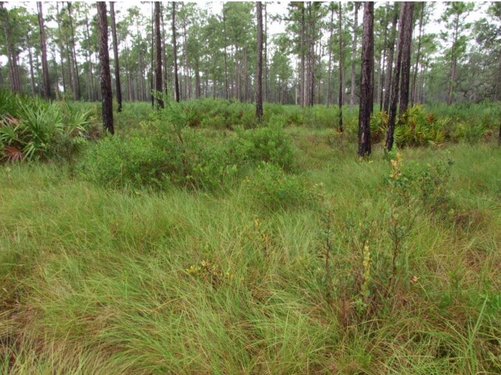

# Wet Flatwoods

### within Freshwater Forested Wetlands

<figcaption>Photo: Katy NeSmith, FNAI</figcaption>

### Overall vulnerability:

Moderate

### Area:

-   308,338 hectares within Florida (modeled)

-   152,895 hectares (50%) is located on public lands

## General Information

Wet flatwoods are pine forests with a sparse or absent midstory and a dense groundcover of grasses, herbs, and low shrubs. The pine canopy typically consists of one or a combination of longleaf pine, slash pine, pond pine, or South Florida slash pine.  This community is found in flatlands with sand substrate and are seasonally inundated. They often occur in the ecotones between mesic flatwoods and shrub bogs, wet prairies, dome swamps, or strand swamps. 

Wet flatwoods also occur in broad, low flatlands, often in a mosaic with these communities. The understory and ground cover within this community includes several common species such as saw palmetto, gallberry, wax myrtle, and a wide variety of grasses and herbs, along with fetterbush and bay trees. It is found statewide except extreme southern peninsula and the Keys.  Fire occurs fairly frequently, 2-4 years for grassy wet flatwoods and 5-10 years for shrubby wet flatwoods.

This conservation asset includes Hydric Pine Flatwoods, and Hydric Pine Savanna.

**TODO: map (if exists)**

### Species

Everglades mink, Florida panther, Frosted flatwoods salamander, Reticulated flatwoods salamander, Sherman's fox squirrel

## Impacts of Climate Change

Plants within wet flatwoods are already fairly resilient to changes in moisture, having to withstand the stress of soil saturation or inundation during the wet part of the year, as well as dry conditions at other times.  However, extreme drought and heat stress caused by increased temperatures could lead to changes in species composition and structure and increased mortality.   For species whose reproductive cycle is linked to wet/dry cycles, changes in the timing and amount of precipitation could affect these life cycle events, potentially causing mismatches of phenological processes, leading to reduced reproductive success, reduced recruitment and increased  mortality.  Higher winter air temperatures will increase over-wintering Southern pine beetle larva survival rate, and higher annual air temperatures will allow the beetles to produce more generations per year. Severe drought stress reduces resin production and greatly increases the susceptibility of trees to beetle infestation.  Altered fire regimes or the absence of fire could lead to compositional and structural changes, potentially altering the system's suitability to the current suite of species.  The absence of fire in flatwoods communities can lead to a dense mid-story.  Additionally, some plants have reduced reproductive success without frequent fire, as fire is required for their reproduction.    Increased summer and winter minimum temperatures, as well as increased extreme events (e.g., droughts, floods) will enhance invasive species processes, from introduction through establishment and expansion.

#### This habitat is expected to be impacted by sea level rise:

- 3 meters of sea level rise: 16% of area (49,530 ha)
- 1 meter of sea level rise: 5% of area (15,360 ha)
    

[More information about general climate impacts to ecosystems and habitats in Florida](/impacts/habitats).

### Impacts to Species

Several species, including the frosted flatwoods salamander, reticulated flatwoods salamander and Panama City crayfish, are associated with small wetlands found within a flatwoods matrix.  Changes in the timing and amount of precipitation could affect these species' life cycle events, leading to reduced reproductive success, reduced recruitment and increased mortality. 

Wet flatwoods provide habitat for large, wide-ranging species such as the Florida panther and black bear.  Changes in precipitation and temperature that would lead to fragmentation of these systems would impact the suitability as travel corridors for these species.   Species such as the red-cockaded woodpecker and Sherman's fox squirrel would be impacted as the openness of the flatwoods become more densely vegetated as species composition shifts in response to changes in precipitation patterns and altered fire regimes.

[More information about general climate impacts to species in Florida](/impacts/species).

## Other Non-climate Threats

-	Conversion to agriculture
-	Conversion to housing and urban development
-	Incompatible fire
-	Incompatible forestry practices
-	Invasive animals
-	Invasive plants
-	Roads

## Adaptation Strategies

#### Policy

- Encourage the passage of state regulations to strengthen protection of flatwoods.
- Develop policies and incentives for decreasing impervious surfaces.
- Review and update Best Management Practices to accommodate current and future conditions.
- Identify overused areas and limit recreational trails/roads and OHV use.
- Centralize recreation impacts to easy-access areas.
- Provide greater regulation and enforcement of recreational use and access restrictions.

#### Education/Outreach

- Develop educational materials for private landowners on appropriate use fertilizers and pesticides and impacts on water quality, include potential incentives to reduce use.
- Develop training on the use of existing and emerging tools for managing wetlands under climate change (e.g., vulnerability and risk assessments, scenario planning, decision support tools, and adaptive management).
- Enhance outreach efforts to correlate water quality and habitat health to improve public stewardship and support actions to improve water quality.
- Work with communities to reduce stormwater runoff and improve water quality.
- Work with counties, local municipalities and regional planning councils to incorporate natural resources adaptation strategies in comprehensive plans and hazard planning efforts.
- Actively engage with communities to minimize urban encroachment.
- Work with volunteers to control invasive species.
- Implement outreach to increase public understanding of the increased wildfire risks due to climate change.

#### Monitoring

- Monitor pollutants.
- Inventory culverts and other barriers to flow.
- Monitor natural community range shifts.
- Monitor for introductions/increases in invasive species.
- Monitor vegetation as density and distributions shift with environmental changes.
- Monitor disease prevalence and occurrence (spatially and temporally).

#### Planning

- Identify areas particularly vulnerable to loss or transition under climate change and develop management strategies and approaches for adaptation.
- Incorporate climate change considerations into new and future revisions of area management plans.
- Collaborate with other agencies to ensure new water control structures have consideration for future conditions.
- Reduce roadway and paved area construction near sensitive systems to maintain natural hydrology.
- Assess and take steps to reduce risks of facilitating movement of “new” undesirable non-native species, pests, and pathogens.

#### Protection: 

- Identify and prioritize protection of corridors between hydric hammock and other natural areas to enhance species movement and migration.
- Identify important (and potentially resilient) wet flatwoods to serve as refugia and provide opportunities for range shifts, prioritize inclusion in land protection planning efforts.
- Maintain habitat quality to enhance the resilience of wet flatwoods to changing conditions.
- Preserve wet flatwoods and their buffers that are not yet impacted by human development.
- Encourage landowner cost share programs and enrollment in conservation easements to increase habitat base.

#### Restoration

- Plant with a mix of species that can survive in a diverse range of future climate conditions.
- Practice prescribed fire management to maintain fuel loads and natural conditions, increase acreage of wet flatwoods in maintenance condition class.
- Review and revise techniques to maintain or mimic natural disturbance regimes (e.g., what techniques should be used when prescribed fire is no longer feasible).
- Cultivate multiple age classes of tree and understory species to protect stands from pests or diseases that may be more virulent to specific life stages or specific species.
- Eliminate hydrologic barriers/conveyances
- Remove invasive plants.
- Redesign or mitigate existing physical barriers or structures that impede movement and dispersal within and among habitats.
- Implement best management practices to reduce sources of land-based pollutant and nutrient loads.
- Implement management practices that eliminate or reduce application of pesticides in the rainy season.
- Remove ditches to deter saltwater intrusion and restore natural water flow.
- Improve habitat quality to enhance the resilience of wet flatwoods to changing conditions.
- Select native plant species for restoration efforts that are expected to be better adapted to future climate conditions.
- Replace culverts with those designed to accommodate future flow conditions and allow for fish and wildlife passage.

[More information about adaptation strategies](/strategies).

## Additional Resources

 - [Florida Natural Areas Inventory Profile](http://www.fnai.org/PDF/NC/Wet_Flatwoods_Final_2010.pdf)
