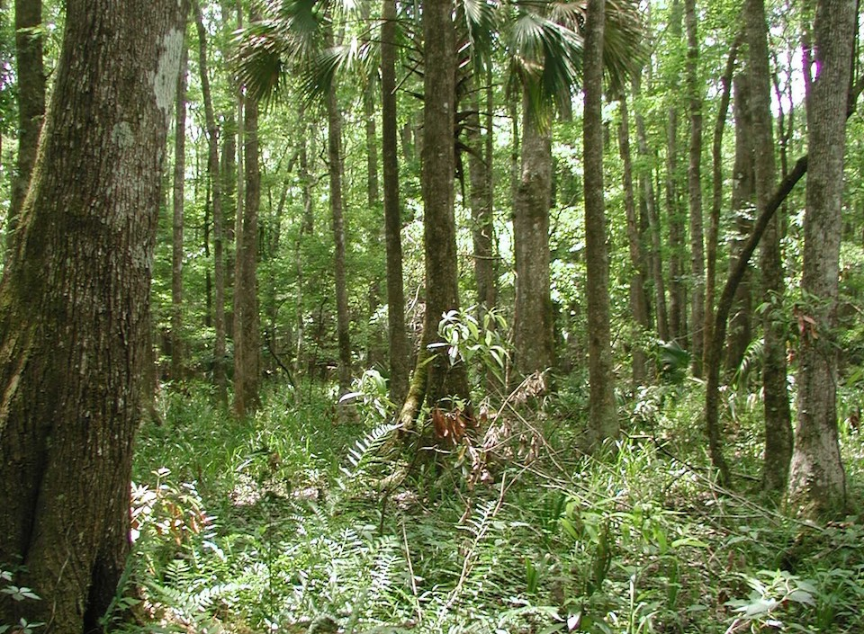

<content-header icon="freshwater_forested_wetlands" title="Hydric Hammock" subtitle="within Freshwater Forested Wetlands"></content-header>

<figcaption>Photo: Ann Johnson</figcaption>

### Overall vulnerability:

Moderate

### Area:

-   97,339 hectares within Florida (modeled)

-   83,568 hectares (86%) is located on public lands

## General Information

Hydric hammock occurs on soils that are poorly drained or have high water tables. This association is a still-water wetland, flooded less frequently and for shorter periods of time than mixed hardwood and cypress swamps.  Typical plant species include laurel oak, live oak, cabbage palm, southern red cedar, and sweetgum. Canopy closure is typically 75%-90%. The sub-canopy layer and ground layer vegetation is highly variable between sites. Wax myrtle is the most frequent shrub in hydric hammock. Other shrubs include yaupon, dahoon, and swamp dogwood. Ground cover may be absent or consist of a dense growth of ferns, sedges, grasses, and greenbriers. Sites are usually between mesic hammocks or pine flatwoods and river swamp, wet prairie, or marsh. 

Hydric hammock is found in a narrow band along parts of the Gulf coast and along the St. Johns River where it often extends to the edge of coastal salt marshes.

This conservation asset includes Coastal Hydric Hammock, Prairie Hydric Hammock and Cabbage Palm Hammock.

**TODO: map (if exists)**

### Species

Florida black bear, Homosassa Shrew, Swallow-tailed kite, Sherman's short-tailed shrew

## Impacts of Climate Change

Hydric hammock is likely to have 30% of the current area inundated by 1 m of sea level rise and 55% inundated by 3 m of sea level rise.  Increased salinity will lead to species composition shifts as those species with lower salt tolerances are replaced by those that can withstand higher salinity. The ability of this system to migrate inland will depend on the rate of sea level rise and the presence of natural and anthropogenic barriers.  Plant distributions may change due to drought, leading to compositional and structural changes within the system.   Hydric hammocks are typically only inundated for short periods of time following heavy rains; increased wet periods and floods could lead to changes in species composition. Frequency and depth of inundation have a significant effect on oak canopy composition.  As trees become stressed due to heat and drought they may become more susceptible to attack by pests and pathogens.   Increased summer and winter minimum temperatures, as well as increased extreme events (e.g., droughts, floods) will enhance invasive species processes, from introduction through establishment and expansion.

#### This habitat is expected to be impacted by sea level rise:

- 3 meters of sea level rise: 56% of area (54,125 ha)
- 1 meter of sea level rise: 30% of area (29,365 ha)
    

[More information about general climate impacts to ecosystems and habitats in Florida](/impacts/habitats).

### Impacts to Species

Hydric hammocks provide valuable habitat for game animals (e.g., white-tailed deer, black bear) that rely on the large production of oak mast (acorns).  Changes in the hydrology of hydric hammocks due to increased or decreased precipitation, increased drought or flooding, or altered timing  of precipitation could lead to shifts in the production and availability of mast.  

Hydric hammock seems to be a preferred habitat of feral hogs, which can pose significant problems to the system and species found within it through habitat degradation and competition.  As the hydrology of the hydric hammock is altered, access and damage caused by feral hogs may increase.  Soil disturbances by feral hogs can also allow for the spread of invasive plants.  The subsequent changes would decrease the suitability of this community to species such as the Homosassa Shrew and Sherman's short-tailed shrew.   

For species whose reproductive cycle is linked to wet/dry cycles, such as the Gulf hammock dwarf siren and the spotted turtle, changes in the timing and amount of precipitation could affect these life cycle events, potentially causing mismatches of phenological processes, leading to reduced reproductive success, reduced recruitment and increased mortality.

[More information about general climate impacts to species in Florida](/impacts/species).

## Other Non-climate Threats

-	Conversion to housing and urban development
-	Incompatible fire
-	Invasive plants
-	Roads

## Adaptation Strategies

#### Education/Outreach

- Implement outreach to increase public understanding of the increased wildfire risks due to climate change.
- Develop educational materials for private landowners on appropriate use fertilizers and pesticides and impacts on water quality, include potential incentives to reduce use.
- Develop training on the use of existing and emerging tools for managing wetlands under climate change (e.g., vulnerability and risk assessments, scenario planning, decision support tools, and adaptive management).
- Work with communities to reduce stormwater runoff and improve water quality.
- Work with counties, local municipalities and regional planning councils to incorporate natural resources adaptation strategies in comprehensive plans and hazard planning efforts.
- Work with volunteers to control invasive species.
- Actively engage with communities to minimize urban encroachment.

#### Policy

- Develop policies and incentives for decreasing impervious surfaces.
- Identify overused areas and limit recreational trails/roads and OHV use.
- Centralize recreation impacts to easy-access areas.
- Provide greater regulation and enforcement of recreational use and access restrictions.
- Review and update Best Management Practices to accommodate current and future conditions.
- Encourage the passage of state regulations to strengthen protection of hydric hammock.

#### Protection: 

- Protect critical areas that are naturally positioned to be more resistant to climate change.
- Identify and prioritize protection of corridors between hydric hammock and adjacent natural areas to enhance species movement and migration.
- Preserve the structural complexity and biodiversity of vegetation.
- Establish protections for transitional habitats that will provide for range shifts and serve as potential climate refugia.
- Maintain habitat quality to enhance the resilience of hydric hammocks to changing conditions.
- Preserve hydric hammock and their buffers that are not yet impacted by human development.
- Encourage landowner cost share programs and enrollment in conservation easements to increase habitat base.
- Protect buffer zones to allow for future inland migration.
- Purchase inland development rights or property rights.

#### Monitoring

- Inventory culverts and other barriers to flow.
- Monitor pollutants.
- Monitor natural community range shifts.
- Monitor for introductions/increases in invasive species.
- Monitor vegetation as density and distributions shift with environmental changes.
- Monitor disease prevalence and occurrence (spatially and temporally).
- Monitor for changes in recruitment of mast producing trees and amount of mast production.

#### Planning

- Identify areas particularly vulnerable to loss or transition under climate change and develop management strategies and approaches for adaptation.
- Assess and take steps to reduce risks of facilitating movement of “new” undesirable non-native species, pests, and pathogens.
- Incorporate climate change considerations into new and future revisions of area management plans.
- Collaborate with other agencies to ensure new water control structures have consideration for future conditions.
- Reduce roadway and paved area construction near sensitive systems to maintain natural hydrology.

#### Restoration

- Improve habitat quality to enhance the resilience of hydric hammocks to changing conditions.
- Cultivate multiple age classes of tree and understory species to protect stands from pests or diseases that may be more virulent to specific life stages or specific species.
- Plant mast producing trees that are more heat tolerant.
- Restore the structural complexity and biodiversity of vegetation.
- Replace culverts with those designed to accommodate future flow conditions and allow for fish and wildlife passage.
- Remove invasive plants.
- Eliminate hydrologic barriers/conveyances.
- Plant with a mix of species that can survive in a diverse range of future climate conditions.
- Select native plant species for restoration efforts that are expected to be better adapted to future climate conditions.
- Remove ditches to deter saltwater intrusion and restore natural water flow.
- Implement management practices that accommodate shifts in the timing of the rainy season and eliminate or reduce application of pesticides during this period.
- Implement best management practices to reduce sources of land-based pollutant and nutrient loads.

[More information about adaptation strategies](/strategies).

## Additional Resources

 - [Florida Natural Areas Inventory Profile](http://www.fnai.org/PDF/NC/Hydric_Hammock_Final_2010.pdf)
