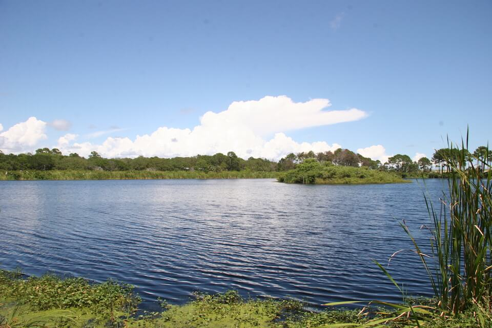

# Lakes, Ponds and Reservoirs

<figcaption>Photo: FWC</figcaption>

### Overall vulnerability:

This conservation asset was not assessed for vulnerability.

### Area:

-   380,123 hectares within Florida (modeled)

-   19,547 hectares (5%) is located on public lands

**TODO: map (if exists)**

## General Information

Florida has approximately 7,800 Natural Lakes with a surface area of one acre (0.4 ha) or more. The majority of these lakes were formed or enlarged by dissolution of the underlying limestone by acidic surface waters. Most natural lakes in Florida retain an intimate connection with groundwater, and lack a natural surface outflow. They may be connected to aquatic caves by underground fissures or bedding planes, and thus provide additional habitat for animal species found in those subterranean habitats, or they may have bottom substrates of silt or sand. Most of these lakes have highly variable water levels. 

Despite their origin, many Florida lakes are not alkaline, and are vulnerable to acidification. They are commonly nutrient-deficient, thus are vulnerable to nutrient inputs.  

Florida’s lakes are usually less than 45 feet (14 m) deep, with sand, silt, or organic bottom substrates. Depending on the water chemistry, vegetation in the lakes can vary from nonexistent, to a fringe of emergent plants at the shoreline, to a complete covering of floating plants.  Invasive, non-native aquatic weeds are a major threat to this habitat. Some Florida lakes have held water continuously for 8,000 years, and two exceed 30,000 years in age.  

Reservoirs are constructed to collect water for municipal and/or agricultural water use, to provide hydroelectric power, and to improve opportunities for recreational activities (e.g. boating, swimming), and development. Reservoirs are created by the damming of a flowing stream or excavation within a terrestrial habitat. They are essentially permanent, although some dry completely during droughts.

This conservation asset includes Natural lakes, Natural Ponds, and Man-made Reservoirs.

### Habitats

- [Coastal Dune Lake](/habitats/freshwater/3112)

### Species

American alligator, Mottled duck, Southern bald eagle, Lake Eustis pupfish,  Wading birds

## Impacts of Climate Change

Increasing air temperature will cause warming water temperatures.  This could be further exacerbated by reduced precipitation, with shallower water areas experiencing more warming.  

Increased precipitation could lead to increased nutrient, sediment and pollutant loading within the system. Lakes are vulnerable to changes in water levels, with decreased precipitation leading to lower the water levels that can hasten successional processes.  

Increased precipitation and floods that prevent periodic dry-downs may lead to increased rate of eutrophication. Changes to adjacent land use due to climate change, particularly towards more intensive agriculture or increased impervious surfaces, will increase runoff and sedimentation rates and, therefore, successional processes.

[More information about general climate impacts to ecosystems and habitats in Florida](/impacts/habitats).

### Impacts to Species

Fish and invertebrates with narrow temperature tolerances will be impacted when water temperatures exceed their maximum threshold.  Warmer water temperatures can increase the stress on species, leading to declines in health and increases in vulnerability to parasites and disease. 

Many aquatic species will be affected by bank erosion, increased siltation, and run-off caused by increased precipitation and storm events.  

Increased algal blooms, droughts, and high temperatures can cause low oxygen levels, leading to fish mortality.  

Increased invasive plants can cause degradation to the system impacting suitability for waterfowl and wading birds.

[More information about general climate impacts to species in Florida](/impacts/species).

## Other Non-climate Threats

-	Chemicals and toxins
-	Conversion to agriculture
-	Conversion to commercial and industrial development
-	Conversion to housing and urban development
-	Groundwater withdrawal
-	Incompatible forestry practices
-	Incompatible recreational activities
-	Invasive animals
-	Invasive plants
-	Management of nature
-	Nutrient loads - agriculture and urban
-	Surface water withdrawal and diversion

## Adaptation Strategies

#### Planning

- Re-evaluate fishery management, habitat management and water quality standards where doing so could increase recruitment.
- Create, maintain and enforce minimum flows to prevent harmful drawdown of groundwater and allow recharge during periods of decreased precipitation or drought.
- Reduce roadway and paved area construction near aquatic systems.
- Develop timber harvest plans that reduce or avoid timber harvest near shoreline in favor of harvesting methods that maintain a greater canopy cover (e.g., patch/selection cuts).
- Develop strategies to deal with changes in lake access points for various future conditions.
- Consider allowing for shifts in community composition.

#### Restoration

- Reconnect fragmented habitat.
- Improve habitat quality to enhance the resilience of isolated waters to changing conditions.
- Modify water management (timing & amount of releases from water control structures) in response to expected water level changes due to climate change.
- Implement best management practices to reduce sources of land-based pollutant and nutrient loads impacting species and habitats.
- Select native plant species for restoration efforts that are expected to be better adapted to future climate conditions.
- Conduct hydrological restoration of disturbed areas to slow runoff and increase water retention and increase hydroperiod.
- Restore riparian areas to increase water retention and uptake of soil retention and reduce impacts of flood events, erosion, and sedimentation.

#### Protection

- Identify and prioritize protection of corridors between aquatic systems and between associated upland habitats to promote species migration corridors.
- Increase protection of water bodies that are most vulnerable to climate change.
- Preserve aquatic systems and buffers that are not yet impacted by human development.
- Maintain habitat quality to enhance the resilience of isolated waters to changing conditions.
- Identify and protect important and potentially resilient lakes and ponds and associated wetland areas and ensure that a variety of these habitats are included in land protection planning.
- Maintain floodplains as undeveloped areas and protect associated wetlands for floodwater storage.
- Implement best management practices to reduce sources of land-based pollutant and nutrient loads.

#### Policy

- Work with small municipalities, counties and industry to address unpaved road sediment and stormwater runoff issues.
- Review and update Best Management Practices to accommodate current and future conditions.
- Promote water use and allocation measures to protect critical habitats
- Redefine flood hazard zones to match projected expansion of flooding frequency and extent.
- Encourage the passage of state regulations to strengthen protection of riparian areas.
- Encourage landowner cost share programs and enrollment in conservation easements to increase protection of riparian areas.

#### Education/Outreach

- Work with small municipalities and counties to address unpaved road sediment impacts on ephemeral wetlands.
- Ensure that the public knows how to report disease occurrences for fish and game.
- Encourage citizen scientists to track phenology and contribute to national efforts.
- Work with volunteers to control invasive species.
- Engage hunting and angling communities to support water conservation efforts.
- Promote proper use of pesticides.
- Enhance outreach regarding impacts of fertilizer which contribute to increased nutrient loads.
- Work with communities to improve stormwater runoff and encourage groundwater recharge options through low impact development and retrofits.

#### Monitoring

- Analyze fisheries surveys for shifting populations as a result of changing habitat parameters.
- Track flooding frequency and extent to inform capital projects (e.g., road improvements, culvert replacements).
- Monitor disease prevalence and occurrence (spatially and temporally.
- Monitor isolated waters for introductions/increases in invasive species.
- Monitor groundwater table.

## Additional Resources

 - [Florida Natural Areas Inventory Profile](http://www.fnai.org/PDF/NC/Lacustrine.pdf)
