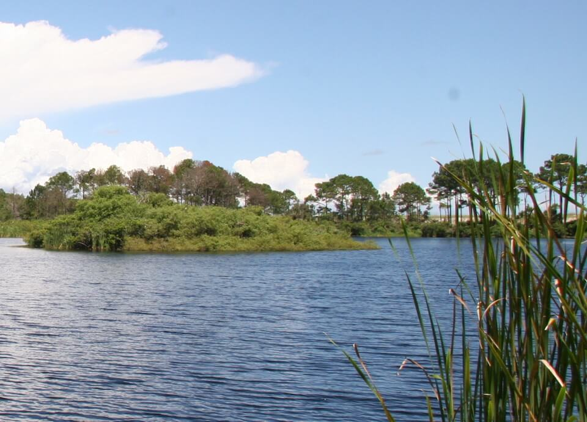

# Coastal Dune Lake

### within Lakes, Ponds and Reservoirs

<figcaption>Photo: FWC</figcaption>

### Overall vulnerability:

Low

### Area:

-   357 hectares within Florida (modeled)

-   230 hectares (65%) is located on public lands

## General Information

Coastal dune lakes are characterized as shallow irregularly shaped or elliptic depressions occurring in coastal communities.  They are generally permanent water bodies, although water levels may fluctuate substantially.  Coastal dune lakes share an intermittent connection with the Gulf of Mexico. The lake water is fed by streams, groundwater seepage, rain, and storm surge. The connection with the Gulf, called an outfall, is a flood control and pours lake water into the Gulf as needed.  Storms occasionally provide large inputs of salt water and salinities vary dramatically over the long term.  Typical plants include rushes, sedges, marsh pennywort, cattail, sawgrass, royal fern, salt myrtle and black willow.  Coastal dune lakes are very unusual features, being relatively short-lived and likely to disappear rapidly.  They are extremely vulnerable to hydrological manipulations.

**TODO: map (if exists)**

### Species

Wading birds

## Impacts of Climate Change

Coastal dune lakes are likely to have 58% of the current area inundated by 1 m of sea level rise and 97% inundated by 3 m of sea level rise.  Increase intensity and frequency of storms will degrade these lakes by increasing salinity and potentially creating/widening the outflow connectivity, creating a more permanent influence of ocean water into the lakes.  Increased salinity will impact the lakes vegetation and wildlife species composition, cause decreased reproductive success, and lead to increased stress and mortality.  Increased precipitation could lead to increased nutrient, sediment and pollutant loading within the system.   Increased temperatures, as well as extreme events  will enhance invasive species processes, from introduction through establishment and expansion.

#### This habitat is expected to be impacted by sea level rise:

- 3 meters of sea level rise: 98% of area (348 ha)
- 1 meter of sea level rise: 58% of area (207 ha)
    

[More information about general climate impacts to ecosystems and habitats in Florida](/impacts/habitats).

### Impacts to Species

Warmer water temperatures can increase the stress on species, leading to declines in health and increases in vulnerability to parasites and disease.  For species whose reproductive cycle is linked to wet/dry cycles, changes in the timing and amount of precipitation could affect these life cycle events, potentially causing mismatches of phenological processes, leading to reduced reproductive success, reduced recruitment and mortality. Coastal dune lakes are important breeding areas for many insects that form the base of food chains; impacts to the system that would reduce/remove these insects would have a cascading effect on multiple other species.  Increased runoff and groundwater pollution as a result of increased precipitation and flooding would significantly alter the nutrient balance and have negative effects on the system and associated wildlife.

[More information about general climate impacts to species in Florida](/impacts/species).

## Other Non-climate Threats

Chemicals and toxins, Coastal development, Groundwater withdrawal, Incompatible recreational activities, Invasive plants, Nutrient loads,  Surface water withdrawal and diversion

## Adaptation Strategies

#### Protection

- Implement best management practices to reduce sources of land-based pollutant and nutrient loads.
- Protect remaining unprotected coastal dune lakes, associated wetland areas, and adjacent upland buffers.
- Maintain habitat quality to enhance the resilience of lakes to changing conditions.
- Identify and prioritize protection of corridors between lakes and associated upland habitats to promote species migration corridors.
- Implement living shorelines along coast adjacent to coastal dune lakes to reduce impacts from tides and storm events.

#### Monitoring

- Monitor disease prevalence and occurrence (spatially and temporally).
- Track flooding frequency and extent to inform capital projects (e.g., road improvements, culvert replacements).
- Monitor for introductions/increases in invasive species.
- Monitor groundwater table.

#### Restoration

- Restore adjacent upland areas to increase water retention and uptake of soil retention and reduce impacts of flood events, erosion, and sedimentation.
- Select native plant species for restoration efforts that are expected to be better adapted to future climate conditions.
- Implement best management practices to reduce sources of land-based pollutant and nutrient loads impacting species and habitats.
- Modify water management (timing & amount of releases from water control structures) in response to expected water level changes due to climate change.
- Conduct hydrological restoration of disturbed areas.
- Reconnect fragmented habitat.

#### Planning

- Develop strategies to deal with changes in lake access points for various future conditions.
- Reduce/eliminate future roadway and paved area construction near lakes.
- Create, maintain and enforce minimum flows to prevent harmful drawdown of groundwater and allow recharge during periods of decreased precipitation or drought.
- Consider allowing for shifts in community composition.

#### Education/Outreach

- Work with communities to improve stormwater runoff and encourage groundwater recharge options through low impact development and retrofits.
- Encourage citizen scientists to track phenology and contribute to national efforts.
- Work with volunteers to control invasive species.
- Work with small municipalities and counties to address unpaved road sediment impacts on ephemeral wetlands.
- Promote proper use of pesticides.
- Enhance outreach regarding impacts of fertilizer which contribute to increased nutrient loads.

#### Policy

- Provide greater regulation and enforcement of recreational use and access restrictions.
- Centralize recreation impacts to easy-access areas.
- Identify overused areas and limit recreational trails use.
- Develop policies and incentives for decreasing impervious surfaces.
- Redefine flood hazard zones to match projected expansion of flooding frequency and extent.
- Review and update Best Management Practices to accommodate current and future conditions.
- Promote water use and allocation measures to protect critical habitats
- Work with small municipalities, counties and industry to address unpaved road sediment and stormwater runoff issues.

[More information about adaptation strategies](/strategies).

## Additional Resources

 - [Florida Natural Areas Inventory Profile](http://www.fnai.org/PDF/NC/Lacustrine.pdf)
