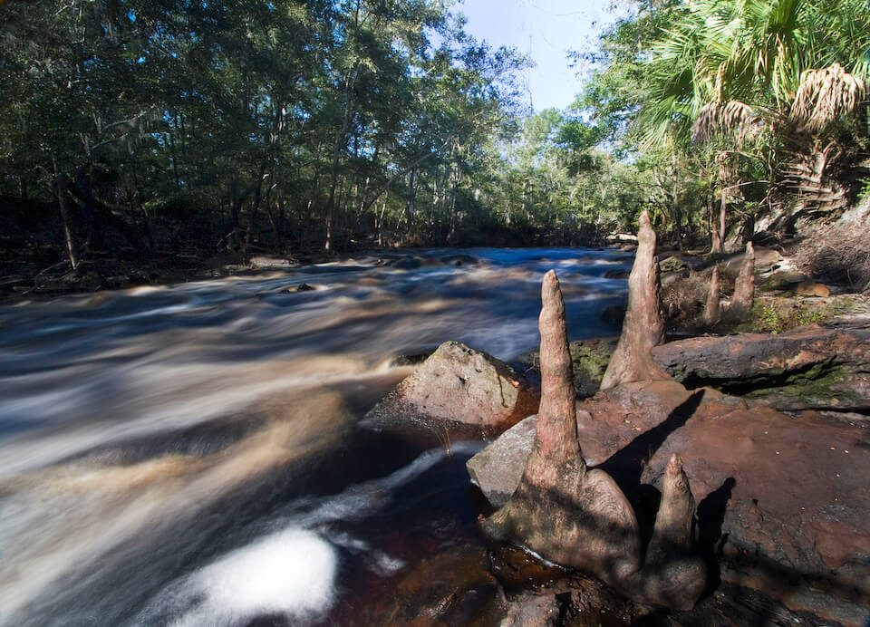

<content-header icon="rivers_streams" title="Rivers and Streams"></content-header>

<figcaption>Photo: David Moynahan, FWC</figcaption>

### Overall vulnerability:

This conservation asset was not assessed for vulnerability.

**TODO: map (if exists)**

## General Information

Florida’s largest rivers are in the northern part of the state.  Florida rivers, typically flow towards the nearest coast, with the exception of the St. Johns River which flows north to the Atlantic.  The only major river that does not flow to the gulf or to the Atlantic is the Kissimmee River, which flows south and discharges to Lake Okeechobee. Florida's rivers and streams can be divided up into six main categories, including Alluvial, Blackwater, Spring-run, Seepage, Calcareous, and Tidally-influenced Rivers and Streams.  Many rivers are a mixture of these types, transitioning along their path.

Alluvial rivers have large, well-defined drainage basins, carry high sediment loads and have large forested floodplains. These rivers typically flood each year, usually in the winter.  All of Florida’s alluvial rivers are in the Panhandle, including the Apalachicola, Choctawhatchee, Escambia and Ochlockonee.  Due to the high natural turbidity of these streams there is minimal vegetation which is mostly confined to channel edges or backwaters.  

Typical blackwater rivers have dark, stained waters from decomposing plant materials. They typically drain pine flatwoods and cypress swamps.  The flow rate is usually gentle in smaller streams to moderate in larger, but is altogether influenced by seasonal local rainfall. Blackwater streams differ from alluvial streams by having high, steep banks, and by lacking extensive floodplains and natural levees. This habitat is well distributed throughout Florida, except in the regions of north and central Florida dominated by Calcareous Streams, and in the Everglades/Big Cypress region of south Florida, where wetlands and coastal streams dominate the aquatic landscape. 

Springs and spring-run rivers are present in the north and central regions of Florida where underlying limestone is close to the surface. Spring-run rivers often represent headwaters or low-order tributaries.  The bottoms of spring runs are generally sand or exposed limestone along a central, stable channel.  Calcareous Rivers occur only in the north and central regions of the state.  These rivers typically have a high pH, high carbonate level, and sand bottom with some limestone exposed. 

Most calcareous streams are clear and cool, although in areas where they flow through pinelands or scrub the streams will become stained by the tannins in the vegetation. Some are associated with sinks, where all or sections of the stream flow underground before resurfacing to flow overland.  Submerged plants are frequently dense, and can include tape grass, wild rice, and giant cutgrass.  

Tidally influenced rivers and streams includes the freshwater or brackish portions of a river or stream adjacent to an estuary or marine habitat in which the effects of tides cause the rise and fall of water levels. The effect of the tides at the upper limits of influence may lag several hours behind tides on the coast.  Saltwater wedges are formed in many of these systems, enabling numerous species a mechanism to move up or down river. Water flow is bidirectional in coastal tidal rivers and streams; as the tide rises, water flows toward the head of the river and, as the tide retreats, the water flows toward the coastal outlet. These streams bridge the freshwater and marine realms, with aquatic communities ranging from tidal freshwater to tidal brackish; salinities can vary from freshwater to approximately that of seawater. This variation, along with temperature and water clarity, determines the flora and fauna of these streams. Typical plants may include cord grass or submerged aquatic vegetation such as seagrasses and algae.

This conservation asset includes  Alluvial, Blackwater Streams, Spring-run, Seepage, Calcareous, and Tidally-influenced Rivers and Streams.

### Species

American alligator, Alligator snapping turtle, Blackmouth shiner, Bluenose shiner, Crystal darter, Okaloosa darter, River otter, West Indian Manatee

## Impacts of Climate Change

Increased precipitation and storm events will cause bank erosion, increased siltation, and run-off in rivers and streams.  Sea level rise will result in the inland movement of seawater, shifting the tidal influence zone of streams and rivers upstream and permanently inundating downstream riparian/coastal habitats with brackish water. 

Tidal and storm surges can degrade aquatic habitats through oxygen depletion, changes in salinity, and increased siltation and turbidity.  

Decreased precipitation may cause extreme low water levels or even create fragmented/disconnected systems as some areas dry completely, resulting in isolated pools of water rather than a flowing connected system.  

Increasing air temperature will cause warming water temperatures.  This could be further exacerbated by reduced precipitation, with shallower water areas experiencing more warming.  

Increased temperatures, as well as extreme events  will enhance invasive species processes, from introduction through establishment and expansion.

[More information about general climate impacts to ecosystems and habitats in Florida](/impacts/habitats).

### Impacts to Species

Species with narrow temperature tolerances will be impacted when water temperatures exceed their maximum threshold.  Additionally, higher water temperatures can increase the stress on the fish, leading to declines in health and increases in vulnerability to parasites and disease.  

Sea level rise will increase the salinity levels further up tidal rivers and streams, impacting those species with lower salinity tolerances and shifting community dynamics as more salt tolerant species move in.  

Changes in the timing and rate of flow will affect species that are sensitive to microclimate variations associated with flow dynamics.   

Some species, particularly fish will be impacted by fragmentation of the system (loss of connectivity) that may occur during extended dry periods and droughts.   

Increased runoff and groundwater pollution as a result of increased precipitation and flooding would significantly alter the nutrient balance and have negative effects on the system and associated wildlife.  Limpkins, found along Florida's rivers and streams feed primarily on apple snails, but will also eat insects, worms and mussels.  Water quality degradation could significantly reduce the abundance and availability of these prey items for the limpkin and other species with similar diets.

[More information about general climate impacts to species in Florida](/impacts/species).

## Other Non-climate Threats

-	Channel modifications
-	Chemicals and toxins
-	Coastal development
-	Conversion to commercial and industrial development
-	Conversion to housing and urban development
-	Conversion to recreation areas
-	Dam operations/incompatible release of water
-	Fishing gear impacts
-	Groundwater withdrawal
-	Incompatible fishing pressure
-	Incompatible forestry practices
-	Incompatible industrial operations
-	Incompatible recreational activities
-	Incompatible resource extraction
-	Industrial spills
-	Invasive animals
-	Invasive plants
-	Management of nature
-	Nutrient loads - agriculture and urban
-	Roads
-	bridges and causeways
-	Shoreline hardening
-	Surface water withdrawal and diversion
-	Vessel impacts

## Adaptation Strategies

#### Protection

- Identify important (and potentially resilient) aquatic systems and wetland areas to serve as refugia, prioritize inclusion in land protection planning efforts.
- Maintain floodplains as undeveloped areas.
- Identify and prioritize protection of corridors between aquatic systems and associated upland habitats that will promote species migration corridors.
- Limit the amount of water that can be withdrawn from streams for irrigation or other purposes, especially in times of high temperatures and low stream flow.
- Preserve aquatic systems and buffers that are not yet impacted by human development.
- Expand protected areas to increase the representation of connected waters and minimize risk of loss across the landscape.

#### Monitoring

- Monitor disease prevalence and occurrence.
- Increase the number of river/stream monitoring stations (e.g., water levels, water temperature).
- Participate in High Water Mark Initiative efforts after flooding events (https://www.fema.gov/high-water-mark-initiative).
- Track flooding frequency and extent to inform capital projects (e.g., road improvements, culvert replacements).
- Analyze fisheries surveys for shifting populations as a result of changing habitat parameters.
- Monitor salt wedge intrusion in rivers.
- Monitor community movements (e.g. Vallisneria americana beds moving with salinity shifts).
- Monitor aquatic systems for introductions/increases in invasive species.
- Increase monitoring of pollutants in the systems and identify sources.

#### Education/Outreach

- Work with communities to reduce stormwater runoff and improve water quality.
- Educate planners on importance of habitat preservation (including serving as hazard buffers), climate change and incorporation into long range planning efforts.
- Work with volunteers to control invasive species.
- Actively engage with communities to minimize urban encroachment.
- Develop education materials for recreational users on the importance of phenology factors, how they may change over time given climate change impacts, and how they relate to regulations/closures.
- Educate and work with fisheries participants to recognize and report irregularities in phenology indicators.

#### Policy

- Redefine riverine flood hazard zones to match projected expansion of flooding frequency and extent.
- Encourage the passage of state regulations to strengthen protection of riparian areas.
- Review and update Best Management Practices to accommodate current and future conditions.
- Encourage landowner cost share programs and enrollment in conservation easements to increase protection of riparian areas.

#### Restoration

- Replace stream crossing structures with those designed to accommodate future flow conditions and allow for fish and wildlife passage.
- Restore/modify channels to create habitat diversity.
- Reconnect rivers to floodplains by modifying or removing barriers (e.g., dams, culverts, berms).
- Implement best management practices to reduce current and future sources of land-based pollutant and nutrient loads impacting species and habitats.
- Restore riparian buffers to reduce erosion and pollution, reduce stream temperature, and allow migration of plants and animals.
- Remove/restore ditches in coastal areas to deter saltwater intrusion and restore natural water flow.
- Create refugia for periods of drought and warming water conditions.
- Implement management practices that eliminate or reduce application of pesticides in the rainy season.
- Reduce bare ground adjacent to flowing waters.
- Improve habitat quality to enhance the resilience of aquatic habitats to changing conditions.

#### Planning

- Develop strategies to deal with changes in river access points, especially during periods of drought.
- Develop timber harvest plans that reduce or avoid timber harvest near shoreline in favor of harvesting methods that maintain a greater canopy cover (e.g., patch/selection cuts).
- Re-evaluate fishery management and water quality standards where doing so could increase recruitment.

## Additional Resources

 - [Florida Natural Areas Inventory Profile](http://www.fnai.org/PDF/NC/Riverine.pdf)
