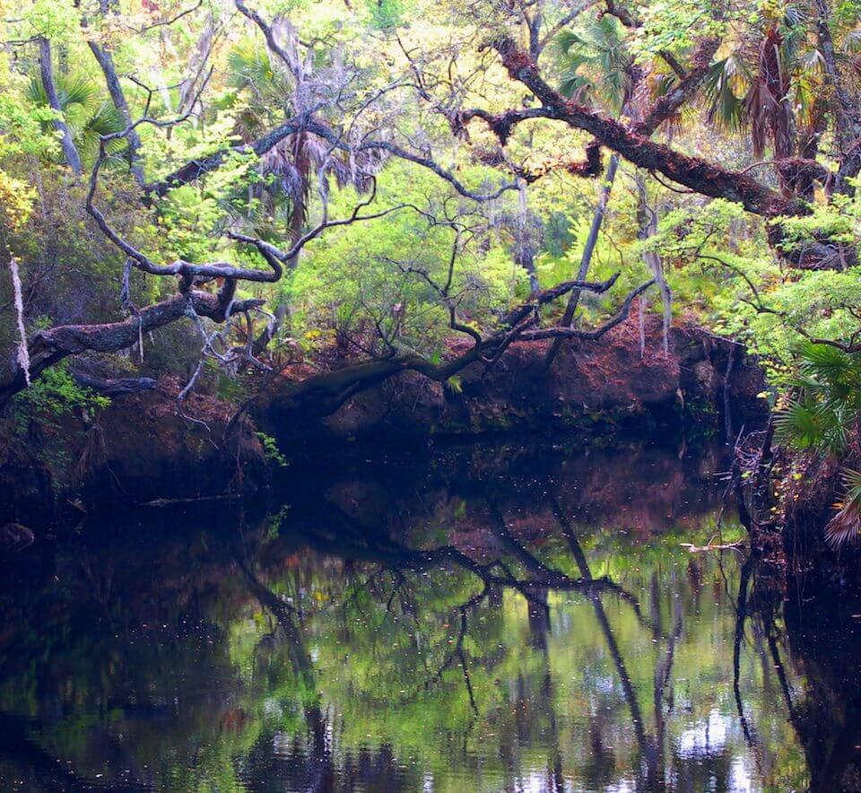

# Springs

<figcaption>Photo: Joe Davis, FWC</figcaption>

### Overall vulnerability:

This conservation asset was not assessed for vulnerability.

**TODO: map (if exists)**

## General Information

Springs are present in the north and central regions of Florida where underlying limestone is close to the surface. Springs often represent headwaters or low-order tributaries.  Because of the calcareous nature of the limestone aquifer, the outflow from most springs carries dissolved mineral ions such as calcium, magnesium, bicarbonate, sulfate, and sodium. Springs typically have high water clarity, low sedimentation, stable channels, and openings that are less than 40 feet (12.2 m) wide.  Individual springs are stable systems, with very little change in water temperature, water flow, or chemical composition, but those characteristics can vary from one spring to the next.  Vegetation in spring and spring run habitats consist of submerged aquatic vegetation, aquatic algae covering limestone outcroppings, and species such as tape grass, wild rice, and giant cutgrass located in the spring runs. The constant temperatures of springs provide essential habitat for manatees and some species of fish.  There are 1,089 mapped springs, with 33 first magnitude springs (springs that discharge water at a rate of at least 2800 liters or 100 cubic feet  of water per second).

### Species

American alligator, Suwannee cooter, Wading birds, West Indian manatee

## Impacts of Climate Change

A 1 m sea level rise would inundate 17% of Florida's springs, 18% of the first magnitude springs, and a 3 m sea level rise would inundate 26% of the state's springs and 36% of the first magnitude springs.  There will be additional impacts to springs from sea level rise as saltwater intrusion occurs through groundwater.   Increased precipitation could lead to increased nutrient, sediment and pollutant loading within the system.   Increased temperatures, as well as extreme events  will enhance invasive species processes, from introduction through establishment and expansion.

[More information about general climate impacts to ecosystems and habitats in Florida](/impacts/habitats).

### Impacts to Species

Changes in the intensity and frequency of storm events and extreme conditions (e.g., drought, floods) will affect the amount of stormwater runoff entering the springs.  Increased nutrient concentrations and chemical pollutants carried in runoff will impact water quality and clarity and contribute to algae blooms that impact native vegetation and interfere with the spring's ecosystem.  Many species such as the West Indian manatee, American eel and American shad spend time in both the freshwater springs the marine environment.  Connectivity between the spring and the ocean is important, but could be impacted due to increased drought and lowered ground water levels.  The loggerhead musk turtle is rarely found outside of Florida's springs and forages  for algae, insects and snails.  Water quality degradation that impacts the insects and snails would eliminate critical food sources for this turtle.  Water quality and clarity degradation could impact the spring and spring run vegetation, which manatees are forage on, particularly important during cold weather events when they congregate in the springs.  There are multiple species that are found only in springs, including Albino cave crayfish and spring crayfish, that are very sensitive to changes in water quality.

[More information about general climate impacts to species in Florida](/impacts/species).

## Other Non-climate Threats

Conversion to commercial and industrial development, Conversion to recreation areas, Groundwater withdrawal, Incompatible forestry practices, Incompatible recreational activities, Incompatible resource extraction, Invasive animals, Invasive plants, Nutrient loads - agriculture and urban, Surface water withdrawal and diversion

[More information about adaptation strategies](/strategies).

