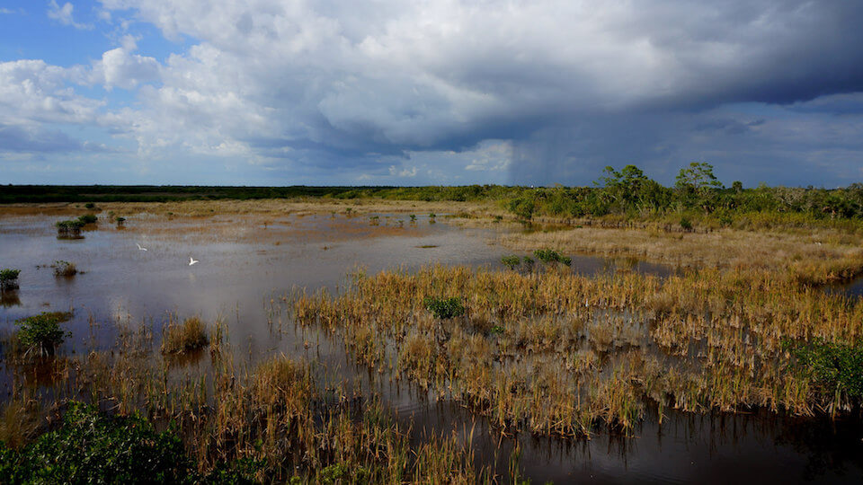

<content-header icon="freshwater_ecosystems" title="Freshwater Ecosystems"></content-header>

Florida has more than 1,700 streams and rivers, 7,800 freshwater lakes, over 1,000 springs, and 11 million acres of wetlands.  

The large river systems in northern Florida have the highest diversity of freshwater fish species and aquatic invertebrates in the state due to the higher gradient of rivers and streams, proximity to the continental landmass, and the presence of karst features such as sinkholes and caves. 

Lake Okeechobee is the central feature of the South Florida Ecosystem.  The lake is formed by a broad, shallow, relatively circular depression in bedrock and has a surface area of approximately 1,890 km2 (730 mi2). The lake was the source of the Everglade’s sheetflow which sustained the Everglades and nourished Florida Bay and coastal estuaries.  

A significant portion of Florida’s landscape is covered by wetlands, ranging from expansive systems (e.g., Everglades, Big Cypress, Paynes Prairie) to isolated features located in a mosaic of upland communities (e.g., ephemeral wetlands, pitcher plant bogs).  

The Florida Everglades is unique in the world, combining both temperate and tropical flora in a widely shifting mosaic of habitats. 

Forested wetlands are found as floodplains along major rivers systems and as large connected systems, particularly in south Florida. The Corkscrew Regional Ecosystem Watershed, Corkscrew Swamp, Okaloacoochee Slough, Fakahatchee and Picayune strands, Belle Meade, and a major portion of Big Cypress National Preserve make up more than 320,000 ha (790,720 acres) of connected wetlands.

<figcaption>Photo: NPS</figcaption>

## Impacts of Climate Change

Regardless of size or type, Florida’s wetland and aquatic systems are expected to be impacted through changes in precipitation, temperature, sea level rise, and the synergisms among these factors. Annual length of soil saturation, amount of organic matter, source of water, and fire frequency all contribute to determining the major characteristics of wetlands in Florida. 

Decreased precipitation coupled with increased temperature will likely alter species composition and increase fragmentation of larger systems through reduced flow and connectivity.  Decreases in water quantity and quality will continue to stress the system and cause degradation. 

Climate change effects that reduce the ability to conduct prescribed burns will contribute to shifts within the ecosystem.  Prescribed fire is used as a management tool to prevent woody vegetation encroachment into marshes and to eliminate invasive exotics that frequently occur at the upland–marsh interface.  

Warming water temperatures, altered stream flow patterns, and increasing storm events will impact river and stream systems. Sea level rise will result in the inland movement of seawater, shifting the tidal influence zone of streams and rivers upstream and permanently inundating downstream riparian/coastal habitats with brackish water. Tidal and storm surges can degrade aquatic habitats through oxygen depletion, changes in salinity, and increased siltation and turbidity.  The suitability of riverine habitats is based on variations in flow, substrate, temperature, dissolved oxygen, and other water chemistry factors. Many aquatic species will be affected by bank erosion, increased siltation, and run-off caused by increased precipitation and storm events. 

Florida’s karst system of sinkholes, submerged caves and springs depend upon the connection between the surface and the underground, with even slight changes in soil moisture, elevation, and temperature causing profound effects.

[More information about general climate impacts to ecosystems and habitats in Florida](/impacts/habitats).

### Impacts to Species

Wetland-dependent species will be impacted through loss and degradation of habitat when water levels and the timing of water inputs become incompatible with their foraging, nesting, or roosting requirements.  Herbaceous wetlands provide the foraging and nesting habitat for many species, including waterfowl, Florida sandhill crane, snail kite, limpkin, mink, river otter, Florida gopher frog, tiger salamander, and flatwoods salamanders. 

Ephemeral wetland-dependent species, such as flatwoods salamanders and striped newts, will be affected by changes in precipitation, regardless of direction of change. The timing of salamanders’ breeding migration is tied to precipitation and temperature, both of which could be impacted by climate change.   Fish species with narrow temperature tolerances will be impacted when water temperatures exceed their maximum threshold.

[More information about general climate impacts to species in Florida](/impacts/species).
