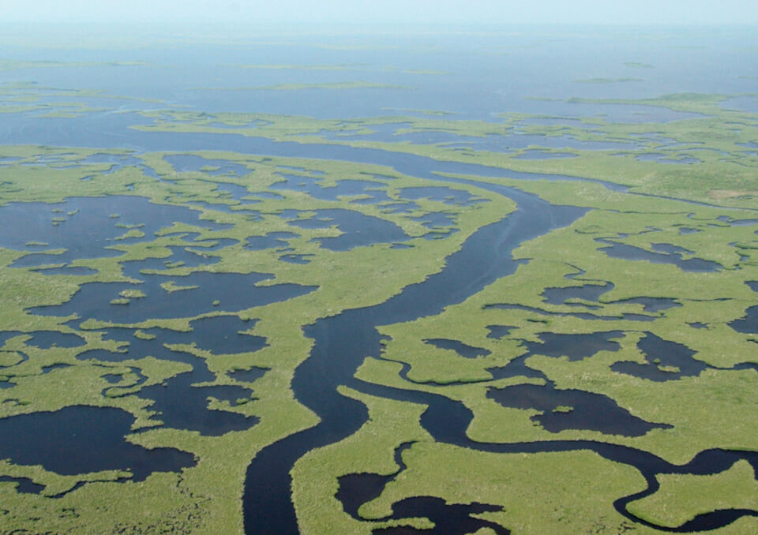

# Estuarine/Marine (system wide)

<figcaption>Photo: NPS</figcaption>

### Overall vulnerability:

This conservation asset was not assessed for vulnerability.

**TODO: map (if exists)**

## General Information

Bays are found along the coast of Florida, connecting to either the Gulf of Mexico on the west coast or the Atlantic Ocean on the east coast.  Tampa Bay is the largest estuary in Florida, other bays include Pensacola Bay, Apalachicola Bay, Charlotte Harbor, Florida Bay and Biscayne Bay.  

Bays receive freshwater inflow from rivers, streams and wetlands.  

Inlets are natural or man-made cuts in the shoreline that link coastal and inland water bodies. This habitat is defined as the subtidal area within a two-kilometer radius of the central part (i.e., throat) of the Inlet. Both bays and inlets tend to be hot spots of biodiversity and are critical in the recruitment of many fish and invertebrate species. They provide habitat for the settling larvae from coastal areas and provide an emigration conduit for outgoing juveniles. They also are essential spawning habitat for several marine fishes.  

Bivalve Reefs occur in both intertidal and subtidal zones to depths of 40 feet (12 m). In Florida the most extensive examples of this habitat, dominated by oysters, are restricted to estuarine environments where salinity concentrations range from 15 to 30 parts per thousand. Events or processes that alter freshwater deliveries to estuaries are detrimental to this habitat. Bivalve reefs are a diverse ecological community that provides nursery grounds, refugia, and foraging areas to a wide variety of wildlife species. 

Tidal flats are non-vegetated areas of sand or mud protected from wave action and composed primarily of mud transported by tidal channels. An important characteristic of the tidal flat environment is its alternating tidal cycle of submergence and exposure to the atmosphere. 

The open ocean (pelagic) environment includes the waters lying over the continental shelf (neritic zone) and waters beyond the continental shelf. The Pelagic community lives in the water column above the seafloor and below the surface. This community does not depend on the seabed, although its members may visit it occasionally. Maximum depths vary from approximately 30 feet (9 m) in the Gulf of Mexico to more than 1,000 feet (304 m) off of the Florida Keys and southeast Florida.

This conservation asset includes Bays, Inlets, Bivalve Reefs, Exposed Limestone, Tidal Flat, and Open Ocean.

### Habitats

- [Keys Tidal Rock Barren](/habitats/marine/52111)

### Species

American oystercatcher, Blue crab, Brown pelican, Diamondback terrapin, Sea turtles

## Impacts of Climate Change

Changes in the coastal currents due to climate change are likely to have wide-ranging consequences for population dynamics and secondary productivity of reefs and associated estuary, bay and lagoon ecosystems.  

Increasing water temperatures along with changes in nutrient inputs will continue to favor harmful algal blooms.  

Increased water temperatures will lead to an increase in the abundance and diversity of invasive species, as well as range expansion northward of species limited by winter temperatures.  

Increased precipitation will lead to increased runoff, impacting water quality by increasing nutrients, pollutants, and turbidity.  

Vegetation and species within bays and lagoons will be impacted as water gets deeper due to sea level rise, water temperature increases and reduces dissolved oxygen concentrations, and the timing and intensity of precipitation becomes more variable, affecting the spatial and temporal patterns of salinity and dissolved oxygen.  

Sea level rise is already reducing the intertidal area of mud flats.  

Benthic communities could be lost due to a combination of nutrient runoff and increased temperatures that decrease dissolved oxygen levels below a threshold.

[More information about general climate impacts to ecosystems and habitats in Florida](/impacts/habitats).

### Impacts to Species

Commercially important pelagic fish species, such as Atlantic bluefin, will be impacted by warming ocean temperatures due to its low adult and larval thermal thresholds and restricted spawning grounds in the Gulf of Mexico.  Sea turtles also have specific thermal requirements, therefore, shifts in ocean temperatures will likely result in distribution shifts.  The loss or degradation of tidal (mud)flats would impact many species of shorebirds and wading birds that rely on these areas as foraging habitat.

[More information about general climate impacts to species in Florida](/impacts/species).

## Other Non-climate Threats

-	Channel modifications/shipping lanes
-	Chemicals and toxins
-	Coastal development
-	Dam operations/incompatible release of water
-	Disruption of longshore transport of sediments
-	Fishing gear impacts
-	Harmful algal blooms
-	Incompatible fishing pressure
-	Incompatible industrial operations
-	Incompatible recreational activities
-	Incompatible wildlife and fisheries management strategies
-	Industrial spills
-	Invasive animals
-	Invasive plants
-	Key predator/herbivore loss
-	Management of nature
-	Nutrient loads - urban
-	Roads
-	bridges and causeways
-	Shoreline hardening
-	Surface and groundwater withdrawal
-	Vessel impacts

## Adaptation Strategies

#### Restoration

- Use natural breakwaters of oysters (or install other natural breakwaters) to dissipate wave action and protect shorelines.
- Recover impacted shoreline habitats with species adapted to changing conditions.
- Restore or create new bivalve or annelid reefs.
- Provide aeration.
- Eliminate artificial features that minimize water circulation.
- Divert cooler deep water to coastal areas.
- Replace hardened shorelines with living shorelines.
- Increase vegetation cover along shoreline and tributaries to provide shade.
- Reduce groundwater withdrawal in watersheds.
- Plant shoreline cover to reduce evapotranspiration.
- Implement best management practices to reduce sources of land-based pollutant and nutrient loads impacting species and habitats.
- Collect freshwater for discharge during high salinity events.

#### Protection

- Adapt protections of important biogeochemical zones and critical habitats as the locations of these areas change with climate.
- Protect remaining natural shorelines.
- Include critical migratory pathways in protection plans.
- Adjust boundaries of existing marine protected areas in response to impacts from climate change.
- Provide protection to areas identified as climate refugia.

#### Monitoring

- Monitor phenology.
- Monitor abundance and presence of invasive species.
- Monitor shifting migration patterns of species.
- Monitor changes in population demographics of commercially and recreationally important species attributable to climate change.
- Monitor, map and research shifts in communities; identify sensitive and resilient species.

#### Planning

- Work with neighboring states/countries on species with large ranges and migratory pathways.
- Develop invasive species control plans, addressing synergistic effects of climate change and invasive species.
- Develop coordinated foreshore habitat management plans that establish a connected network of protected areas across the entire Florida shoreline.
- Evaluate alternate/cyclical/rotational use of habitats for recreational and commercial activities.
- Design estuaries with dynamic boundaries and buffers.

#### Policy

- Limit coastal urban sprawl development.
- Develop incentives/programs for water farming for discharge as needed for high salinity events.
- Adjust harvest limits (commercial and recreational) as needed to address shifting population dynamics.
- Require coastal counties address foreshore habitat conservation and adaptation in all comprehensive planning activities.
- Adjust no-take zones, ensuring that climate refugia sites are included.

#### Education/Outreach

- Work with communities to reduce stormwater runoff negatively impacted natural habitats.
- Enhance outreach regarding impacts of fertilizer on water quality.
- Work with volunteers to control invasive species.
- Work with local fishing, boating and diving industries to reduce impacts of habitat use activities.
- Encourage oyster shell recycling efforts.

## Additional Resources

 - [Florida Natural Areas Inventory Profile](http://www.fnai.org/PDF/NC/Marine_Estuarine.pdf)
