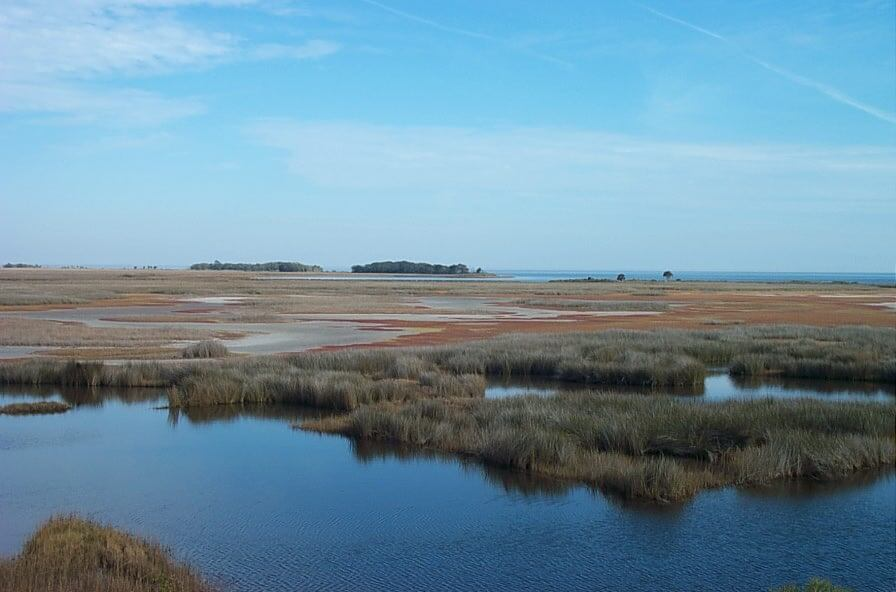

# Saltwater Marsh

<figcaption>Photo: Randy Kautz</figcaption>

### Overall vulnerability:

Moderate

### Area:

-   153,261 hectares within Florida (modeled)

-   114,753 hectares (75%) is located on public lands

**TODO: map (if exists)**

## General Information

Salt marsh is vegetated almost completely by herbaceous plants, primarily grasses, sedges, and rushes. This community type occurs within the intertidal zone of coastal areas and may be infrequently (high marsh) to frequently (low marsh) inundated by salt or brackish water. 

Salt marsh develops where wave energies are low and where mangroves are absent. Mangroves may extirpate shade-intolerant marsh species. The size of a salt marsh depends on the extent of the intertidal zone in which it occurs. Salt marshes of larger sizes are usually dissected by numerous tidal creeks. Areas that have low topographic relief and relatively high tidal ranges are likely to have larger salt marsh extents. 

Within salt marsh, plant species are often distributed unevenly, especially in transitional areas. Species distributions are affected by biotic and abiotic variables such as elevation, substrate type, degree of slope, wave energy, competing species, and salinity. Smooth cordgrass typically occupies the lower elevations and is usually adjacent to tidal creeks and pools. Needlerush dominates the slightly less frequently inundated zone. Vegetation at the higher elevations forms transitional areas to uplands and may contain species such as marsh-hay, glassworts, saltwort, saltgrass, sea ox-eye daises, marsh-elder, and saltbush as well as many other species. 

The salt marsh habitat is among the most productive communities in the world. Primary production is greatly affected by soil salinity and tidal frequency.

This conservation asset includes Salt Flat, Cordgrass, and Needlerush.

### Species

American crocodile, Black rail, Florida salt marsh vole, Lower Keys marsh rabbit, Silver rice rat, Marian's marsh wren, Worthington's marsh wren

## Impacts of Climate Change

Saltwater marshes have considerable capacity to adjust to sea level rise under certain, more favorable conditions.  Under more moderate rates of sea level rise, saltwater marshes should be able to keep pace and move inland.  However, under more rapid rates of sea level rise there could be significant loss of saltwater marsh.  Without inland migration, saltwater marsh is likely to have 95% of the current area inundated by 1 m of sea level rise and 99% inundated by 3 m of sea level rise.   Additionally, mangrove migration and expansion could lead to loss of saltwater marsh as it is replaced by mangroves; saltwater marsh could be reduced by 60% in Florida with only a 2-4 °C increase in annual mean minimum temperature.

#### This conservation asset is expected to be impacted by sea level rise:

- 3 meters of sea level rise: 99% of area (152,232 ha)
- 1 meter of sea level rise: 95% of area (145,553 ha)
    

[More information about general climate impacts to ecosystems and habitats in Florida](/impacts/habitats).

### Impacts to Species

Saltwater marsh species such as the black rail, salt marsh voles, and marsh wrens may lose habitat due to sea level rise, if there are barriers to saltmarsh inland migration or if saltwater marsh plants can't keep pace with the rate of sea level rise.  

With increasing temperatures and fewer cold weather events, species may lose saltwater marsh habitat to mangrove habitat in the northern portions of their range due to mangrove range expansion.  

Some species such as the Lower Keys marsh rabbit and silver rice rat, both found in the Florida Keys, are predicted to lose 100% of their habitat with 1m of sea level rise and don't have any options for migration.  

Fluctuations in freshwater inputs due to changes in precipitation patterns can lead to decreased prey availability, decreased reproductive success, decreased recruitment, and increased mortality in fish and invertebrates species.

[More information about general climate impacts to species in Florida](/impacts/species).

## Other Non-climate Threats

-	Channel modifications/shipping lanes
-	Chemicals and toxins
-	Coastal development
-	Dam operations/incompatible release of water
-	Disruption of longshore transport of sediments
-	Incompatible industrial operations
-	Incompatible wildlife and fisheries management strategies
-	Industrial spills
-	Invasive plants
-	Management of nature
-	Roads
-	bridges and causeways
-	Shoreline hardening
-	Surface water and groundwater withdrawal
-	Vessel impacts

## Adaptation Strategies

#### Education/Outreach

- Enhance outreach regarding impacts of fertilizer on water quality.
- Actively engage with communities to minimize urban encroachment.
- Work with communities and landowners to choose vegetation, living shorelines, oyster reef restoration, or hybrid approaches in favor of traditional hard armoring.
- Enhance outreach efforts to correlate water quality and habitat health to improve public stewardship and support actions to improve water quality.
- Work with volunteers to control invasive species.
- Work with communities to reduce stormwater runoff.
- Work with local fishing, boating and diving industries to reduce impacts of habitat use activities.

#### Policy

- Establish slow speed/no wake zones to reduce shoreline erosion.
- Establish rolling easements.
- Incentivize natural shorelines.

#### Planning

- Study and better understand species that are expected to migrate upslope in order to determine which ones are most likely to support wetland functions and values given climate change.
- Undertake long term wetland planning with the goal of protecting and increasing the resiliency and adaptability of wetland ecosystems in the face of climate change.
- Develop coordinated foreshore habitat management plans that establish a connected network of protected areas across the entire Florida shoreline.
- Work with counties, local municipalities and regional planning councils to incorporate natural resources adaptation strategies in comprehensive plans and hazard planning efforts.

#### Monitoring

- Install Surface Elevation Tables in sensitive areas to improve future modeling efforts and monitor ability of critical habitats to maintain elevation with sea level rise.
- Monitor levels of pollutants.
- Monitor community range shifts.
- Monitor, map and research shifts in communities; identify sensitive and resilient species.
- Encourage periodic bioblitz events to capture comprehensive inventories, repeat periodically (5 to 10 years).
- Monitor disease prevalence and occurrence (spatially and temporally).
- Monitor phenology.
- Monitor sediment dynamics.
- Establish wetland reference sites to monitor the impact of climate change and determine the effectiveness of management and adjustment strategies.

#### Restoration

- Undertake restoration, creation, enhancement for wetlands most threatened by climate change in contexts where restored, created, or enhanced wetlands may also be sustainable.
- Remove barriers to inland migration.
- Restore hydrology by filling mosquito ditches, removing roads, and replacing culverts with types/sizes that will accommodate future flows.
- Implement best management practices to reduce sources of land-based pollutant and nutrient loads impacting species and habitats.
- Install rock sills and other artificial breakwaters (using natural materials) in front of marshes to dissipate wave action and protect shoreline.

#### Protection

- Purchase upslope development rights or property rights.
- Preserve and restore the structural complexity and biodiversity of vegetation.
- Establish protections for transitional habitats that will provide for range shifts and serve as potential climate refugia.
- Use SLAMM outputs to identify and preserve priority migratory pathways for salt marsh habitats, remove barriers when feasible.

## Additional Resources

 - [Florida Natural Areas Inventory Profile](http://www.fnai.org/PDF/NC/Salt_Marsh_Final_2010.pdf)
