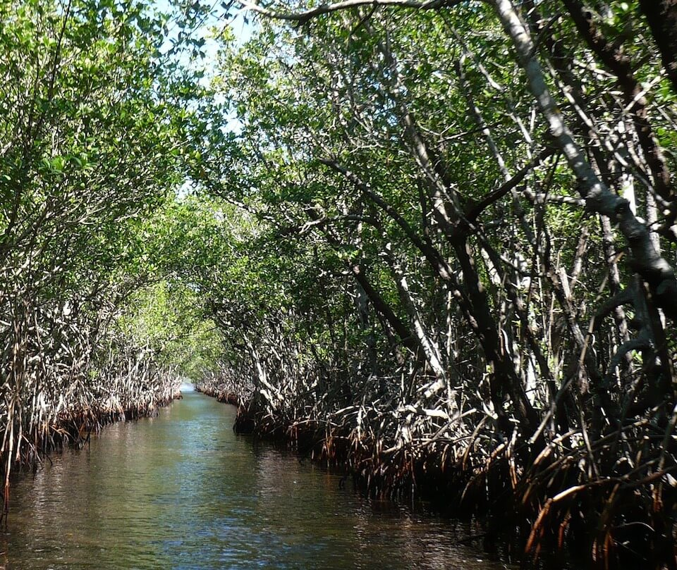

# Mangrove Swamp

### Overall vulnerability:

Moderate

### Area:

-   248,515 hectares within Florida (modeled)

-   225,026 hectares (91%) is located on public lands

**TODO: map (if exists)**

## General Information

These swamp communities are usually composed of red mangrove, black mangrove, and white mangrove. Mangroves form dense, brackish-water swamps along low-energy shorelines and in protected, tidally influenced bays of southern Florida. This community type is composed of freeze-sensitive tree species and, with some limited exceptions, mangroves which are distributed south of Cedar Key on the Gulf coast and south of St. Augustine on the Atlantic coast. Depending on slopes and amounts of disturbance, mangrove swamps may progress in zones of single species from seaward (red mangrove) to landward (white mangrove) areas. Buttonwoods usually occur in areas above high tide. Often vines, such as rubber vines and morning-glory, climb over mangroves, especially at swamp edges.

Includes: Mangrove Swamp, Scrub Mangrove and Buttonwood Forest

### Species

Black-whiskered vireo, Florida prairie warbler,  Mangrove clapper rail, Mangrove cuckoo, Mangrove diamondback terrapin, Wading birds

## Impacts of Climate Change

In coastal areas with low elevation gradients mangroves are likely to be overwhelmed by a rapid rate of sea level rise.  However, they can keep pace with more modest rates of sea level rise, moving inland as the seas rise.  They may be many areas where inland migration is prevented due to barriers/human development.  In addition to moving inland, mangroves are likely to continue a northward range expansion.  Relatively small changes in winter temperature (e.g., increasing minimum temperature) can result in dramatic mangrove range expansion.   Almost 100% of the current extent of mangroves is expected to be inundated by 1m of sea level rise; however, it is expected that mangroves may be able to expand their range inland and possibly northward as temperatures increase and cold weather events decrease. Large expanses of mangroves could be fragmented into smaller, more isolated patches, as mangroves in some areas are able to keep pace and/or migrate while those in other areas won't be able to migrate.  Loss of sediment (peat) due to erosion following storms can lead to collapse when the vegetation is compromised.

#### This conservation asset is expected to be impacted by sea level rise:

- 3 meters of sea level rise: 100% of area (248,486 ha)
- 1 meter of sea level rise: 100% of area (248,154 ha)
    

[More information about general climate impacts to ecosystems and habitats in Florida](/impacts/habitats).

### Impacts to Species

Mangroves provide nesting habitat for many bird species, including wading birds, black-whiskered vireo, mangrove cuckoo, and Florida prairie warbler.  Loss of mangrove habitat will impact these species' reproductive success and survival.   If other conditions are suitable, these bird species may be able to expand their range northward along with the mangroves.  Increased fragmentation of the mangrove habitat could impact wading birds that nest in large colonies, with smaller more isolated colonies potentially less successful.  Changes in freshwater input could alter the species composition of the mangrove habitat.

[More information about general climate impacts to species in Florida](/impacts/species).

## Other Non-climate Threats

Channel modifications/shipping lanes, Chemicals and toxins, Coastal development, Dam operations/incompatible release of water, Fishing gear impacts, Harmful algal blooms, Incompatible fishing pressure, Incompatible industrial operations, Incompatible recreational activities, Incompatible wildlife and fisheries management strategies, Industrial spills, Invasive animals, Invasive plants, Management of nature, Nutrient loads - urban, Roads, bridges and causeways, Shoreline hardening, Surface water and groundwater withdrawal, Vessel impacts

[More information about adaptation strategies](/strategies).

## Additional Resources

 - [Florida Natural Areas Inventory Profile](http://www.fnai.org/PDF/NC/Mangrove_Swamp_Final_2010.pdf)
