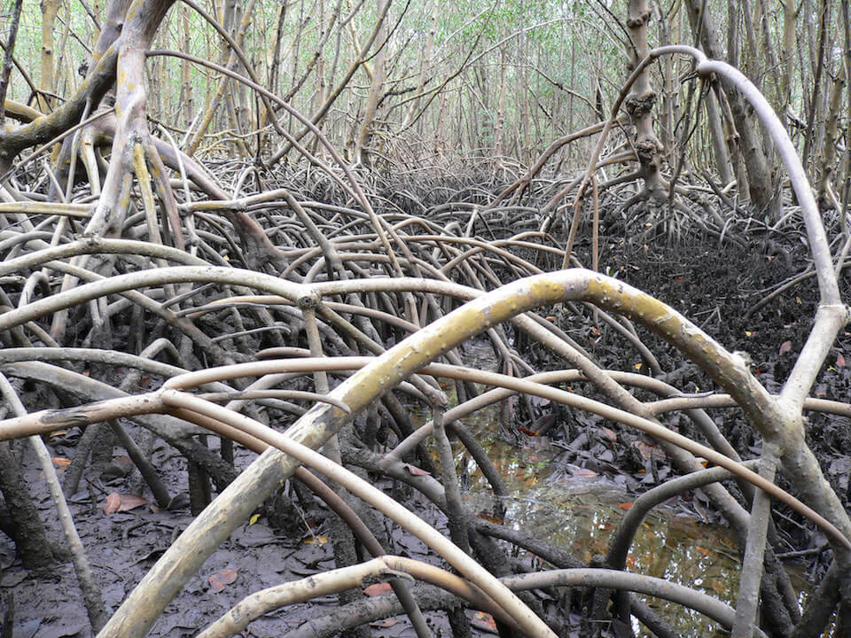

<content-header icon="mangrove_swamp" title="Mangrove Swamp"></content-header>

<figcaption>Photo: NPS</figcaption>

### Overall vulnerability:

Moderate

### Area:

-   248,515 hectares within Florida (modeled)

-   225,026 hectares (91%) is located on public lands

**TODO: map (if exists)**

## General Information

These swamp communities are usually composed of red mangrove, black mangrove, and white mangrove. Mangroves form dense, brackish-water swamps along low-energy shorelines and in protected, tidally influenced bays of southern Florida. This community type is composed of freeze-sensitive tree species and, with some limited exceptions, mangroves which are distributed south of Cedar Key on the Gulf coast and south of St. Augustine on the Atlantic coast. Depending on slopes and amounts of disturbance, mangrove swamps may progress in zones of single species from seaward (red mangrove) to landward (white mangrove) areas. Buttonwoods usually occur in areas above high tide. Often vines, such as rubber vines and morning-glory, climb over mangroves, especially at swamp edges.

This conservation asset includes Mangrove Swamp, Scrub Mangrove and Buttonwood Forest.

### Species

Black-whiskered vireo, Florida prairie warbler,  Mangrove clapper rail, Mangrove cuckoo, Mangrove diamondback terrapin, Wading birds

## Impacts of Climate Change

In coastal areas with low elevation gradients mangroves are likely to be overwhelmed by a rapid rate of sea level rise.  However, they can keep pace with more modest rates of sea level rise, moving inland as the seas rise.  They may be many areas where inland migration is prevented due to barriers/human development.  In addition to moving inland, mangroves are likely to continue a northward range expansion.  

Relatively small changes in winter temperature (e.g., increasing minimum temperature) can result in dramatic mangrove range expansion.   Almost 100% of the current extent of mangroves is expected to be inundated by 1m of sea level rise; however, it is expected that mangroves may be able to expand their range inland and possibly northward as temperatures increase and cold weather events decrease. 

Large expanses of mangroves could be fragmented into smaller, more isolated patches, as mangroves in some areas are able to keep pace and/or migrate while those in other areas won't be able to migrate.  Loss of sediment (peat) due to erosion following storms can lead to collapse when the vegetation is compromised.

#### This conservation asset is expected to be impacted by sea level rise:

- 3 meters of sea level rise: 100% of area (248,486 ha)
- 1 meter of sea level rise: 100% of area (248,154 ha)
    

[More information about general climate impacts to ecosystems and habitats in Florida](/impacts/habitats).

### Impacts to Species

Mangroves provide nesting habitat for many bird species, including wading birds, black-whiskered vireo, mangrove cuckoo, and Florida prairie warbler.  Loss of mangrove habitat will impact these species' reproductive success and survival.   If other conditions are suitable, these bird species may be able to expand their range northward along with the mangroves.  

Increased fragmentation of the mangrove habitat could impact wading birds that nest in large colonies, with smaller more isolated colonies potentially less successful.  

Changes in freshwater input could alter the species composition of the mangrove habitat.

[More information about general climate impacts to species in Florida](/impacts/species).

## Other Non-climate Threats

-	Channel modifications/shipping lanes
-	Chemicals and toxins
-	Coastal development
-	Dam operations/incompatible release of water
-	Fishing gear impacts
-	Harmful algal blooms
-	Incompatible fishing pressure
-	Incompatible industrial operations
-	Incompatible recreational activities
-	Incompatible wildlife and fisheries management strategies
-	Industrial spills
-	Invasive animals
-	Invasive plants
-	Management of nature
-	Nutrient loads - urban
-	Roads
-	bridges and causeways
-	Shoreline hardening
-	Surface water and groundwater withdrawal
-	Vessel impacts

## Adaptation Strategies

#### Planning

- Develop coordinated foreshore habitat management plans that establish a connected network of protected areas across the entire Florida shoreline.
- Work with counties, local municipalities and regional planning councils to incorporate natural resources adaptation strategies in comprehensive plans and hazard planning efforts.

#### Restoration

- Restore mangrove communities that are most likely to withstand climate change impacts if other threats are removed (non-climate stressors).
- Replace hardened shorelines with natural vegetated shorelines.
- Remove impediments/barriers to upslope habitat movement.
- Restore hydrology by filling mosquito ditches, removing roads, and replacing culverts with types/sizes that will accommodate future flows.
- Implement best management practices to reduce sources of land-based pollutant and nutrient loads impacting species and habitats.

#### Protection

- Preserve and restore the structural complexity and biodiversity of vegetation.
- Protect buffer zones landward of shore to allow for future upslope migration.
- Purchase upland development rights or property rights.
- Protect critical areas that are naturally positioned to be more resistant to climate change.
- Protect mangrove forests with abundant mature trees producing a healthy supply of seeds and propagules.
- Protect mangrove areas that demonstrate persistence over time – areas with a range of small young and large old trees or mangrove roots with dense epibiont communities such as oysters, sponges, tunicates and corals.
- Establish protections for transitional habitats that will provide for range shifts and serve as potential climate refugia.
- Protect mangrove areas where they benefit adjacent ecosystems by filtering sediments and pollutants or providing nursery habitats.

#### Policy

- Establish rolling easements.
- Eliminate/reduce mangrove thinning/pruning.
- Incentivize natural shorelines.

#### Education/Outreach

- Work with communities and landowners to choose vegetation, living shorelines, oyster reef restoration, or hybrid approaches in favor of traditional hard armoring.
- Work with volunteers to control invasive species.
- Enhance outreach regarding impacts of fertilizer on water quality.
- Actively engage with communities to minimize urban encroachment.
- Educate planners on importance of coastal habitat preservation (including serving as hazard buffers), climate change and incorporation into long range planning efforts.
- Work with communities to reduce stormwater runoff.

#### Monitoring

- Monitor levels of pollutants.
- Monitor community range shifts.
- Encourage periodic bioblitz events to capture comprehensive inventories, repeat periodically (5 to 10 years).
- Monitor disease prevalence and occurrence (spatially and temporally).
- Monitor phenology.
- Monitor, map  and research shifts in communities; identify sensitive and resilient species.
- Install Surface Elevation Tables in sensitive areas to improve future modeling efforts and monitor ability of critical habitats to maintain elevation with sea level rise.
- Continue and expand disturbance monitoring activities with the goal of establishing early warning systems and management responses to address impacts on mangroves.
- Monitor sediment dynamics.

## Additional Resources

 - [Florida Natural Areas Inventory Profile](http://www.fnai.org/PDF/NC/Mangrove_Swamp_Final_2010.pdf)
