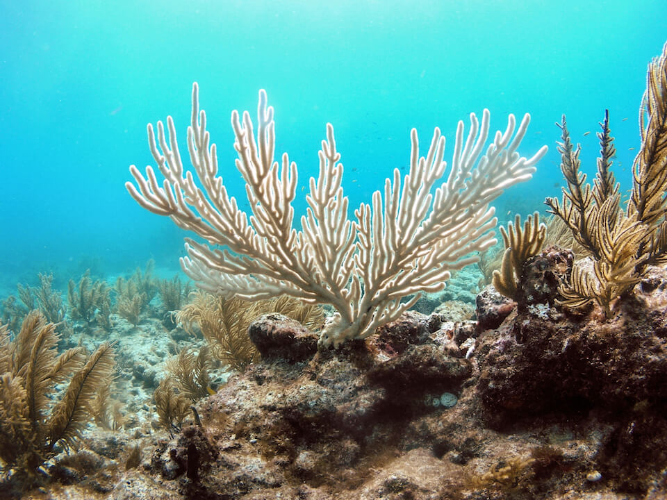

<content-header icon="coral_hardbottom" title="Coral and Hardbottom"></content-header>

<figcaption>Photo: USGS</figcaption>

### Overall vulnerability:

This conservation asset was not assessed for vulnerability.

### Area:

-   566,560 hectares within Florida (modeled)

-   0 hectares (<1%) is located on public lands

**TODO: map (if exists)**

## General Information

A coral reef is an epibenthic community; a concentrated topographic complex of massive corals and other sessile organisms (algae, bryozoans) that build calcium carbonate (limestone) skeletons. The structural complexity provides habitat for a highly diverse flora and fauna that live all or portions of their lives on coral reefs.  Two major Coral Reef types are recognized: patch reefs and offshore bank reefs. 

Bank Reefs are further defined by zones (e.g., reef flat, spur and groove). The types of coral reefs found off the coast of Florida include the shallow-wave resistant reefs in the region from Dry Tortugas to Martin County; deeper (30-130 ft.; 10-40 m) reefs in the same region; the Oculina Banks seaward of Palm Beach to Vero Beach. Deep water (165-265 ft.; 50-80 m) structures such as Pulley Ridge and the Florida Middle Grounds occur along the west Florida shelf break in federal waters.  

Hard Bottom is characterized as mixed communities of algae, sponges, octocorals and stony corals. This habitat occurs in subtidal, intertidal, and supratidal zones throughout Florida's coastal waters. Hard Bottom is composed of attendant epibenthic biota on a rocky substrate composed of coquina, limestone, or relic coral, molluscan, and annelid reefs. Coquina is a limestone composed of broken shell debris. Limestone rock (many different strata) occurs as high- or low-relief outcrops of calcium carbonate. 

Relic reefs are the skeletal remains of once-living reefs such as the Vermetid Reef built by worm-like gastropod mollusks, Petaloconchus. These reefs are only known to be found in shallow waters seaward of the outer islands in the Ten Thousand Islands area of southwest Florida.

Hard bottom biological communities are structured by depth and latitude and inhabited by sessile, planktonic, epifaunal, and pelagic plants and animals; infaunal organisms are present in interstitial soft bottom substrate. In the region south of Stuart on the east coast of Florida and Bay Port on the west coast, subtidal hard bottom communities are characteristically inhabited by soft corals (octocorals) and sponges. Octocoral beds have dense concentrations of sea fans, sea plumes, and sea feathers. Mobile species found in octocoral beds include flamingo tongue shell, purple shrimp, and basket starfish. 

Sponge beds include the branching, vase, tube, Florida loggerhead, and sheepswool sponges. Other mobile fauna found in both the octocoral beds and the sponge beds include amphipods, isopods, burrowing shrimp, crabs, sand dollars, and many species of fish. Although the coral species found in Hard Bottom habitat are not reef-building, they do contribute to the three-dimensional nature of the areas by increasing the surface area for sessile organisms and by providing important refuges for a variety of fish and invertebrates.

### Species

Pillar coral

## Impacts of Climate Change

Warming of as little as 1◦C can result in coral bleaching.  Moderate bleaching results in stress that causes reduced growth rates and reproductive output, whereas severe bleaching results in coral death. Bleaching also appears to make corals more vulnerable to disease.   Ocean acidification and temperature increases may lead to shifts from coral dominated reefs to  reefs dominated by algae or sponges.  Increased ocean acidity will reduce calcification and compromise skeletal structure of coral reefs.   

Increased precipitation will lead to increased runoff, impacting water quality by increasing nutrients, pollutants, and turbidity. It can take years for coral reefs to recover from damage incurred by storms and increasing storm frequency will reduce the odds of recovery between disturbance events.

[More information about general climate impacts to ecosystems and habitats in Florida](/impacts/habitats).

### Impacts to Species

Many reef-associated species are expected to decline because of the decline in their coral-constructed habitat.  Both fish and invertebrate diversity are expected to decrease with loss of coral cover and structure. Some coral-associated species may be able to live in other habitats (e.g., rocky reefs), but others are specialized coral associates restricted to reefs.

[More information about general climate impacts to species in Florida](/impacts/species).

## Other Non-climate Threats

-	Channel modifications/shipping lanes
-	Chemicals and toxins
-	Coastal development
-	Dam operations/incompatible release of water
-	Disruption of longshore transport of sediments
-	Fishing gear impacts
-	Harmful algal blooms
-	Incompatible fishing pressure
-	Incompatible industrial operations
-	Incompatible recreational activities
-	Incompatible resource extraction
-	Incompatible wildlife and fisheries management strategies
-	Industrial spills
-	Invasive animals
-	Invasive plants
-	Key predator/herbivore loss
-	Management of nature
-	Nutrient loads - urban
-	Roads
-	Shoreline hardening
-	Vessel impacts

## Adaptation Strategies

#### Education/Outreach

- Evaluate adopt-a-species programs at all educational and public levels.
- Empower local communities to participate at the appropriate stages of MPA development decision-making processes.
- Work with local fishing, boating, and diving industries to report changes or impacts to the system.
- Engage volunteers for reef restoration, protection and stewardship efforts.
- Enhance outreach efforts to correlate water quality and habitat health to improve public stewardship and support actions to improve water quality, especially nutrients.
- Educate recreational users on the importance of phenology factors and how they relate to regulations/closures.
- Educate planners on importance of coastal habitat preservation (including serving as hazard buffers), climate change and incorporation into long range planning efforts.

#### Monitoring

- Continue and expand disturbance monitoring activities with the goal of establishing early warning systems and management responses to address impacts on nearshore coastal habitats.
- Monitor levels of pollutants.
- Monitor phenology.
- Monitor disease prevalence and occurrence.
- Encourage periodic bioblitz events to capture comprehensive inventories, repeat periodically (5 to 10 years).
- Analyze fisheries surveys for shifting populations.
- Monitor, map, and research shifts in communities; identify sensitive and resilient species.

#### Restoration

- Restore nearshore habitats.
- Implement best management practices to reduce sources of land-based pollutant and nutrient loads impacting species and habitats that are highly vulnerable to climate change.
- Restore coastal vegetation and upland buffers to reduce the impact of increased disturbance events on reef systems (stormwater runoff and sediment transport).
- Re-evaluate restoration and enhancement activities to address need for broader coverage at different spatial and temporal scales at the community level rather than species.
- Recover impacted shoreline habitats with species adapted to changing conditions.
- Restore or create new bivalve or annelid reefs.

#### Protection

- Provide shading or screening of corals that reduces the effects of harmful levels of UV-radiation.
- Protect areas that have exhibited resistance to bleaching and may have low vulnerability to future bleaching.
- Minimize risk and increase resilience through additional marine protections.
- Protect coastal vegetation and upland buffers to reduce the impact of increased disturbance events on reef systems (stormwater runoff and sediment transport).
- Protect areas that contain large and resistant colonies that produce large amounts of healthy larvae and display high biodiversity with fast-and slow-growing species.

#### Planning

- Restrict development and other land uses that alter disturbance processes in sensitive areas, set up buffer reserves and management areas.
- Develop coordinated foreshore habitat management plans that establish a connected network of protected areas across the entire Florida shoreline.
- Evaluate alternate/cyclical/rotational use of habitats for recreational and commercial activities.

#### Policy

- Require coastal counties to address foreshore habitat conservation and adaptation in all comprehensive planning activities.
- Re-direct or limit boating or other recreational and commercial pressures at sensitive sites where intense use could further reduce habitat cover.

## Additional Resources

 - [Florida Natural Areas Inventory Profile](http://www.fnai.org/PDF/NC/Marine_Estuarine.pdf)
