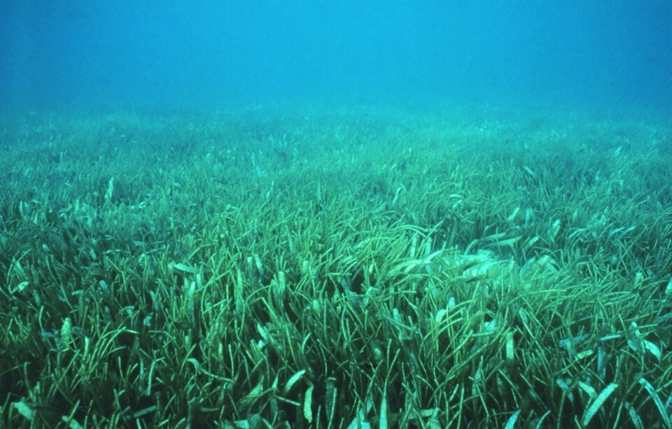

<content-header icon="seagrass" title="Seagrass"></content-header>

<figcaption>Photo: NOAA</figcaption>

### Overall vulnerability:

This conservation asset was not assessed for vulnerability.

<h3>Habitat area: 
<a href="/habitats/marine/6200/map" style="float:right;font-size:smaller;margin-right: 2rem;">
<fa-icon name="map"></fa-icon>
explore on map
</a>
</h3>

-   979,120 hectares within Florida (modeled)
-   0 hectares (<1%) is located on public lands

## General Information

Seagrasses are marine flowering plants adapted to grow and reproduce in the underwater environment. Florida estuaries and nearshore coastal waters contain the nation’s largest seagrass resources (more than two-million acres), as well as its two most extensive, contiguous seagrass beds (i.e., Florida Bay and the Big Bend region). Factors that affect the establishment and growth of seagrass include light availability, water temperature, salinity, sediment composition, nutrient levels, wave energy, and tidal range. 

Seagrass most often occurs in areas of low to moderate current velocities where the water is clear; thereby allowing sunlight to penetrate to the leaf blades. 

Seagrass communities are highly productive, faunally rich, and ecologically important systems. Hundreds to thousands of species of flora and fauna may inhabit seagrass habitats utilizing food, substrate, and shelter provided by the plants. Seagrasses also stabilize sediments and help maintain water clarity.

### Species

Blue crab, West Indian manatee

## Impacts of Climate Change

Changes in sea level, salinity, temperature, atmospheric carbon dioxide (CO2), and ultra violet (UV) radiation can affect seagrass.  Sea level rise reduces the amount of light reaching seagrass beds, thereby reducing growth rates.  Some grass beds may not persist due to shoreline construction and armoring impeding their shoreward migration. Increased water temperature may lead to shifts in range and extent of seagrass species, as species in North Florida are replaced by more tropical species.  

Increased salinity due to decreased freshwater input and increased evaporation rates can cause physiological stress to the vegetation.  

Large-scale die-offs of seagrass in Florida Bay have been attributed to hypoxia and sulfide production driven by warm, hypersaline waters.  Increased water temperature and nutrient enrichment together promote hypoxia and harmful algal blooms.   Increased precipitation will lead to increased runoff, impacting water quality by increasing nutrients, pollutants, and turbidity.

[More information about general climate impacts to ecosystems and habitats in Florida](/impacts/habitats).

### Impacts to Species

Florida's seagrass beds are vital for providing foraging, refugia and nursery habitat for numerous fish, shellfish, manatees and sea turtles.  Changes in water quality and clarity that impact the health, distribution, and abundance of seagrass beds will impact the health, reproductive success and survival of a multitude of species.  

Degradation or loss of seagrass beds will impact reproductive success, recruitment and survival of many species that depend on it as nursery habitat.  The sea squirt and mollusks attach larvae and eggs to the seagrass leaves, while other juvenile fish and invertebrates use the seagrass beds as refugia, concealing themselves from predators.  

The loss of seagrass beds will further exacerbate degraded water quality due to the loss of the substrate stabilizing function seagrass provides.  Areas devoid of seagrass are vulnerable to intense wave action from currents and storms.

[More information about general climate impacts to species in Florida](/impacts/species).

## Other Non-climate Threats

-	Channel modifications/shipping lanes
-	Chemicals and toxins
-	Coastal development
-	Dam operations/incompatible release of water
-	Disruption of longshore transport of sediments
-	Fishing gear impacts
-	Groundwater withdrawal
-	Harmful algal blooms
-	Incompatible fishing pressure
-	Incompatible industrial operations
-	Incompatible recreational activities
-	Industrial spills
-	Invasive animals
-	Invasive plants
-	Key predator/herbivore loss
-	Management of nature
-	Nutrient loads - urban
-	Roads
-	Shoreline hardening
-	Surface water withdrawal
-	Vessel impacts

## Adaptation Strategies

#### Monitoring

- Continue and expand disturbance monitoring activities with the goal of establishing early warning systems and management responses to address impacts on seagrass.
- Monitor community range shifts.
- Monitor, map and research shifts in communities; identify sensitive and resilient species.
- Monitor restoration and management projects to provide feedback on results and determine if they need to be adapted to meet their goals.
- Monitor disease prevalence and occurrence (spatially and temporally).
- Monitor phenology.
- Encourage periodic bioblitz events to capture comprehensive inventories, repeat periodically (5 to 10 years).
- Monitor toxic levels of pollutants.

#### Education/Outreach

- Work with local fishing, boating and diving industries to share information on systems and impacts from climate change and other stressors.
- Enhance outreach efforts to correlate water quality and habitat health to improve public stewardship and support actions to improve water quality.
- Educate planners on importance of coastal habitat preservation (including serving as hazard buffers), climate change and incorporation into long range planning efforts.
- Enhance outreach regarding impacts of fertilizer on water quality.
- Work with communities and landowners to choose vegetation, living shorelines, oyster reef restoration, or hybrid approaches in favor of traditional hard armoring.
- Work with communities to reduce stormwater runoff.

#### Protection

- Preserve the structural complexity and biodiversity of vegetation (e.g., species diversity, genetic diversity, trophic diversity).
- Fully protect seagrass communities that are at low risk of succumbing to climate change and anthropogenic impacts (areas to serve as refugia).
- Protect multiple sites of the full range of seagrass communities and from a wide geographical range.
- Establish coastal buffer zones to limit soil, nutrient and pollutant runoff.
- Protect seagrass communities that are producing a healthy supply of seeds/propagules (protect supply sources of seeds to repopulate following disturbances).
- Protect seagrass communities that are of important ecological significance (high species diversity, nursery habitat) and essential to the livelihoods of local communities (human).

#### Restoration

- Restore the structural complexity and biodiversity of vegetation (e.g., species diversity, genetic diversity, trophic diversity).
- Reduce surface water runoff in order to minimize impacts on sensitive Submerged Aquatic Vegetation (SAV).
- Introduce founder populations (pioneering species), followed by transplantation of other species.
- Restore critical seagrass communities that are most likely to withstand climate change impacts if other threats are removed (non-climate stressors).

#### Planning

- Develop baseline maps of seagrass meadows to allow for monitoring of changes in distribution and abundance.
- Identify patterns of connectivity between seagrass beds and adjacent habitats to improve the design of marine protected area networks.

#### Policy

- Re-direct or limit boating or other recreational and commercial pressures at sensitive sites where intense use could further reduce habitat cover.
- Implement codes of conduct for fishing and boat anchoring to reduce disturbances and damage.

## Additional Resources

 - [Florida Natural Areas Inventory Profile](http://www.fnai.org/PDF/NC/Marine_Estuarine.pdf)
