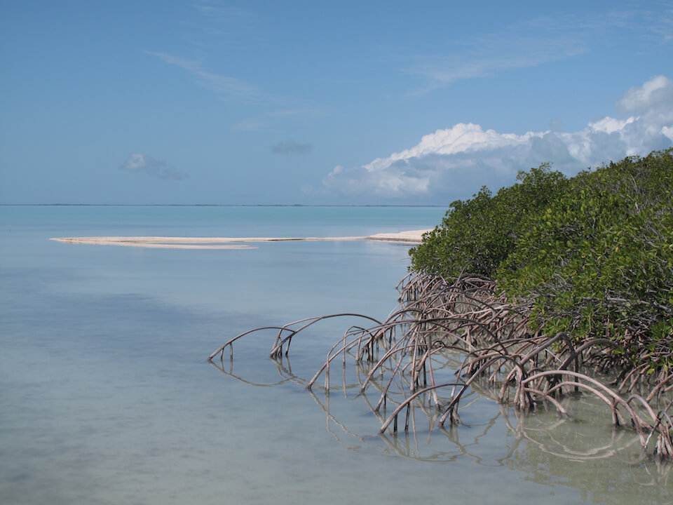

# Marine & Estuarine Ecosystems

<figcaption>Photo: NPS</figcaption>

## General Information

Florida’s estuarine and marine ecosystems include the waters and sub-tidal zones of estuaries, semi-enclosed bays and lagoons, and open ocean, as well as seagrasses, coastal marshes, mangroves, and various types of reed such as oyster reefs, coral reefs or rocky reefs.  Mangroves are one of the most productive habitats, providing integral nursery habitats for fish species.  Shorelines fringed by mangrove prop roots harbor diverse fish assemblages in high densities. Biscayne Bay has the longest stretch of mangrove shoreline left on the east coast of the U.S. Mangroves also provide shoreline protection from wind, waves, and erosion. The most extensive salt marshes in Florida begin in northwest Florida at the mouth of the Ochlockonee River near Apalachicola and end in New Port Richey.  Florida has many large bays and lagoons, including Apalachee Bay, Tampa Bay, Charlotte Harbor, Florida Bay and the Indian River lagoon. The combination of freshwater and saltwater wetlands, seagrass and mangrove communities, contribute valuable cover, foraging areas, and reproductive habitats for many fish and wildlife species. Seagrasses are found in protected bays, lagoons, and other shallow coastal waters.  Seagrass communities provide feeding grounds, nursery areas, and protective cover for a diversity of marine species.  Additionally, seagrasses stabilize bottom sediments and aid in preventing erosion during storm events. The Florida reef is the only living coral barrier reef in the continental US and is the third largest in the world.  It extends almost 200 miles long and has more than 6,000 individual reefs in the system.  Over 30 different kinds of corals are found in Florida waters. Coral reefs provide habitat for thousands of species of plants and animals.

## Impacts of Climate Change

The three primary climate change drivers that impact estuarine and marine habitats are sea level rise, increasing ocean temperatures and ocean acidification.  Sea level rise and associated increases in water depth will decrease light availability and impact seagrass distribution, productivity, and structure.  Even small changes in water temperatures can have profound effects, especially where coral reefs, seagrasses, and mangroves predominate.    Increasing ocean temperatures lead to lower oxygen levels in the surface water and higher evaporation rates increases the sea surface salinity.  Both factors, low oxygen and increased salinity can lead to stress and decreased reproductive success.  One of the primary effects of increased temperature on seagrass will be the alteration of growth rates and other physiological functions of the plants.  Over recent years, modest sea surface temperature increases have resulted in catastrophic impacts to the world’s coral reefs at the global, regional, and Florida-wide scales.  Since corals play a pivotal role in supporting biodiversity, harboring the highest diversity of marine species, impacts to their long-term survival can have devastating effects on reef-associated biodiversity.  

Additionally, estuarine productivity will be impacted by changes in the timing and amount of freshwater, nutrient, and sediment delivery.  Species may be impacted as salinity levels shift due to changes in precipitation and freshwater input, favoring those species more tolerant of a range of salinity levels.  Increased runoff will impact water quality by increasing nutrients, pollutants, and turbidity.   

Both saltwater marsh and mangroves may be able to keep pace with sea level rise and other climatic changes. Relatively small changes in winter climate can result in dramatic mangrove range expansion to the north.  However, this may be at the expense of saltwater marsh, as mangroves expand into areas occupied by saltwater marsh vegetation. This loss may be balanced as other inland habitats transition to saltwater marsh as they become inundated.  The inland migration of saltwater marsh will be limited by natural and human-built barriers.

[More information about general climate impacts to ecosystems and habitats in Florida](/impacts/habitats).

### Impacts to Species

Many species of birds use the mangrove canopy as nesting sites, including wading birds, mangrove cuckoos, and white-crowned pigeons. Saltmarsh-dependent bird species such as seaside sparrows may be forced to leave the area if suitable habitat no longer exists. Impacts to corals long-term survival can have devastating effects on reef-associated biodiversity. Most of Florida's sport fish species and many other marine animals spend significant parts of their lives (particularly early development stages) on or around coral reef habitats.  Warmer water temperatures can lead to increased negative effects of diseases on species, as pathogens are generally favored by warmer temperatures relative to their hosts.

[More information about general climate impacts to species in Florida](/impacts/species).
