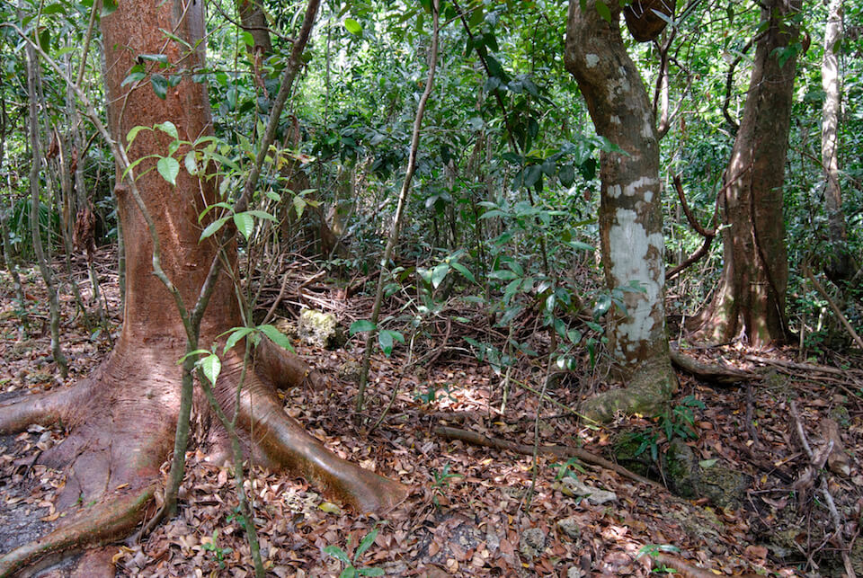

<content-header icon="hardwood_forested_uplands" title="Rockland Hammock" subtitle="within Hardwood Forested Uplands">
</content-header>

<figcaption>Photo: Gary Knight, FNAI</figcaption>

### Overall vulnerability:

Very High

<h3>Habitat area: 
<a href="/habitats/terrestrial/1130/map" style="float:right;font-size:smaller;margin-right: 2rem;">
<fa-icon name="map"></fa-icon>
explore on map
</a>
</h3>

-   7,802 hectares within Florida (modeled)
-   6,780 hectares (87%) is located on public lands

## General Information

Rockland hammocks occur only in south Florida and are characterized by tree and shrub species on the northern edge of a range that extends southward into the Caribbean. These communities are sparsely distributed along coastal uplands south of a line from about Vero Beach on the Atlantic coast to Sarasota on the Gulf coast. They occur on many tree islands in the Everglades and on uplands throughout the Florida Keys. This cold-intolerant tropical community has very high plant species diversity, sometimes containing over 35 species of trees and about 65 species of shrubs. Characteristic tropical plants include strangler fig, gumbo-limbo, mastic, bustic, lancewood, ironwoods, poisonwood, pigeon plum, Jamaica dogwood, and Bahama lysiloma. Live oak and cabbage palm are also sometimes found within this community. 

Rockland hammocks in the Florida Keys may also contain several plants, including lignum vitae, mahogany, thatch palms, and manchineel, which are extremely rare within the United States.

This conservation asset includes Thorn Scrub.

### Species

Florida tree snail, Key deer, Mangrove cuckoo, Rim rock crowned snake, Schaus swallowtail butterfly, White-crowned pigeon

## Impacts of Climate Change

Florida's rockland hammock habitat is likely to have 58% of the current area inundated by 1 m of sea level rise and 91% inundated by 3 m of sea level rise.  Increased soil salinity from saltwater intrusion and increased length of root inundation, increased exposure of salt spray and coastal erosion will lead to changes in species composition and structure as salt intolerant plants decline and plants with higher salt tolerances increase.   Increased temperature along with decreased precipitation and drought could lead to increased wildfire within rockland hammocks.   Drought and heat stress caused by increased temperatures can lead to increased insect outbreaks and habitat degradation.   Increased intensity and/or frequency of storms will cause habitat degradation and loss.

#### This habitat is expected to be impacted by sea level rise:

- 3 meters of sea level rise: 91% of area (7,091 ha)
- 1 meter of sea level rise: 58% of area (4,525 ha)

[Explore sea level rise impacts map](/habitats/terrestrial/1130/map).

[More information about general climate impacts to ecosystems and habitats in Florida](/impacts/habitats).

### Impacts to Species

Rockland hammocks provide critical habitat for many south Florida and Florida Keys endemic species.  Many species, including the Key Largo cotton mouse, Key Largo woodrat, Key ringneck snake, Rim rock crowned snake, Florida tree snail and Schaus swallowtail butterfly are dependent upon the rockland hammock community and may face extinction in the wild if/when the habitat is gone.  Impacts due to sea level rise, increased exposure to salinity, and storm events could cause the reduction or loss of key host/food plants for these species.

[More information about general climate impacts to species in Florida](/impacts/species).

## Other Non-climate Threats

-	Chemicals and toxins
-	Conversion to housing and urban development
-	Groundwater Withdrawal
-	Incompatible fire
-	Invasive animals
-	Invasive plants
-	Roads
-	Surface water withdrawal

## Adaptation Strategies

#### Education/Outreach

- Provide education and incentives for neighboring landowners to reduce critical invasive plants and assist in detection of new species.
- Work with volunteers to control invasive species.
- Work with communities and landowners to choose native vegetation in favor of non-native vegetation.
- Work with local communities to remove dumped debris, e.g., construction materials, landscape debris, automobile parts, trash.

#### Monitoring

- Monitor for shifting phenology – and potential phenological mismatches as species alter the timing of events such as breeding, flowering, migration.
- Conduct surveys to detect new infestations of invasive species and presence of new species.
- Monitor status of indicator species to guide or inform adaptive management.
- Monitor species diversity and habitat transition over time in response to sea level rise and changing climatological conditions.

#### Policy

- Provide greater regulation and enforcement of recreational use and access restrictions.
- Centralize recreation impacts to easy-access areas.
- Revise zoning codes to protect areas from adverse impacts from development.
- Reduce public access to areas as they become stressed/impacted by climate change and more susceptible to non-climate stressors.

#### Planning

- Assess and take steps to reduce risks of facilitating movement of “new” undesirable non-native species, pests, and pathogens.
- Reduce roadway and paved area construction near sensitive systems to maintain natural hydrology.
- Identify areas particularly vulnerable to loss or transition under climate change and develop management strategies and approaches for adaptation.
- Plan timing of restoration activities to avoid impacts on rare species during critical life history phases and during times of increased stress due to impacts from climate change.
- Incorporate climate change considerations into new and future revisions of species and area management plans.

#### Protection

- Preserve remaining rockland hammock and buffers.
- Identify and prioritize protection of corridors between rockland hammock and other natural habitats that will promote species migration corridors.
- Limit the amount of ground water that can be withdrawn, especially in times of decreased precipitation or drought.
- Reduce or eliminate mosquito spraying on and adjacent to rockland hammock.
- Consider relocating rare species to higher elevation areas when critical populations may be affected by impacts from sea level rise (e.g., increased soil salinity).
- Reduce or eliminate pesticide spray and dust from adjacent agricultural and commercial operations.
- Develop ex-situ living collections of unique/endemic plant species with partners such as botanic gardens and arboreta.
- Eliminate use of herbicide adjacent to sources of freshwater (e.g., sinkholes).

#### Restoration

- Prioritize restoration activities on areas of higher elevation (more secure from sea level rise).
- Remove roads within protected areas.
- Use plant stock that will be resilient in response to climate change, e.g., species with similar structure and function but with higher salt tolerance.
- Remove new invasive species before they become established.

[More information about adaptation strategies](/strategies).

