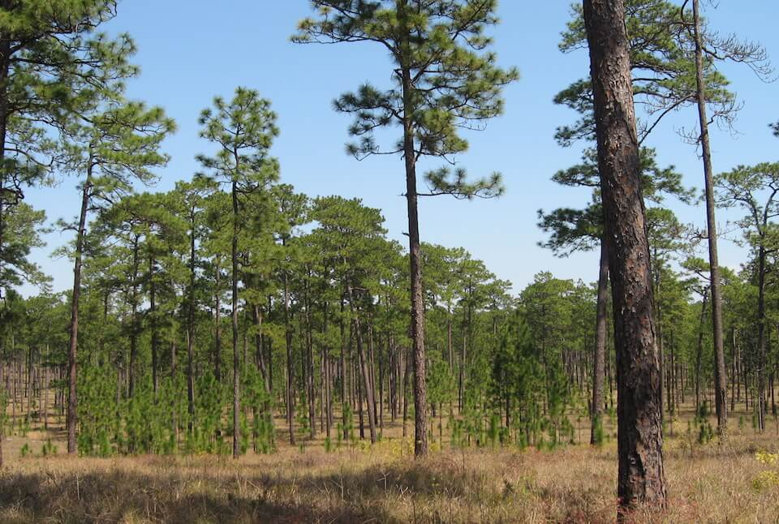

<content-header icon="high_pine_scrub" title="High Pine and Scrub"></content-header>

<figcaption>Photo: FWC</figcaption>

### Overall vulnerability:

This conservation asset was not assessed for vulnerability.

### Area:

-   660,344 hectares within Florida (modeled)

-   412,223 hectares (62%) is located on public lands

**TODO: map (if exists)**

## General Information

High pine is found on hilltops and gentle slopes, characterized by excessively drained soils.  It typically has widely spaced longleaf pine and/or turkey oak with wiregrass understory. Absence of pines is usually due to past management, especially logging and usually results in a sandhill dominated by xeric oaks, especially turkey oak.  

Scrub communities occur statewide on old dunes with deep fine sand soils that are excessively drained. Scrub communities found on the Lake Wales Ridge are among the oldest plant communities in Florida and are home to high numbers of endemic and rare species.  

Both communities are fire maintained systems, with a natural fire frequency of 2-5 years for high pine and 10 -20 years, or more for scrub.  Fire suppression can result in a shift of species composition.

This conservation asset includes  Scrub, Upland Mixed Woodland, Upland Coniferous, and Sandhill.

### Habitats

- [Scrub](/habitats/terrestrial/1210)- [Upland Pine](/habitats/terrestrial/1231)- [Sandhill](/habitats/terrestrial/1240)

### Species

Eastern indigo snake, Florida mouse, Florida scrub-jay, Gopher frog, Gopher tortoise, Red-cockaded woodpecker, Sand skink, Sherman's fox squirrel

## Impacts of Climate Change

Altered fire regimes or the absence of fire could lead to compositional and structural changes to hardwood forests, potentially altering their suitability to the current suite of species.  Additionally, the reduction or lack of prescribed fire (fuel reduction) coupled with increased evapotranspiration rates could lead to more frequent and intense wildfires. 

Changes in temperature and precipitation regimes could lead to altered composition and structure of these systems, as trees and other vegetation more suited to hotter/drier or hotter/wetter conditions replace some of the more heat and moisture sensitive species.  

Increased temperatures, as well as extreme events (e.g., flood, drought, fires) will enhance invasive species processes, from introduction through establishment and expansion. 

Drought and increased temperatures can lead stress, mortality and increased insect outbreaks and mortality in forests.  

These systems are also at higher risk of future development as people move out of more vulnerable coastal areas.

#### This conservation asset is expected to be impacted by sea level rise:

- 3 meters of sea level rise: 3% of area (20,829 ha)
- 1 meter of sea level rise: 1% of area (7,685 ha)
    

[More information about general climate impacts to ecosystems and habitats in Florida](/impacts/habitats).

### Impacts to Species

Many species dependent upon these fire maintained systems would be impacted if the fire regime is altered.  Species such as the red-cockaded woodpecker, gopher tortoise and Sherman's fox squirrel rely on the openness of the sandhill community that is maintained by prescribed fire.  Alterations to the frequency or seasonality of fire would lead to habitat degradation, fragmentation and loss, impacting species such as the red-cockaded woodpecker, gopher tortoise, and Sherman's fox squirrel.  

The loss of gopher tortoises within a system will impact a suite of other species (commensals) that depend on the tortoises' burrow for habitat, including gopher frog, Florida mouse, eastern indigo snake, and many hundreds of species of invertebrates.  

Reproductive success for species such as the striped newt and gopher frog would decrease as critical breeding ponds found within these upland communities are impacted by decreased precipitation and increased evapotranspiration rates.

[More information about general climate impacts to species in Florida](/impacts/species).

