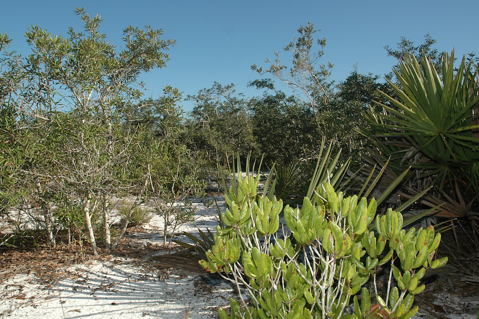

# Scrub

### within High Pine and Scrub

<figcaption>Photo: FWC</figcaption>

### Overall vulnerability:

High

### Area:

-   161,995 hectares within Florida (modeled)

-   124,171 hectares (77%) is located on public lands

## General Information

Scrub communities occur on areas of deep, well-drained, infertile sandy soils that are typically white or near white. Scrub has a patchy distribution and occurs in both inland and coastal areas, from the panhandle through subtropical regions of the peninsula. The largest and most important patches of scrub occur along the central ridge of the peninsula near Ocala and in Polk and Highlands counties. 

This community is fire-dependent -  it is maintained by fires that are usually very hot or intense, but occur infrequently at intervals of 10-20 years, or more. Generally, scrub is dominated by evergreen, or nearly evergreen, oaks and/or Florida rosemary, with or without a pine overstory. A relatively large suite of plant species is endemic to scrub.  

Many temporary wetlands are found throughout the scrub landscape and are an integral part of this community, providing breeding and foraging habitat for many wildlife species.

This conservation asset includes Oak Scrub, Rosemary Scrub, Sand Pine Scrub, and Coastal Scrub.

**TODO: map (if exists)**

### Species

Cedar Key mole skink, Florida scrub jay, Florida mouse, Florida pine snake,  Sand skink, Short-tailed snake

## Impacts of Climate Change

Altered fire regimes or the absence of fire could lead to compositional and structural changes, potentially altering their suitability to the current suite of species.  Prescribed fire is used in scrub oak habitats to maintain overgrowth of vegetation and to maintain open sandy areas.   Increased temperatures, as well as extreme events (e.g., flood, drought, fires) will enhance invasive species processes, from introduction through establishment and expansion.  Drought and increased temperatures can lead stress, mortality and increased insect outbreaks and mortality.  Coastal scrub will be impacted by sea level rise, changes in soil salinity, and increased intensity and/or frequency of storms leading to habitat degradation, fragmentation and loss.   Scrub systems typically don't flood or stay flooded for long period of time; however, if precipitation and/or extreme events  (e.g., storms, floods) increase, this community may experience saturated soils or flood conditions.  This could lead to a change in plants species as those that have a low tolerance to more hydric conditions are replaced by those that can withstand wetter conditions.   Scrub systems have already seen much destruction as a result of agriculture and residential development and will be at a high risk of future development as people move out of more vulnerable waterfront areas.

#### This habitat is expected to be impacted by sea level rise:

- 3 meters of sea level rise: 10% of area (15,794 ha)
- 1 meter of sea level rise: 4% of area (6,923 ha)
    

[More information about general climate impacts to ecosystems and habitats in Florida](/impacts/habitats).

### Impacts to Species

Scrub communities in Florida are already significantly reduced from historic amounts and are highly fragmented.  Further fragmentation due to the impacts of climate change will affect scrub dependent species.  

The Florida scrub jay depends on fire to keep scrub oak habitats short and maintain plenty of open sandy areas in which to store acorns.  

The sand skink requires well-drained sandy soils and cannot tolerate dense ground cover or heavily rooted vegetation.  Altered fire regimes leading to an increase in shrubby vegetation would reduce the suitability of the habitat for sand skinks.  

The loss of gopher tortoises within a system will impact a suite of other species (commensals) that depend on the tortoises' burrow for habitat, including gopher frog, Florida mouse, eastern indigo snake, and many hundreds of species of invertebrates.  

Gopher frogs are tied to both upland communities such as scrub and sandhill (in association with gopher tortoises) and small embedded wetlands within these systems.  Changes in the timing and amount of precipitation will impact the reproductive success and survival of gopher frogs.

[More information about general climate impacts to species in Florida](/impacts/species).

## Other Non-climate Threats

-	Conversion to agriculture
-	Conversion to commercial and industrial development
-	Conversion to housing and urban development
-	Conversion to recreation areas
-	Incompatible fire
-	Incompatible forestry practices
-	Incompatible recreational activities
-	Incompatible resource extraction
-	Invasive animals
-	Invasive plants
-	Roads

## Adaptation Strategies

#### Planning

- Identify areas particularly vulnerable to loss or transition under climate change and develop management strategies and approaches for adaptation.
- Determine how to minimize impacts from potential increased use of mechanical treatments, as they become the best management option when prescribed fire is no longer an option.
- Incorporate fire risk into land use planning.
- Incorporate climate change considerations into new and future revisions of species and area management plans.
- Assess and take steps to reduce risks of facilitating movement of “new” undesirable non-native species, pests, and pathogens.
- Conduct a predictive assessment of current and potential invasive species ranges and impacts.

#### Policy

- Create a moratorium on developing in undisturbed areas of endemic habitats, focusing development in previously developed and/or abandoned areas.
- Identify overused areas and limit recreational trails/roads and OHV use.
- Centralize recreation impacts to easy-access areas.
- Provide greater regulation and enforcement of recreational use and access restrictions.

#### Education/Outreach

- Expand prescribed fire training opportunities for both public and private land managers.
- Educate planners on importance of habitat preservation (including serving as hazard buffers), climate change and incorporation into long range planning efforts.
- Work with partners at landscape scales to strengthen and maximize use of existing conservation programs, particularly conservation easement tax incentives, the private lands programs focused on endangered species, and other federal and state private lands incentive programs to conserve private lands of high conservation value, to enhance habitat values and maintain working landscapes under climate change.
- Work with local communities to remove dumped debris, e.g., construction materials, landscape debris, automobile parts, trash.
- Work with volunteers to control invasive species.
- Actively engage with communities to minimize urban encroachment.
- Develop education materials for recreational users on the importance of phenology factors, how they may change over time given climate change impacts, and how they relate to regulations/closures.

#### Monitoring: 

- Monitor and correct for any point source or non-point source pollution.
- Monitor invasive plants and animals.
- Evaluate the effectiveness of various land management practices in reducing the impact of climate change.
- Document changes in vegetation structure and composition to track climate change effects.
- Monitor for changes in the number, size, configuration of sandy openings within scrub.

#### Protection:  

- Provide landowners and stakeholder groups with incentives for conservation and restoration of key corridor habitats that will provide connectivity under current and future conditions.
- Maintain habitat quality to enhance the resilience of scrub to changing conditions.
- Preserve scrub areas and buffers that are not yet impacted by human development.
- Encourage landowner cost share programs and enrollment in conservation easements to increase habitat base.
- Protect and maintain high quality native seed sources including identifying areas for seed collection across latitudinal ranges of target species.
- Seed bank, develop, and deploy as appropriate plant materials for restoration that will be resilient in response to climate change.

#### Restoration

- Connect existing areas of protected scrub by acquiring lands for conservation between them.
- Review and revise techniques to maintain or mimic natural disturbance regimes (e.g., what techniques should be used when prescribed fire is no longer feasible).
- Remove new species of invasive plants before they become established.
- Restore native understory plant communities, using stock that is more likely to persist in future climatic conditions.
- Redesign or mitigate existing physical barriers or structures that impede movement and dispersal within and among habitats.
- Allow for shifting plant species composition in response to changes in precipitation, especially in areas that may become wetter.
- Remove roads within scrub areas and restore fire break ditches, only use temporary firebreaks, as needed.
- Increase acreage of scrub communities in maintenance condition class.

[More information about adaptation strategies](/strategies).

