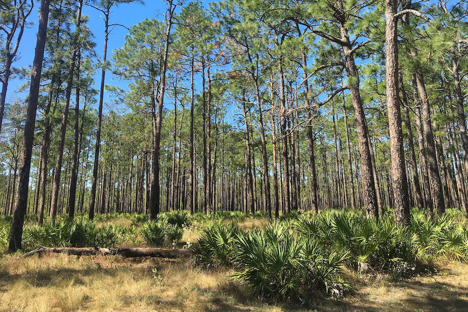

<content-header icon="high_pine_scrub" title="Upland Pine" subtitle="within High Pine and Scrub">
</content-header>

<figcaption>Photo: USFWS</figcaption>

### Overall vulnerability:

Moderate

<h3>Habitat area: 
<a href="/habitats/terrestrial/1231/map" style="float:right;font-size:smaller;margin-right: 2rem;">
<fa-icon name="map"></fa-icon>
explore on map
</a>
</h3>

-   66,696 hectares within Florida (modeled)
-   59,960 hectares (90%) is located on public lands

## General Information

Upland pine forest is characterized as a rolling forest of widely spaced pines with few understory shrubs and a dense ground cover of grasses and herbs, occurring on the rolling hills of extreme northern Florida. Pristine areas are dominated by longleaf pine and wiregrass, while areas that suffered agricultural disturbances are dominated generally by shortleaf and loblolly pines and old field grasses and herbs. 

Fire is a dominant factor in the ecology of this community because it reduces hardwood encroachment and facilitates pine and wiregrass reproduction. The natural fire frequency appears to be every 1 to 5 years, primarily in the warm season.  

Upland pine forest is often confused with sandhill. The primary differences between them reside in their soil characteristics and some species of plants and animals.  The presence of clay helps retain soil moisture, creating more mesic conditions than are found on the deep sands that support sandhill. Upland pine can be distinguished from mesic flatwoods by its occurrence on rolling hills rather than flatlands and by its lack of saw palmetto.

**TODO: map (if exists)**

### Species

Eastern indigo snake, Gopher tortoise, Sherman's fox squirrel, Southern bald eagle, Tiger salamander, Wild turkey

## Impacts of Climate Change

Altered fire regimes or the absence of fire, along with other climatic changes, could lead to compositional and structural changes to these upland pine systems, potentially altering their suitability to the current suite of species.  The absence of fire typically leads to an increase in woody vegetation, creating a dense mid-story.    Drought and heat stress caused by increased temperatures can lead to increased insect outbreaks and habitat degradation.  Warmer winter air temperatures will increase over-wintering Southern pine beetle larva survival rate, and higher annual air temperatures will allow the beetles to produce more generations per year.  Severe drought stress reduces resin production and greatly increases the susceptibility of trees to beetle infestation.   Increased summer and winter minimum temperatures, as well as extreme events (e.g., droughts, floods) will enhance invasive species processes, from introduction through establishment and expansion.   Cogon grass, mimosa, Japanese climbing fern, Japanese honeysuckle and natal grass are currently problematic in upland pine.

#### This habitat is expected to be impacted by sea level rise:

- 3 meters of sea level rise: <1% of area (51 ha)
- 1 meter of sea level rise: <1% of area (0 ha)

[Explore sea level rise impacts map](/habitat/terrestrial/1231/map).

[More information about general climate impacts to ecosystems and habitats in Florida](/impacts/habitats).

### Impacts to Species

Fire is essential for the regeneration and maintenance of longleaf pines as well as the highly diverse herbaceous groundcover.  Species such as the red-cockaded woodpecker rely on the openness of this community that is maintained by prescribed fire.  Alterations to the frequency or seasonality of fire would lead to habitat degradation, fragmentation and loss due to heavy hardwood and shrub encroachment and decrease in the herbaceous groundcover.  

Loss of mature longleaf pine due to heat induced stress, storms and/or insect outbreaks would reduce the number of suitable nest cavity trees for red-cockaded woodpeckers. Many other species, including redheaded woodpeckers, eastern bluebirds, brown-headed nuthatches, lizards, squirrels and frogs are know to use red-cockaded woodpecker nest cavities.  

Gopher tortoises depend on the open herbaceous groundcover.  The loss of gopher tortoises within a system will impact a suite of other species (commensals) that depend on the tortoises' burrow for habitat, including gopher frog, Florida mouse, eastern indigo snake, and many hundreds of species of invertebrates.

[More information about general climate impacts to species in Florida](/impacts/species).

## Other Non-climate Threats

-	Conversion to agriculture
-	Conversion to commercial and industrial development
-	Conversion to housing and urban development
-	Conversion to recreation areas
-	Groundwater withdrawal
-	Incompatible fire
-	Incompatible forestry practices
-	Incompatible recreational activities
-	Incompatible resource extraction
-	Invasive animals
-	Invasive plants
-	Roads
-	Surface water withdrawal

## Adaptation Strategies

#### Protection:  

- Maintain habitat quality to enhance the resilience of upland pine areas to changing conditions.
- Provide landowners and stakeholder groups with incentives for conservation and restoration of key corridor habitats that will provide connectivity under current and future conditions.
- Seed bank, develop, and deploy as appropriate plant materials for restoration that will be resilient in response to climate change.
- Protect and maintain high quality native seed sources including identifying areas for seed collection across latitudinal ranges of target species.
- Encourage landowner cost share programs and enrollment in conservation easements to increase habitat base.
- Preserve upland pines and their buffers that are not yet impacted by human development.

#### Monitoring: 

- Monitor and correct for any point source or non-point source pollution.
- Monitor disease prevalence and occurrence (spatially and temporally).
- Monitor for introductions/increases in invasive species.
- Monitor for signs of beetle outbreaks.
- Document changes in vegetation structure and composition to track climate change effects.
- Evaluate the effectiveness of various land management practices in reducing the impact of climate change.

#### Planning

- Incorporate fire risk into land use planning.
- Identify areas particularly vulnerable to loss or transition under climate change and develop management strategies and approaches for adaptation.
- Incorporate climate change considerations into new and future revisions of species and area management plans.
- Assess and take steps to reduce risks of facilitating movement of “new” undesirable non-native species, pests, and pathogens.
- Conduct a predictive assessment of current and potential invasive species ranges and impacts.

#### Restoration

- Restore native understory plant communities, using stock that is more likely to persist in future climatic conditions.
- Remove new species of invasive plants before they become established.
- Review and revise techniques to maintain or mimic natural disturbance regimes (e.g., what techniques should be used when prescribed fire is no longer feasible).
- Increase acreage of upland pine communities in maintenance condition class.
- Eliminate hydrologic barriers/conveyances.
- Redesign or mitigate existing physical barriers or structures that impede movement and dispersal within and among habitats.

#### Policy

- Identify overused areas and limit recreational trails/roads and OHV use.
- Centralize recreation impacts to easy-access areas.
- Review and update Best Management Practices to accommodate current and future conditions.
- Provide greater regulation and enforcement of recreational use and access restrictions.

#### Education/Outreach

- Work with volunteers to control invasive species.
- Actively engage with communities to minimize urban encroachment.
- Work with counties, local municipalities and regional planning councils to incorporate natural resources adaptation strategies in comprehensive plans and hazard planning efforts.
- Work with partners at landscape scales to strengthen and maximize use of existing conservation programs, particularly conservation easement tax incentives, the private lands programs focused on endangered species, and other federal and state private lands incentive programs to conserve private lands of high conservation value, to enhance habitat values and maintain working landscapes under climate change.
- Implement outreach to increase public understanding of the benefits of prescribed fire and the increased wildfire risks due to climate change.
- Expand prescribed fire training opportunities for both public and private land managers.

[More information about adaptation strategies](/strategies).

