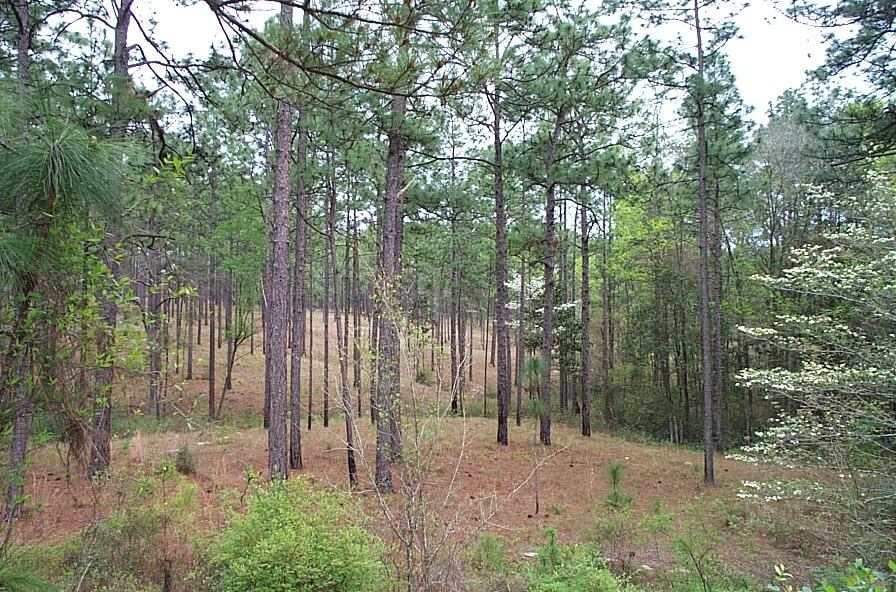

# Sandhill

### within High Pine and Scrub

<figcaption>Photo: Randy Kautz</figcaption>

### Overall vulnerability:

High

### Area:

-   313,937 hectares within Florida (modeled)

-   195,956 hectares (62%) is located on public lands

## General Information

Sandhill communities occur only in north and central Florida in areas of gently rolling terrain on deep, well-drained, mostly yellow, sterile sands. This xeric community is dominated by an overstory of widely spaced, scattered longleaf pine, along with an understory of turkey oak, sand post oak, and bluejack oak. The park-like ground cover consists of various grasses and herbs, including wiregrass, lopsided Indian grass, bluestems, blazing star, partridge pea, beggars tick, milk pea, queen's delight, and others. 

Due to the poor water retention properties of the soils and open canopy, temperature and humidity fluctuate rapidly and frequently in this habitat compared to high-moisture closed-canopy forests. However, many temporary wetlands are found throughout sandhill landscapes and are an integral part of this habitat type, providing breeding and foraging habitat for many wildlife species. 

Sandhill is a community that is sustained by ground fires with short return intervals to reduce hardwood intrusion and to promote flowering of many grasses and herbs. In the absence of fire, sandhill will eventually succeed into a xeric hammock. Sand pine can quickly invade sandhills where seed sources are available and fires are suppressed.

**TODO: map (if exists)**

### Species

Bluetail mole skink, Burrowing owl, Gopher tortoise, Red-cockaded woodpecker, Striped newt

## Impacts of Climate Change

Altered fire regimes or the absence of fire, along with other climatic changes, could lead to compositional and structural changes to these habitats, potentially altering their suitability to the current suite of species.  The absence of fire in the longleaf pine sandhill community can lead to an increase in woody vegetation, creating a dense mid-story.  Plant species dependent upon fire (e.g., longleaf pine, wiregrass) to initiate/facilitate germination/flowering will be impacted by altered fire regime (changes in frequency and timing of fires).  This could lead to shifts in species composition and system structure. Additionally, the reduction or lack of prescribed fire (fuel reduction) coupled with increased evapotranspiration rates could lead to more frequent and intense wildfires.  Drought and heat stress caused by increased temperatures can lead to increased insect outbreaks and mortality in forests. Higher winter air temperatures will increase over-wintering Southern pine beetle larva survival rate, and higher annual air temperatures will allow the beetles to produce more generations per year. Severe drought stress reduces resin production and greatly increases the susceptibility of trees to beetle infestation.   Increased summer and winter minimum temperatures, as well as extreme events (e.g., droughts, floods) will enhance invasive species processes, from introduction through establishment and expansion.   Decreased precipitation, coupled with increased temperatures would cause degradation of small associated wetlands found within the sandhill community.

#### This habitat is expected to be impacted by sea level rise:

- 3 meters of sea level rise: <1% of area (2,998 ha)
- 1 meter of sea level rise: <1% of area (191 ha)
    

[More information about general climate impacts to ecosystems and habitats in Florida](/impacts/habitats).

### Impacts to Species

Species such as the red-cockaded woodpecker, gopher tortoise and Sherman's fox squirrel rely on the openness of the sandhill community that is maintained by prescribed fire.  Alterations to the frequency or seasonality of fire would lead to habitat degradation, fragmentation and loss due to heavy hardwood and shrub encroachment.  Additionally, it could lead to decreased reproductive success and mortality.  

Loss of mature longleaf pine due to heat induced stress, storms and/or insect outbreaks would reduce the number of suitable nest cavity trees for red-cockaded woodpeckers.  

Reproductive success for species such as the striped newt and gopher frog would decrease as critical breeding ponds found within the sandhill community are impacted by decreased precipitation and increased evapotranspiration rates. T

he loss of gopher tortoises within a system will impact a suite of other species (commensals) that depend on the tortoises' burrow for habitat, including gopher frog, Florida mouse, eastern indigo snake, and many hundreds of species of invertebrates.

[More information about general climate impacts to species in Florida](/impacts/species).

## Other Non-climate Threats

-	Conversion to commercial and industrial development
-	Conversion to housing and urban development
-	Conversion to recreation areas
-	Incompatible fire
-	Incompatible recreational activities
-	Incompatible resource extraction
-	Invasive animals
-	Invasive plants
-	Roads

## Adaptation Strategies

#### Policy

- Develop expanded cost-share payments for private landowners through state and federal cooperative forest programs for reforestation of longleaf pine.
- Identify overused areas and limit recreational trails/roads and OHV use.
- Centralize recreation impacts to easy-access areas.
- Provide greater regulation and enforcement of recreational use and access restrictions.
- Modify the Conservation Reserve Program to create stronger incentives for longleaf pine restoration.

#### Education/Outreach

- Educate private landowners about the multiple advantages of longleaf pine restoration can yield and the benefits for the climate and the economy.
- Provide training concerning the re-establishment and management of longleaf pine ecosystems, especially on how to incorporate healthy fire regimes.
- Expand prescribed fire training opportunities for both public and private land managers.
- Develop education materials for recreational users on the importance of phenology factors, how they may change over time given climate change impacts, and how they relate to regulations/closures.
- Work with local communities to remove dumped debris, e.g., construction materials, landscape debris, automobile parts, trash.
- Work with partners at landscape scales to strengthen and maximize use of existing conservation programs, particularly conservation easement tax incentives, the private lands programs focused on endangered species, and other federal and state private lands incentive programs to conserve private lands of high conservation value, to enhance habitat values and maintain working landscapes under climate change.
- Work with volunteers to control invasive species.
- Actively engage with communities to minimize urban encroachment.
- Educate planners on importance of habitat preservation (including serving as hazard buffers), climate change and incorporation into long range planning efforts.

#### Monitoring: 

- Monitor invasive plants and animals.
- Evaluate the effectiveness of various land management practices in reducing the impact of climate change.
- Monitor and correct for any point source or non-point source pollution.
- Document changes in vegetation structure and composition to track climate change effects.
- Monitor for signs of beetle outbreaks.

#### Planning

- Incorporate fire risk into land use planning.
- Incorporate climate change considerations into new and future revisions of species and area management plans.
- Identify areas particularly vulnerable to loss or transition under climate change and develop management strategies and approaches for adaptation.
- Build upon and implement key components of the 2009 Range-wide Conservation Plan for Longleaf Pine.
- Work with the Longleaf Partnership Council on identified strategic priorities and actions.
- Conduct a predictive assessment of current and potential invasive species ranges and impacts.
- Assess and take steps to reduce risks of facilitating movement of “new” undesirable non-native species, pests, and pathogens.

#### Protection:  

- Maintain habitat quality to enhance the resilience of sandhill to changing conditions.
- Preserve sandhill areas and buffers that are not yet impacted by human development.
- Encourage landowner cost share programs and enrollment in conservation easements to increase habitat base.
- Protect and maintain high quality native seed sources including identifying areas for seed collection across latitudinal ranges of target species.
- Seed bank, develop, and deploy as appropriate plant materials for restoration that will be resilient in response to climate change.
- Provide landowners and stakeholder groups with incentives for conservation and restoration of key corridor habitats that will provide connectivity under current and future conditions.

#### Restoration

- Increase acreage of sandhill communities in maintenance condition class.
- Review and revise techniques to maintain or mimic natural disturbance regimes (e.g., what techniques should be used when prescribed fire is no longer feasible).
- Eliminate hydrologic barriers/conveyances.
- Restore and expand healthy longleaf pine forests – longleaf pine may be better suited to thrive in the coming decades than other southern pine species.
- Restore mixed stand forests with a longleaf component to longleaf-dominated stands.
- Restore native understory plant communities, using stock that is more likely to persist in future climatic conditions.
- Redesign or mitigate existing physical barriers or structures that impede movement and dispersal within and among habitats.
- Remove new species of invasive plants before they become established.

[More information about adaptation strategies](/strategies).

