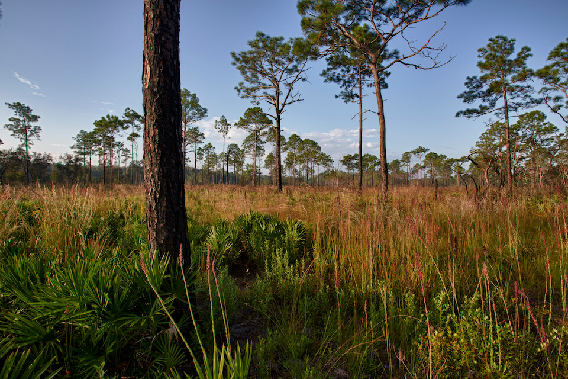

# Pine Flatwoods and Dry Prairie

<figcaption>Photo: FWC</figcaption>

### Overall vulnerability:

This conservation asset was not assessed for vulnerability.

### Area:

-   696,368 hectares within Florida (modeled)

-   393,787 hectares (57%) is located on public lands

**TODO: map (if exists)**

## General Information

Pine flatwoods is the most extensive type of terrestrial ecosystem in Florida.  Pine flatwoods occur on flat sandy terrain where the overstory is characterized by longleaf pine, slash pine, or pond pine. The type of pine flatwood community present is usually related to soil differences and small variations in topography. Seasonal change in the frequency and amount of precipitation is the most important climatic variable influencing pine flatwood systems.  Pine flatwoods have been significantly altered following human settlement, through clearing for timber and conversion to agriculture and livestock operations.  Compositional and structural changes have taken place over time as fire frequencies have been reduced.  Fire is an important factor in the maintenance of flatwoods.  Dry prairies have essentially the same features as pine flatwoods except that they lack a pine overstory.   Dry prairies are composed of grasses, sedges, herbs and shrubs found in central Florida. They often merge with open pine flatwoods and open hammock.  Pine rocklands are found exclusively on limestone substrate in the Florida Keys and isolated areas in south Florida. The South Florida slash pine is the only canopy species within the overstory of this community.

Includes: Dry Flatwoods, Pine Rockland, Dry Prairie, and Palmetto Prairie

### Habitats

- [Dry Flatwoods](/habitats/terrestrial/1310)- [Mesic Flatwoods](/habitats/terrestrial/1311)- [Scrubby Flatwoods](/habitats/terrestrial/1312)- [Pine Rockland](/habitats/terrestrial/1320)- [Dry Prairie](/habitats/terrestrial/1330)

### Species

Burrowing owl, Florida black bear, Florida grasshopper sparrow, Florida pine snake, Florida sandhill crane, Gopher frog, Reticulated flatwoods salamander

## Impacts of Climate Change

Altered fire regimes or the absence of fire, along with other climatic changes, could lead to compositional and structural changes to these habitats, potentially altering their suitability to the current suite of species.  The absence of fire in pine flatwoods and dry prairie communities can lead to an increase in woody mid-story vegetation. Mesic sites tend to change more rapidly than xeric ones.  Species presence and richness is tied to hydroperiod; changes to the timing and amount of precipitation would lead to shifts in the system's composition and structure.   Dominant canopy species (longleaf pine, slash pine and pond pine) have different levels of stress caused by increased moisture or dryness.  Extreme events (e.g., droughts, floods) that cause disturbance to the system will enhance invasive species processes, from introduction through establishment and expansion.  Drought and heat stress caused by increased temperatures can lead to increased insect outbreaks and mortality.

#### This conservation asset is expected to be impacted by sea level rise:

- 3 meters of sea level rise: 10% of area (68,721 ha)
- 1 meter of sea level rise: 4% of area (24,936 ha)
    

[More information about general climate impacts to ecosystems and habitats in Florida](/impacts/habitats).

### Impacts to Species

Many of the grasses and forbs of pine flatwoods and dry prairies are major food sources for numerous small mammals, birds, and reptiles.  Changes in vegetation composition or abundance due to climate change may decrease the suitability of the habitat for feeding or nesting.  Loss of mature canopy trees due to storms, disease, or insect infestations will reduce the number and extent of suitable nest trees for birds such as the red-cockaded woodpecker and Southeastern American kestrel.  Reduction in prey availability (e.g., invertebrates, amphibians and reptiles) due to changes in temperature and in the timing and amount of precipitation could significantly impacts species such as the burrowing owl, Florida sandhill crane, and Southeastern American kestrel.

[More information about general climate impacts to species in Florida](/impacts/species).

## Other Non-climate Threats

nan

[More information about adaptation strategies](/strategies).

