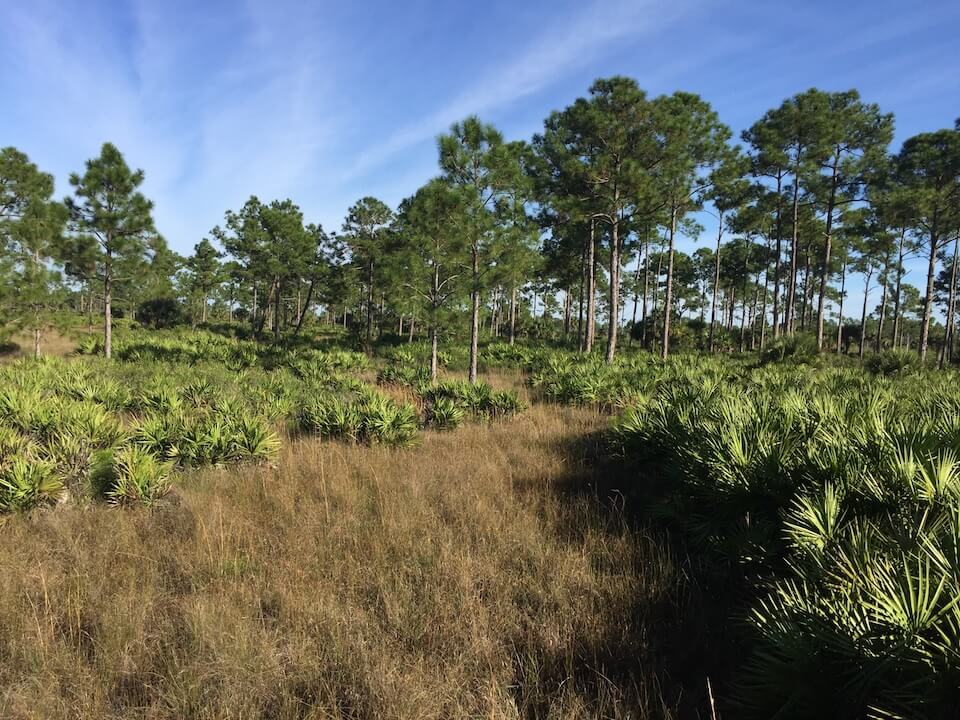

<content-header icon="pine_flatwoods_dry_prairie" title="Dry Flatwoods" subtitle="within Pine Flatwoods and Dry Prairie">
</content-header>

<figcaption>Photo: FWC</figcaption>

### Overall vulnerability:

High

<h3>Habitat area: 
<a href="/habitats/terrestrial/1310/map" style="float:right;font-size:smaller;margin-right: 2rem;">
<fa-icon name="map"></fa-icon>
explore on map
</a>
</h3>

-   575,081 hectares within Florida (modeled)
-   309,402 hectares (54%) is located on public lands

## General Information

Natural pinelands (dry flatwoods) includes pine forests, excluding pine rocklands, sandhills, and sand pine scrub, which are listed as separate classes. Natural pineland habitats on dry sites include mesic  and scrubby flatwoods.  Generally, slash pine-dominated sites occupy intermediate or moderately moist areas. The understory and ground cover within these communities include several common species such as saw palmetto, gallberry, wax myrtle, and a wide variety of grasses and herbs.  Cypress domes, bay heads, titi swamps, and freshwater marshes are commonly interspersed in isolated depressions throughout natural pineland habitats.  

Fire is an important factor that helps to maintain and shape natural pineland communities; almost all of the plants and animals found here are adapted to having fires occur at least every one to eight years.  Much of this community has been altered by humans as a result of conversion to agriculture and pine plantations, alteration of fire regimes, and introduced species.

This conservation asset includes  Dry Flatwoods, Mesic Flatwoods and Scrubby Flatwoods.

### Species

Cooper's Hawk, Florida pine snake, Sherman's short-tailed shrew, Squirrel treefrog, Wild turkey

## Impacts of Climate Change

Altered fire regimes or the absence of fire, along with other climatic changes, could lead to compositional and structural changes, potentially altering their suitability to the current suite of species.  The absence of fire in flatwoods communities can lead to an increase in woody mid-story vegetation.   Drought and heat stress caused by increased temperatures can lead to increased insect outbreaks and mortality. Higher winter air temperatures will increase over-wintering Southern pine beetle larva survival rate, and higher annual air temperatures will allow the beetles to produce more generations per year. Severe drought stress reduces resin production and greatly increases the susceptibility of trees to beetle infestation.   Increased summer and winter minimum temperatures, as well as extreme events (e.g., droughts, floods) that cause disturbance to the system will enhance invasive species processes, from introduction through establishment and expansion.

#### This habitat is expected to be impacted by sea level rise:

- 3 meters of sea level rise: 10% of area (58,813 ha)
- 1 meter of sea level rise: 3% of area (18,473 ha)

[Explore sea level rise impacts map](/habitats/terrestrial/1310/map).

[More information about general climate impacts to ecosystems and habitats in Florida](/impacts/habitats).

### Impacts to Species

Species such as the red-cockaded woodpecker, Sherman's fox squirrel, and Sherman's short-tailed shrew rely on the herbaceous groundcover maintained by prescribed fire.  Alterations to the frequency or seasonality of fire would lead to habitat degradation, fragmentation and loss due to heavy hardwood and shrub encroachment.  

Loss of mature longleaf pine due to heat induced stress, storms and/or insect outbreaks would reduce the number of suitable nest cavity trees for red-cockaded woodpeckers.  

Loss of natural pinelands, leading to a more fragmented landscape, would impact wide-ranging species such as the Florida black bear that utilize pinelands as habitat and travel corridors.   

Reduction in prey availability (e.g., insects) due to changes in temperature and in the timing and amount of precipitation could significantly impacts species such as the Sherman's short-tailed shrew.

[More information about general climate impacts to species in Florida](/impacts/species).

## Other Non-climate Threats

-	Conversion to agriculture
-	Conversion to commercial and industrial development
-	Conversion to housing and urban development
-	Conversion to recreation areas
-	Groundwater withdrawal
-	Incompatible fire
-	Incompatible forestry practices
-	Incompatible recreational activities
-	Incompatible resource extraction
-	Invasive animals
-	Invasive plants
-	Roads
-	Surface water withdrawal

## Adaptation Strategies

#### Policy

- Provide greater regulation and enforcement of recreational use and access restrictions.
- Develop expanded cost-share payments for private landowners through state and federal cooperative forest programs for reforestation.
- Centralize recreation impacts to easy-access areas.
- Identify overused areas and limit recreational trails/roads and OHV use.

#### Education/Outreach

- Expand prescribed fire training opportunities for both public and private land managers.
- Develop education materials for recreational users on the importance of phenology factors, how they may change over time given climate change impacts, and how they relate to regulations/closures.
- Educate planners on importance of habitat preservation (including serving as hazard buffers), climate change and incorporation into long range planning efforts.
- Work with partners at landscape scales to strengthen and maximize use of existing conservation programs, particularly conservation easement tax incentives, the private lands programs focused on endangered species, and other federal and state private lands incentive programs to conserve private lands of high conservation value, to enhance habitat values and maintain working landscapes under climate change.
- Work with local communities to remove dumped debris, e.g., construction materials, landscape debris, automobile parts, trash

#### Monitoring: 

- Monitor for signs of beetle outbreaks.
- Monitor invasive plants and animals.
- Document changes in vegetation structure and composition to track climate change effects.
- Monitor and correct for any point source or non-point source pollution.
- Evaluate the effectiveness of various land management practices in reducing the impact of climate change.

#### Planning

- Assess and take steps to reduce risks of facilitating movement of “new” undesirable non-native species, pests, and pathogens
- Identify areas particularly vulnerable to loss or transition under climate change and develop management strategies and approaches for adaptation
- Incorporate fire risk into land use planning.
- Conduct a predictive assessment of current and potential invasive species ranges and impacts
- Incorporate climate change considerations into new and future revisions of species and area management plans

#### Protection:  

- Expand protected areas to increase the representation of pinelands and minimize risk of loss across the landscape.
- Preserve pineland systems and buffers that are not yet impacted by human development.
- Provide landowners and stakeholder groups with incentives for conservation and restoration of key corridor habitats that will provide connectivity under current and future conditions.
- Encourage landowner cost share programs and enrollment in conservation easements to increase habitat base.
- Identify important (and potentially resilient) pineland systems to serve as refugia, prioritize inclusion in land protection planning efforts.

#### Restoration

- Increase acreage of pinelands in maintenance condition class.
- Review and revise techniques to maintain or mimic natural disturbance regimes (e.g., what techniques should be used when prescribed fire is no longer feasible).
- Remove new species of invasive plants before they become established.
- Restore native understory plant communities, using stock that is more likely to persist in future climatic conditions.
- Redesign or mitigate existing physical barriers or structures that impede movement and dispersal within and among habitats.
- Eliminate hydrologic barriers/conveyances.

[More information about adaptation strategies](/strategies).

