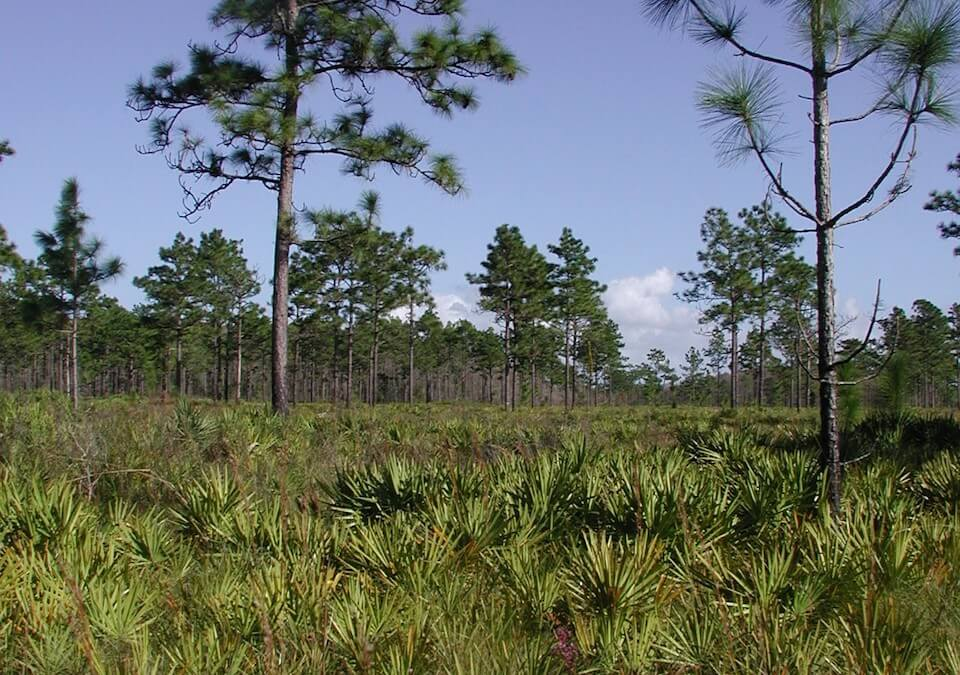

<content-header icon="pine_flatwoods_dry_prairie" title="Mesic Flatwoods" subtitle="within Pine Flatwoods and Dry Prairie">
</content-header>

<figcaption>Photo: FWC</figcaption>

### Overall vulnerability:

Low

<h3>Habitat area: 
<a href="/habitats/terrestrial/1311/map" style="float:right;font-size:smaller;margin-right: 2rem;">
<fa-icon name="map"></fa-icon>
explore on map
</a>
</h3>

-   536,193 hectares within Florida (modeled)
-   295,888 hectares (55%) is located on public lands

## General Information

Mesic flatwoods have an open pine canopy and an understory and groundcover layer of low shrubs and herbs, including saw palmetto, gallberry, dwarf live oak, and wiregrass.  The principal canopy tree in northern and central Florida is longleaf pine, although slash pine is currently more common in northern Florida as a result of invasion by, or planting of slash pine after logging of longleaf pine.  The South Florida slash pine is the dominant canopy tree in south Florida. 

Mesic flatwoods are found statewide, except extreme southern peninsula and the Keys, and are the most widespread biological community in Florida. However, very few undisturbed areas of mesic flatwoods exist because of habitat degradation and silvicultural, agricultural, or residential development. Mesic flatwoods are often fairly resilient, and with proper management they can generally be restored.  

Fire is an important factor that helps to maintain and shape mesic flatwoods, occurring every 2-4 years.  Fire stimulates flowering in many flatwoods herbs and frequent fire (1-3 years) increases species richness and abundance of herbs.

**TODO: map (if exists)**

### Species

Florida black bear, Florida panther, Frosted flatwoods salamander, Reticulated flatwoods salamander

## Impacts of Climate Change

Altered fire regimes or the absence of fire, along with other climatic changes, could lead to compositional and structural changes, potentially altering their suitability to the current suite of species.  The absence of fire in flatwoods communities can lead to a dense mid-story.  Additionally, some plants have reduced reproductive success without frequent fire, as fire is required for their reproduction.   Plants within mesic flatwoods are already fairly resilient to changes in moisture, having to withstand the stress of soil saturation or inundation during the wet part of the year, as well as dry conditions at other times.  However, extreme drought and heat stress caused by increased temperatures could lead to increased insect outbreaks and mortality. Higher winter air temperatures will increase over-wintering Southern pine beetle larva survival rate, and higher annual air temperatures will allow the beetles to produce more generations per year. Severe drought stress reduces resin production and greatly increases the susceptibility of trees to beetle infestation.   Increased summer and winter minimum temperatures, as well as increased extreme events (e.g., droughts, floods) will enhance invasive species processes, from introduction through establishment and expansion.   Cogon grass, old world climbing fern and natal grass are the most significant invasive plants currently found in mesic flatwoods.

#### This habitat is expected to be impacted by sea level rise:

- 3 meters of sea level rise: 10% of area (53,444 ha)
- 1 meter of sea level rise: 3% of area (16,692 ha)

[Explore sea level rise impacts map](/habitat/terrestrial/1311/map).

[More information about general climate impacts to ecosystems and habitats in Florida](/impacts/habitats).

### Impacts to Species

Alterations to the frequency or seasonality of fire would lead to habitat degradation, fragmentation and loss of mesic flatwoods due to heavy hardwood and shrub encroachment.  Species such as the red-cockaded woodpecker and Sherman's fox squirrel would be impacted as the openness of the flatwoods become more densely vegetated. Loss of mature longleaf pine due to heat induced stress, storms and/or insect outbreaks would reduce the number of suitable nest cavity trees for red-cockaded woodpeckers.  

Flatwoods salamanders and striped newts, dependent upon ephemeral wetlands embedded within the mesic flatwoods for breeding sites, will be affected by changes in precipitation, regardless of direction of change.

[More information about general climate impacts to species in Florida](/impacts/species).

## Other Non-climate Threats

-	Conversion to agriculture
-	Conversion to commercial and industrial development
-	Conversion to housing and urban development
-	Conversion to recreation areas
-	Groundwater withdrawal
-	Incompatible fire
-	Incompatible forestry practices
-	Incompatible recreational activities
-	Incompatible resource extraction
-	Invasive animals
-	Invasive plants
-	Roads
-	Surface water withdrawal

## Adaptation Strategies

#### Policy

- Identify overused areas and limit recreational trails/roads and OHV use.
- Centralize recreation impacts to easy-access areas.
- Provide greater regulation and enforcement of recreational use and access restrictions.

#### Education/Outreach

- Expand prescribed fire training opportunities for both public and private land managers.
- Develop education materials for recreational users on the importance of phenology factors, how they may change over time given climate change impacts, and how they relate to regulations/closures.
- Work with local communities to remove dumped debris, e.g., construction materials, landscape debris, automobile parts, trash
- Work with partners at landscape scales to strengthen and maximize use of existing conservation programs, particularly conservation easement tax incentives, the private lands programs focused on endangered species, and other federal and state private lands incentive programs to conserve private lands of high conservation value, to enhance habitat values and maintain working landscapes under climate change
- Educate planners on importance of habitat preservation (including serving as hazard buffers), climate change and incorporation into long range planning efforts.

#### Monitoring: 

- Monitor invasive plants and animals.
- Monitor and correct for any point source or non-point source pollution.
- Evaluate the effectiveness of various land management practices in reducing the impact of climate change.
- Document changes in vegetation structure and composition to track sea level rise and climate change effects.

#### Planning

- Incorporate fire risk into land use planning.
- Review, evaluate and revise grazing policies on conservation lands, as needed in response to impacts to the system due to climate change.
- Incorporate climate change considerations into new and future revisions of species and area management plans.
- Identify areas particularly vulnerable to loss or transition under climate change and develop management strategies and approaches for adaptation.
- Conduct a predictive assessment of current and potential invasive species ranges and impacts
- Assess and take steps to reduce risks of facilitating movement of “new” undesirable non-native species, pests, and pathogens

#### Protection:  

- Expand protected areas to increase the representation of mesic flatwoods and minimize risk of loss across the landscape.
- Identify important (and potentially resilient) mesic flatwoods to serve as refugia, prioritize inclusion in land protection planning efforts.
- Preserve mesic flatwoods and buffers that are not yet impacted by human development.
- Encourage landowner cost share programs and enrollment in conservation easements to increase habitat base.
- Provide landowners and stakeholder groups with incentives for conservation and restoration of key corridor habitats that will provide connectivity under current and future conditions.

#### Restoration

- Increase acreage of fire-dependent communities to maintenance condition class
- Eliminate hydrologic barriers/conveyances
- Remove new species of invasive plants before they become established.
- Restore native understory plant communities – seed transfer and/or commercial production of native understory plant material
- Redesign or mitigate existing physical barriers or structures that impede movement and dispersal within and among habitats
- Review and revise techniques to maintain or mimic natural disturbance regimes (e.g., what techniques should be used when prescribed fire is no longer feasible)

[More information about adaptation strategies](/strategies).

