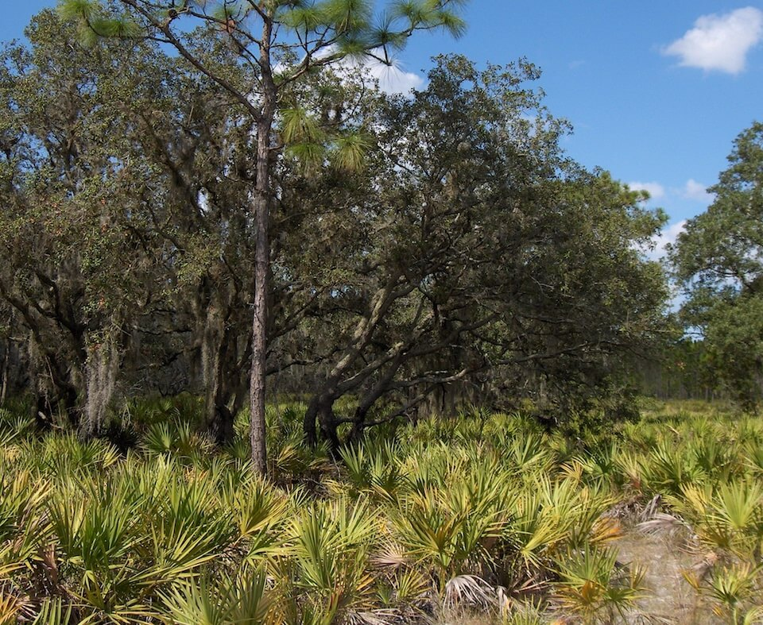

<content-header icon="pine_flatwoods_dry_prairie" title="Scrubby Flatwoods" subtitle="within Pine Flatwoods and Dry Prairie"></content-header>

<figcaption>Photo: Paul Russo</figcaption>

### Overall vulnerability:

Moderate

<h3>Habitat area: 
<a href="/habitats/terrestrial/1312/map" style="float:right;font-size:smaller;margin-right: 2rem;">
<fa-icon name="map"></fa-icon>
explore on map
</a>
</h3>

-   37,891 hectares within Florida (modeled)
-   21,015 hectares (55%) is located on public lands

## General Information

Scrubby flatwoods typically occur on drier ridges, many of which formed originally on or near old coastal dunes. Scrubby flatwoods differ from scrub by the presence of scattered wiregrass and a preponderance of flatwoods species such as fetterbush, wax myrtle, and gallberry. Shrubby oaks, including sand live oak, Chapman oak, and myrtle oak or scrub oak, are often dominant and slash pine, sand pine or longleaf pine may be present. Other typical plants including saw palmetto, staggerbush, dwarf blueberry, gopher apple, rusty lyonia, tarflower, golden-aster, silkbay, garberia, huckleberry, goldenrod, runner oak, pinweeds, and frostweed.  

Scrubby flatwoods normally do not flood even under extremely wet conditions. Temperature and humidity of air and soil in scrubby flatwoods fluctuate substantially more than in most other communities because the scattered overstory, sparse understory, and barren sands of do not ameliorate daily and seasonal changes very well.

**TODO: map (if exists)**

### Species

Eastern indigo snake, Florida mouse, Gopher frog, Gopher tortoise, Sand skink

## Impacts of Climate Change

Altered fire regimes or the absence of fire, along with other climatic changes, could lead to compositional and structural changes, potentially altering their suitability to the current suite of species.  The absence of fire in flatwoods communities can lead to an increase in woody mid-story vegetation.   Drought and heat stress caused by increased temperatures can lead to increased insect outbreaks and mortality. Higher winter air temperatures will increase over-wintering Southern pine beetle larva survival rate, and higher annual air temperatures will allow the beetles to produce more generations per year. Severe drought stress reduces resin production and greatly increases the susceptibility of trees to beetle infestation.   Increased summer and winter minimum temperatures, as well as extreme events (e.g., droughts, floods) will enhance invasive species processes, from introduction through establishment and expansion.   Scrubby flatwoods typically don't flood; however, if precipitation and/or extreme events  (e.g., floods) increase, this community may experience saturated soils or flood conditions.  This could lead to a change in plants species as those that have a low tolerance to more hydric conditions are replaced by those that can withstand wetter conditions.

#### This habitat is expected to be impacted by sea level rise:

- 3 meters of sea level rise: 14% of area (5,208 ha)
- 1 meter of sea level rise: 5% of area (1,745 ha)

[Explore sea level rise impacts map](/habitat/terrestrial/1312/map).

[More information about general climate impacts to ecosystems and habitats in Florida](/impacts/habitats).

### Impacts to Species

Scrubby flatwoods provide critical habitat for the Florida mouse. Changes in the vegetation composition or structure in response to changes in temperature or precipitation could lead to habitat degradation or loss for the Florida mouse.  The Florida scrub jay depends on fire to keep habitats short and maintain plenty of open sandy areas in which to store acorns.  The sand skink requires well-drained sandy soils and cannot tolerate dense ground cover or heavily rooted vegetation.  Altered fire regimes leading to an increase in shrubby vegetation would reduce the suitability of the habitat for sand skinks.  

The loss of gopher tortoises within a system will impact a suite of other species (commensals) that depend on the tortoises' burrow for habitat, including gopher frog, Florida mouse, eastern indigo snake, and many hundreds of species of invertebrates.  

Changes in the timing and amount of precipitation will impact the reproductive success and survival of gopher frogs.

[More information about general climate impacts to species in Florida](/impacts/species).

## Other Non-climate Threats

-	Conversion to agriculture
-	Conversion to commercial and industrial development
-	Conversion to housing and urban development
-	Conversion to recreation areas
-	Groundwater withdrawal
-	Incompatible fire
-	Incompatible forestry practices
-	Incompatible recreational activities
-	Incompatible resource extraction
-	Invasive animals
-	Invasive plants
-	Roads
-	Surface water withdrawal

## Adaptation Strategies

#### Education/Outreach

- Expand prescribed fire training opportunities for both public and private land managers.
- Provide educational materials to residents in adjacent neighborhoods on the use and need of prescribed fire in these systems, the impacts of climate change on prescribed fire, and the benefits to the human community of prescribed fire (e.g., fuel reduction to minimize wildfires).
- Work with local communities to remove dumped debris, e.g., construction materials, landscape debris, automobile parts, trash
- Work with partners at landscape scales to strengthen and maximize use of existing conservation programs, particularly conservation easement tax incentives, the private lands programs focused on endangered species, and other federal and state private lands incentive programs to conserve private lands of high conservation value, to enhance habitat values and maintain working landscapes under climate change

#### Planning

- Incorporate fire risk into land use planning.
- Identify areas particularly vulnerable to loss or transition under climate change and develop management strategies and approaches for adaptation
- Incorporate climate change considerations into new and future revisions of species and area management plans.
- Conduct a predictive assessment of current and potential invasive species ranges and impacts
- Assess and take steps to reduce risks of facilitating movement of “new” undesirable non-native species, pests, and pathogens

#### Policy

- Identify overused areas and limit recreational trails/roads and OHV use.
- Centralize recreation impacts to easy-access areas.
- Provide greater regulation and enforcement of recreational use and access restrictions.

#### Monitoring: 

- Evaluate the effectiveness of various land management practices in reducing the impact of climate change.
- Monitor invasive plants and animals.
- Document changes in vegetation structure and composition to track sea level rise and climate change effects.
- Monitor for stressed pine trees and increased impacts from southern pine beetle, especially during droughts.
- Monitor and correct for any point source or non-point source pollution.

#### Protection:  

- Provide landowners and stakeholder groups with incentives for conservation and restoration of key corridor habitats that will provide connectivity under current and future conditions.
- Reduce and remove fuel through hardwood thinning to protect areas from wildfires
- Expand protected areas to increase the representation of scrubby flatwoods and minimize risk of loss across the landscape.
- Preserve scrubby flatwoods and buffers that are not yet impacted by human development.
- Encourage landowner cost share programs and enrollment in conservation easements to increase habitat base.
- Identify important (and potentially resilient) scrubby flatwoods to serve as refugia, prioritize inclusion in land protection planning efforts.

#### Restoration

- Increase acreage of community in maintenance condition class for prescribed fire.
- Eliminate hydrologic barriers/conveyances
- Remove new species of invasive plants before they become established.
- Redesign or mitigate existing physical barriers or structures that impede movement and dispersal within and among habitats
- Use plant stock that will be resilient in response to climate change, e.g., species with similar structure and function but more tolerant to future conditions (e.g., drier, wetter, warmer)
- Reduce the susceptibility of pines to increased pine beetle infestations by reducing hardwoods and other underbrush (reducing competition and overall stress of pines)
- Use more longleaf pine in restoration activates due to its higher tolerance to increased temperatures and lower susceptibility to pine beetles.
- Review and revise techniques to maintain or mimic natural disturbance regimes (e.g., what techniques should be used when prescribed fire is no longer feasible)

[More information about adaptation strategies](/strategies).

