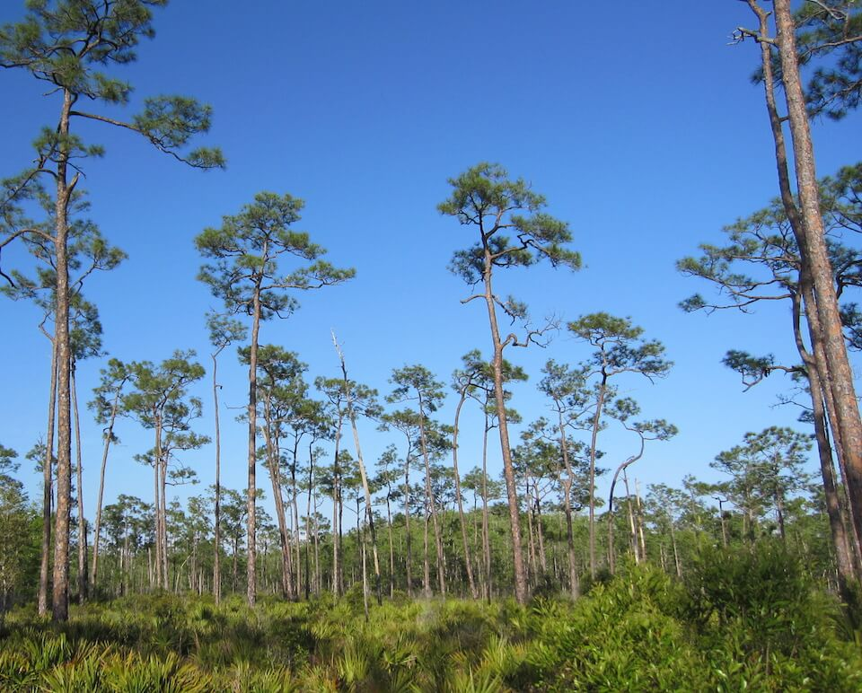

<content-header icon="pine_flatwoods_dry_prairie" title="Pine Rockland" subtitle="within Pine Flatwoods and Dry Prairie">
</content-header>

<figcaption>Photo: USFWS</figcaption>

### Overall vulnerability:

Very High

<h3>Habitat area: 
<a href="/habitats/terrestrial/1320/map" style="float:right;font-size:smaller;margin-right: 2rem;">
<fa-icon name="map"></fa-icon>
explore on map
</a>
</h3>

-   6,829 hectares within Florida (modeled)
-   6,509 hectares (95%) is located on public lands

## General Information

Pine rockland is a unique type of pine flatwoods that is found exclusively on limestone substrate in the Florida Keys, the Big Cypress Swamp, and the Miami Rock Ridge (the limestone outcropping that rises from the Everglades to heights of 23 feet (7 m) above sea level). The overstory of pine rocklands contains a single canopy species, South Florida slash pine. The dominant pines tower over a savanna-like understory of saw palmettos, locust berry, willow bustic, beautyberry, broom grasses, silver palms, and a rich herbaceous layer. This community is often associated with rockland hammock and other short-hydroperiod freshwater wetland communities. These sub-tropical pine trees and understory plants have adapted to seasonal wildfires and the lack of soil on the exposed limestone rock. 

Fire is required for the maintenance of the pine rockland community, with fire frequency ranging from 2 to 3 years to 10 to 15 years, typically burning twice per decade. 

 Pine rockland communities are globally imperiled and support federal and state listed plant species, such as deltoid spurge and Small’s milkwort which only occur in this habitat.

### Species

Key deer, Rim rock crowned snake, Miami blue butterfly, Florida brown snake, Red rat snake

## Impacts of Climate Change

Pine rockland habitat is likely to have 81% of the current area inundated by 1 m of sea level rise and 99% inundated by 3 m of sea level rise.  Altered fire regimes or the absence of fire, along with other climatic changes, could lead to compositional and structural changes, potentially altering suitability to the current suite of species.  Lack of fire could lead to an increase in wildfire if other management actions are not applied to manage fuel loads. Use of prescribed fire is already very challenging within the pine rockland communities, given their isolated locations, often within a matrix of developed lands. Drought and heat stress caused by increased temperatures can lead to increased insect outbreaks and mortality.   Increased extreme events (e.g., storms, droughts, floods) will enhance invasive species processes, from introduction through establishment and expansion.   Brazilian pepper is the most widespread invasive currently found pine rocklands.  In fire suppressed systems, Brazilian pepper will form a dense, monospecific canopy, almost completely eliminating native vegetation.

#### This habitat is expected to be impacted by sea level rise:

- 3 meters of sea level rise: 99% of area (6,732 ha)
- 1 meter of sea level rise: 81% of area (5,522 ha)

[Explore sea level rise impacts map](/habitats/terrestrial/1320/map).

[More information about general climate impacts to ecosystems and habitats in Florida](/impacts/habitats).

### Impacts to Species

Pine rocklands provide critical habitat for many south Florida and Florida Keys endemic species.  Many species, including the Key deer, Rim rock crowned snake, and Miami blue butterfly are dependent upon the pine rockland community and may face extinction in the wild if/when the habitat is gone due to sea level rise and other impacts from climate change that render the habitat unsuitable.  Reduction in fire frequency or lack of fire will allow for increased invasion and growth of hardwood species, causing degradation of the habitat for multiple species.  Additionally, altered fire regimes will affect wildlife species due to a reduction of the amount and richness of  understory and herbaceous plants caused by reduced amount of sunlight penetrating the canopy and midstory.  

Patches of dense invasive vegetation would yield areas of unsuitable habitat for all species and increase habitat fragmentation between remaining suitable areas.  

Presence of invasive animals will lead to increased competition for resources and mortality of native species as invasives are often better suited to out-compete the natives.  Impacts due to sea level rise, increased exposure to salinity, and storm events could cause the reduction or loss of key host/food plants for the Miami blue butterfly.  Many of these species are highly restricted within their limited range and are extremely vulnerable to impacts from storms, particularly the Miami Blue butterfly.

[More information about general climate impacts to species in Florida](/impacts/species).

## Other Non-climate Threats

-	Chemicals and toxins
-	Conversion to commercial and industrial development
-	Conversion to housing and urban development
-	Incompatible fire
-	Invasive animals
-	Invasive plants
-	Roads

## Adaptation Strategies

#### Education/Outreach

- Work with partners at landscape scales to strengthen and maximize use of existing conservation programs, particularly conservation easement tax incentives, the private lands programs focused on endangered species, and other federal and state private lands incentive programs to conserve private lands of high conservation value, to enhance habitat values and maintain working landscapes under climate change.
- Expand prescribed fire training opportunities for both public and private land managers.
- Implement outreach to increase public understanding of the increased wildfire risks due to climate change.
- Develop education materials for recreational users on the importance of phenology factors, how they may change over time given climate change impacts, and how they relate to regulations/closures.
- Educate planners on importance of habitat preservation (including serving as hazard buffers), climate change and incorporation into long range planning efforts.
- Work with local communities to remove dumped debris, e.g., construction materials, landscape debris, automobile parts, trash.
- Actively engage with communities to minimize urban encroachment.
- Work with communities and landowners to choose native vegetation in favor of non-native vegetation.
- Work with volunteers to control invasive species.

#### Policy

- Develop policies and incentives for decreasing impervious surfaces.
- Review and update Best Management Practices to accommodate current and future conditions.
- Encourage the passage of state regulations to strengthen protection of pine rocklands.
- Provide greater regulation and enforcement of recreational use and access restrictions.
- Reduce public access to areas as they become stressed/impacted by climate change and more susceptible to non-climate stressors.
- Centralize recreation impacts to easy-access areas.

#### Monitoring

- Monitor and correct for any point source or non-point source pollution.
- Monitor species diversity and habitat transition over time in response to sea level rise and changing climatological conditions.
- Monitor disease prevalence and occurrence (spatially and temporally).
- Establish early detection and rapid response to potentially invasive species.
- Inventory culverts and other barriers to flow.
- Monitor pollutants.
- Monitor quality and quantity of embedded sources of freshwater.
- Monitor status of indicator species to guide or inform adaptive management.

#### Restoration

- Remove new invasive species before they become established.
- Review and revise techniques to maintain or mimic natural disturbance regimes (e.g., what techniques should be used when prescribed fire is no longer feasible).
- Remove roads within protected areas.
- Restore firebreak ditches, creating temporary firebreaks as needed.
- Use plant stock that will be resilient in response to climate change, e.g., species with similar structure and function but with higher salt tolerance.
- Prioritize restoration activities on areas of higher elevation (more secure from sea level rise).

#### Protection

- Preserve remaining pine rockland and buffers.
- Identify and prioritize protection of corridors between pine rockland and other natural habitats that will promote species migration corridors.
- Limit the amount of ground water that can be withdrawn, especially in times of decreased precipitation or drought.
- Reduce or eliminate mosquito spraying on and adjacent to pine rocklands.
- Reduce or eliminate pesticide spray and dust from adjacent agricultural and commercial operations.
- Develop ex-situ living collections of unique/endemic plant species with partners such as botanic gardens and arboreta.
- Consider relocating rare species to higher elevation areas when critical populations may be affected by impacts from sea level rise (e.g., increased soil salinity).
- Eliminate use of herbicide adjacent to sources of freshwater (e.g., sinkholes).

#### Planning

- Plan timing of restoration activities to avoid impacts on rare species during critical life history phases and during times of increased stress due to impacts from climate change.
- Incorporate climate change considerations into new and future revisions of species and area management plans.
- Identify areas particularly vulnerable to loss or transition under climate change and develop management strategies and approaches for adaptation.
- Reduce roadway and paved area construction near sensitive systems to maintain natural hydrology.
- Assess and take steps to reduce risks of facilitating movement of “new” undesirable non-native species, pests, and pathogens.

[More information about adaptation strategies](/strategies).

