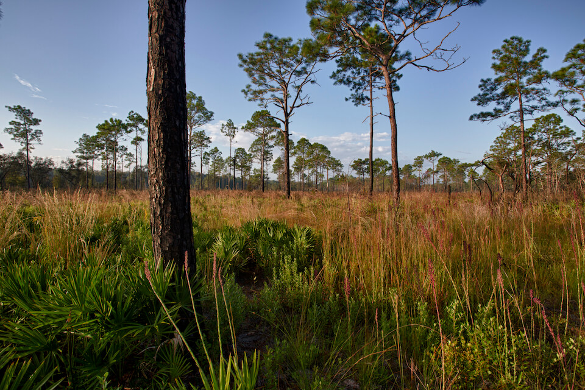

<content-header icon="pine_flatwoods_dry_prairie" title="Dry Prairie" subtitle="within Pine Flatwoods and Dry Prairie"></content-header>

<figcaption>Photo: FWC</figcaption>

### Overall vulnerability:

High

<h3>Habitat area: 
<a href="/habitats/terrestrial/1330/map" style="float:right;font-size:smaller;margin-right: 2rem;">
<fa-icon name="map"></fa-icon>
explore on map
</a>
</h3>

-   63,085 hectares within Florida (modeled)
-   41,307 hectares (65%) is located on public lands

## General Information

Dry prairies are large native grass- and shrub-lands occurring on very flat terrain interspersed with scattered cypress domes and strands, bayheads, isolated freshwater marshes, and hardwood hammocks. The typical dry prairie is a mosaic of dry prairie and wet prairie, having a mixture of upland and wetland plants.  This community is characterized by many species of grasses, sedges, herbs, and shrubs, including saw palmetto, fetterbush, staggerbush, tar flower, gallberry, blueberry, wiregrass, carpet grasses, and various bluestems. These sites contain highly scattered pines that cover less than 10 to 15 % of an area.  

Dry prairies are restricted to central Florida; the largest areas historically occurred just north of Lake Okeechobee. The current extent of dry prairie in Florida has been significantly reduced over the past several decades.

**TODO: map (if exists)**

### Species

Audubon's crested caracara, Burrowing owl, Florida grasshopper sparrow, Florida sandhill crane

## Impacts of Climate Change

Altered fire regimes or the absence of fire, along with other climatic changes, could lead to compositional and structural changes to dry prairie, potentially altering their suitability to the current suite of species.  Without appropriate fire regimes, trees and other woody vegetation move into dry prairie, creating unsuitable conditions for many of the habitat dependent species.   Decreased precipitation and drought can lead community composition change as drought intolerant species are replaced by those more tolerant of extended dry periods.   Floods can also cause shifts in species composition, favoring those species that can persist in more hydric conditions.    Increased summer and winter minimum temperatures, as well as extreme events (e.g., droughts, floods) will enhance invasive species processes, from introduction through establishment and expansion.

[More information about general climate impacts to ecosystems and habitats in Florida](/impacts/habitats).

### Impacts to Species

Species such as the crested caracara, burrowing owl, Florida sandhill crane, and the federally endangered Florida grasshopper sparrow rely on appropriate fire regimes to prevent encroachment of woody vegetation.  Increased extreme events (e.g., drought, floods) can cause decreased reproductive success and mortality if extreme conditions happen during nesting season.  

Reduction in seed and prey availability (e.g., invertebrates, amphibians and reptiles) due to changes in temperature and in the timing and amount of precipitation could significantly impacts species such as the burrowing owl, Florida grasshopper sparrow, Florida sandhill crane, and Southeastern American kestrel.  

Sandhill cranes require shallow wetlands for nesting, if timing and amount of precipitation changes there could be a decrease in reproductive success.  If wetlands are too dry during nesting they would not provide adequate habitat or if they dry during the incubation period it would allow for increased nest predation by terrestrial predators.  If precipitation increases during the nesting season the nest will flood, leading to nest failure.

[More information about general climate impacts to species in Florida](/impacts/species).

## Other Non-climate Threats

-	Conversion to agriculture
-	Conversion to commercial and industrial development
-	Conversion to housing and urban development
-	Incompatible fire
-	Incompatible forestry practices
-	Incompatible resource extraction
-	Invasive plants
-	Roads
-	Surface water withdrawal

## Adaptation Strategies

#### Protection:  

- Expand protected areas to increase the representation of dry prairie and minimize risk of loss across the landscape.
- Identify important (and potentially resilient) areas of dry prairie to serve as refugia, prioritize inclusion in land protection planning efforts.
- Provide landowners and stakeholder groups with incentives for conservation and restoration of key corridor habitats that will provide connectivity under current and future conditions.
- Protect and maintain high quality native seed sources including identifying areas for seed collection across latitudinal ranges of target species.
- Seed bank, develop, and deploy as appropriate plant materials for restoration that will be resilient in response to climate change.
- Preserve dry prairie and buffers that are not yet impacted by human development.
- Encourage landowner cost share programs and enrollment in conservation easements to increase habitat base.

#### Monitoring: 

- Monitor and correct for any point source or non-point source pollution.
- Monitor invasive plants and animals.
- Document changes in vegetation structure and composition to track sea level rise and climate change effects.

#### Education/Outreach

- Work with local communities to remove dumped debris, e.g., construction materials, landscape debris, automobile parts, trash.
- Work with partners at landscape scales to strengthen and maximize use of existing conservation programs, particularly conservation easement tax incentives, the private lands programs focused on endangered species, and other federal and state private lands incentive programs to conserve private lands of high conservation value, to enhance habitat values and maintain working landscapes under climate change
- Expand prescribed fire training opportunities for both public and private land managers.

#### Policy

- Provide greater regulation and enforcement of recreational use and access restrictions.
- Centralize recreation impacts to easy-access areas.
- Identify overused areas and limit recreational trails/roads and OHV use.
- Create stronger incentives for dry prairie restoration.

#### Planning

- Review, evaluate and revise grazing policies on conservation lands, as needed in response to impacts to the system due to climate change.
- Identify areas particularly vulnerable to loss or transition under climate change and develop management strategies and approaches for adaptation.
- Incorporate climate change considerations into new and future revisions of species and area management plans.
- Assess and take steps to reduce risks of facilitating movement of “new” undesirable non-native species, pests, and pathogens.
- Conduct a predictive assessment of current and potential invasive species ranges and impacts.
- Incorporate fire risk into land use planning.

#### Restoration

- Redesign or mitigate existing physical barriers or structures that impede movement and dispersal within and among habitats.
- Restore native understory plant communities – seed transfer and/or commercial production of native understory plant material.
- Remove invasive plants.
- Eliminate hydrologic barriers/conveyances.
- Review and revise techniques to maintain or mimic natural disturbance regimes (e.g., what techniques should be used when prescribed fire is no longer feasible).
- Increase acreage of dry prairie to maintenance condition class.

[More information about adaptation strategies](/strategies).

