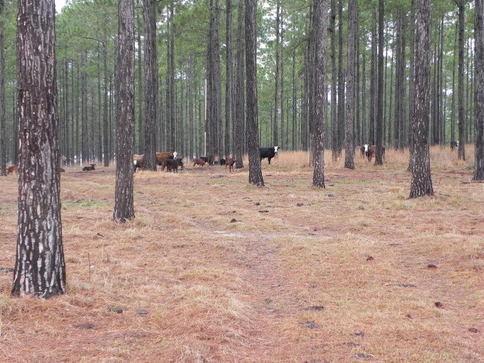

<content-header icon="working_lands" title="Working Lands (Disturbed)"></content-header>

<figcaption>Photo: Arlo Kane, FWC</figcaption>

### Overall vulnerability:

This conservation asset was not assessed for vulnerability.

### Area:

-   4,230,928 hectares within Florida (modeled)

-   585,826 hectares (14%) is located on public lands

**TODO: map (if exists)**

## General Information

The working lands category includes altered lands, primarily silviculture or agricultural operations, that provide value to fish and wildlife.  The value provided to fish and wildlife depends on the size, configuration, type and intensity of the working landscape.  Working lands still provide breeding and/or foraging habitat to a variety of species.  Additionally, working lands provide key linkages/corridors between habitat patches.

This conservation asset includes Rural Open Forested, Rural Open Pine, Tree Plantations, Cropland/Pasture, Orchards/Groves, and Vineyards and Nurseries.

### Habitats

- [Working Lands - Low Intensity](/habitats/terrestrial/1831)- [Working Lands - Moderate Intensity](/habitats/terrestrial/1833)

### Species

Audubon's crested caracara, Burrowing owl, Florida black bear, Florida sandhill crane, Gopher tortoise

## Impacts of Climate Change

Florida's climate makes it suitable for many crops, fruits and livestock.  Florida's agriculture and silviculture have been successful in adapting to climate variations that occur from year to year; however, the magnitude and rate of change  posed by climate change poses a challenge.  Increased extreme events (storms, floods, droughts) will affect land and irrigation water availability, crop yield and quality, livestock productivity, as well as pest and disease pressures.  

Decreased precipitation and droughts will lead to an increase in competition for limited water supply between working lands and natural systems.  The reduction or lack of prescribed fire will impact these systems and the species dependent upon them.  

Types of land use may shift in response to changes in temperature and precipitation, moving towards types that are more sustainable under future conditions.  If these changes shift toward more intensive use of the land, species could be impacted by habitat degradation, fragmentation or loss.  Working lands will be at a higher risk of conversion to urban development as human populations leave coastal areas in response to sea level rise.

#### This conservation asset is expected to be impacted by sea level rise:

- 3 meters of sea level rise: 3% of area (133,789 ha)
- 1 meter of sea level rise: <1% of area (28,591 ha)
    

[More information about general climate impacts to ecosystems and habitats in Florida](/impacts/habitats).

### Impacts to Species

Areas within working landscapes provide critical foraging, breeding, refugia, and travel space for multiple species.   Changes to the extent and level of connectivity of suitable areas within the various types of working lands due to impacts from climate change (e.g., altered fire regime, tree mortality, hydrology) or more intensive management practices in response to the impacts of climate change will affect these species.  

The suitability of the shallow wetlands for nesting sandhill cranes will be impacted if timing and amount of precipitation changes, leading to a decrease in reproductive success.  

Audubon's crested caracaras and Southeastern American kestrels use open pasture or ranchland as foraging habitat.  As impacts form climate change occur, the availability of these components in the appropriate matrix could be altered.  Additionally, suitable caracara habitat may be lost if land use type is shifted to more intensive agricultural operations or converted to residential/commercial development in response to climate change. 

Changes in agricultural practices (e.g., herbicides, pesticides, mechanical treatments) in response to climate change may cause the reduction of prey availability (e.g., invertebrates, amphibians and reptiles) and could significantly impacts species such as the burrowing owl and Southeastern American kestrel.

[More information about general climate impacts to species in Florida](/impacts/species).

## Other Non-climate Threats

-	Conversion to commercial and industrial development
-	Conversion to housing and urban development
-	Conversion to more intensive agriculture
-	Conversion to recreation areas
-	Incompatible forestry practices
-	Roads

