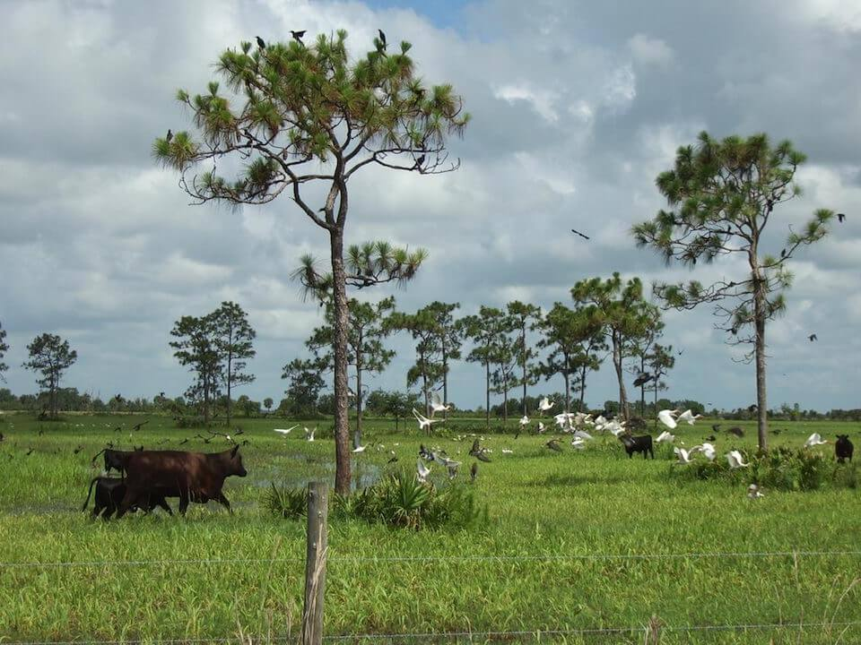

# Working Lands - Moderate Intensity

### within Working Lands (Disturbed)

<figcaption>Photo: Marty Folk, FWC</figcaption>

### Overall vulnerability:

This habitat was not assessed for vulnerability.

### Area:

-   1,862,694 hectares within Florida (modeled)

-   173,843 hectares (9%) is located on public lands

## General Information

Working lands 2 includes altered land types that have more intensive uses, primarily agricultural, but still providing some habitat and/or corridors for wildlife species. 

Field crops include primarily grass/grain type of crops including wheat, oats, hay and other grasses.  

Improved pastures have typically been cleared, tilled, reseeded with specific grass types, and periodically improved with brush control and fertilizer application. 

Orchards include areas with active tree cropping operations that produce fruit, nuts, or other resources not including wood products.  

Vineyards and nurseries includes tree nurseries, sod farms, vineyards (grapes), and areas devoted to cultivation of flowers, decorative flowering plants and other ornamental plants.  

Specialty farms includes a variety of special or unique farming activities such as horse farms.

This conservation asset includes Field Crops, Improved Pasture, Fallow Cropland, Citrus Groves, Fruit Orchards, Pecan Orchards, Fallow Orchards, Vineyards and Nurseries, and Specialty Farms.

**TODO: map (if exists)**

### Species

Burrowing owl, Florida sandhill crane, Gopher tortoise

## Impacts of Climate Change

Increased extreme events (storms, floods, droughts) will affect land and irrigation water availability, crop yield and quality, livestock productivity, as well as pest and disease pressures.   Decreased precipitation and droughts will lead to an increase in competition for limited water supply between working lands and natural systems.  Increased precipitation would lead to increased erosion and loss of crops and habitats.    Field crops and improved pasture land will be at a higher risk of conversion to urban development as human populations leave coastal areas in response to sea level rise.  Saltwater intrusion associated with sea level rise could reduce the number of groundwater wells used for irrigation.   Increased temperatures can effect livestock production by causing heat stress, illness and disease and mortality.  Additionally, increased temperatures will promote the growth of some forage crops but decrease the nutrient availability.   Combined changes in temperature and precipitation can promote the spread of vector-borne pests such as flies, ticks and mosquitos, as well as increase livestock diseases.  Types of land use may shift in response to changes in temperature and precipitation, moving towards types that are more sustainable under future conditions.  If these changes shift toward more intensive use of the land, species could be impacted by habitat degradation, fragmentation or loss.

#### This habitat is expected to be impacted by sea level rise:

- 3 meters of sea level rise: 2% of area (32,718 ha)
- 1 meter of sea level rise: <1% of area (8,853 ha)
    

[More information about general climate impacts to ecosystems and habitats in Florida](/impacts/habitats).

### Impacts to Species

Loss of embedded wetlands due to changes in temperature, evapotranspiration rates and increased demand for water for irrigation will cause reduced reproductive success in Florida sandhill cranes.  Florida sandhill cranes require shallow wetlands, with appropriate water levels at the appropriate time for successful nesting.  Changes in agricultural practices (e.g., herbicides, pesticides, mechanical treatments) in response to climate change may cause the reduction of prey availability (e.g., invertebrates, amphibians and reptiles) and could significantly impacts species such as the burrowing owl and Southeastern American kestrel.

[More information about general climate impacts to species in Florida](/impacts/species).

## Other Non-climate Threats

-	Conversion to commercial and industrial development
-	Conversion to housing and urban development
-	Conversion to more intensive agriculture
-	Conversion to recreation areas
-	Groundwater withdrawal
-	Invasive plants
-	Roads
-	Surface water withdrawal

## Adaptation Strategies

#### Restoration

- Shift planting dates in response to changes in temperature and precipitation.
- Restore/enhance riparian corridors.
- Minimize use of herbicides/pesticides near wetlands and water bodies.
- Restore hydrology and embedded wetlands (promote water retention on-site).
- Promote ranchland/cropland management practices that reduce erosion.
- Increase water storage capacity.
- Switch to more heat/drought/salinity tolerant species (crop and livestock).
- Install shade areas for livestock.
- Evaluate fire management techniques, adjust in response to climate change impacts.
- Remove or minimize invasive species.
- Increase soil organic matter by use of low tillage and maintenance of permanent soil cover.
- Manage fuel loads to reduce fire severity.

#### Protection

- Leave riparian corridors natural.
- Consider risk-coping production systems such as crop rotations, agroforestry, crop-livestock associations, crop-fish systems, and the use of hedges or vegetative strips (erosion control).
- Increase soil organic matter by use of low tillage and maintenance of permanent soil cover.
- Encourage landowner cost share programs and enrollment in conservation easements to increase habitat base.
- Maintain habitat quality to enhance the resilience to changing conditions.
- Provide landowners and stakeholder groups with incentives for conservation and restoration of key corridors that will provide connectivity under current and future conditions.

#### Planning

- Support alternative irrigation techniques (e.g., subsurface drip irrigation) to reduce water use and encourage use of climate-sensitive water supplies.
- Evaluate the use of drought-resistant species in forage/crop planting.
- For ranching: Consider conservation stocking: extend forage supply, reduce feed costs, and assist with ecological restoration; Consider grazing season: match forage quality and supply with animal requirements;  Evaluate cow size: smaller animals require less intake and have higher feed efficiency; Evaluate livestock breed: some breeds tolerate heat/drought better.
- Consider shift in livestock species, from cattle to sheep or goats (more heat tolerant, require less water, consume a wider variety of forage).

#### Education/Outreach

- Work with entities such as resource conservation districts, cooperative extensions, and other agricultural organizations to introduce adaptation techniques.
- Develop education materials for landowners on the importance of phenology factors, how they may change over time given climate change impacts, and how they relate to regulations/closures.
- Actively engage with landowners to minimize urban encroachment and amount/placement of impervious surfaces.
- Educate landowners on importance of habitat preservation (including serving as hazard buffers), climate change and incorporation into long range planning efforts.
- Evaluate alternate income sources, such as ecotourism, carbon management, alternative energy sources.
- Increase coordination between the private sector and local to federal governmental agencies on drought planning and drought-related policies.
- Work with landowners to reduce stormwater runoff and improve water quality.

#### Monitoring

- Monitor and correct for any point source or non-point source pollution.
- Document changes in vegetation structure and composition to track climate change effects.
- Monitor for increases in pests/diseases.
- Enhance invasive species monitoring.
- Evaluate the effectiveness of various land management practices in reducing the impact of climate change.

#### Policy

- Prevent or limit groundwater extraction from aquifers during periods of drought.
- Manage water demand (through water reuse, recycling, rainwater harvesting, desalination, etc.).
- Review and update Best Management Practices to accommodate current and future conditions.
- Develop expanded cost-share payments for private landowners through state and federal cooperative forest programs for reforestation.

[More information about adaptation strategies](/strategies).

