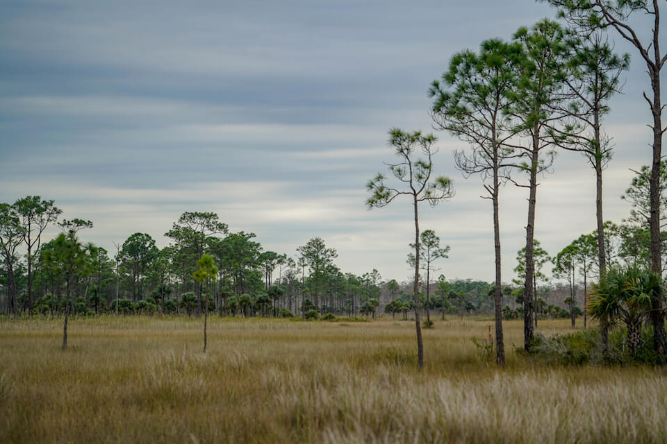

<content-header icon="terrestrial_ecosystems" title="Terrestrial Ecosystems"></content-header>

Terrestrial ecosystems in Florida range from systems similar to those found in the Southeastern Coastal Plain to systems more commonly found in sub-tropical and Caribbean areas. The habitats found here are influenced by winter temperatures and other climatic factors, as well as by local factors such as fire, substrate, elevation, and species interactions.  

Many of Florida’s upland ecosystems are dependent upon fire, with the frequency, intensity, and seasonality of fire varying between communities.  Altered fire regimes or the absence of fire, along with other climatic changes, could lead to compositional changes to these habitats, potentially altering their suitability to the current suite of species.

<figcaption>Photo: NPS</figcaption>

## Impacts of Climate Change

Increased temperatures will lead to increases in forest pest damage, changing fire patterns, longer growing seasons, higher evapotranspiration/drought stress, and the spread of non-native species. Even moderate increases in temperature (1 °C) may cause serious effects on temperate hardwood forests of northern Florida. Some predictions, based on more significant climate change, indicate potential shifting of the ecosystem from forested to open woodland, scrub and savanna. 

Some tree species already at their southern range boundaries are predicted to have range reductions, such as southern red oak and American beech in the panhandle, and range contraction of longleaf pine, with the southern boundary moving northward up the Florida Peninsula. Loss of key woody species could affect forest suitability for nesting, roosting, or foraging. 

Many of Florida’s upland ecosystems are dependent upon fire.  The ability to maintain these systems through the use of prescribed fire will become more challenging with increased temperatures and changes in precipitation.

[More information about general climate impacts to ecosystems and habitats in Florida](/impacts/habitats).

### Impacts to Species

Species such as the red-cockaded woodpecker rely on the openness of the sandhill for foraging. Florida scrub jays depend on fire to keep scrub oak habitats short and maintain plenty of open sandy areas in which to store acorns. 

Dry prairie provides habitat for multiple distinctive species including the crested caracara, burrowing owl, the Florida sandhill crane, and the federally endangered Florida grasshopper sparrow.  Without appropriate fire regimes, trees and other woody vegetation move into dry prairie, creating unsuitable conditions for these and other species.

[More information about general climate impacts to species in Florida](/impacts/species).
