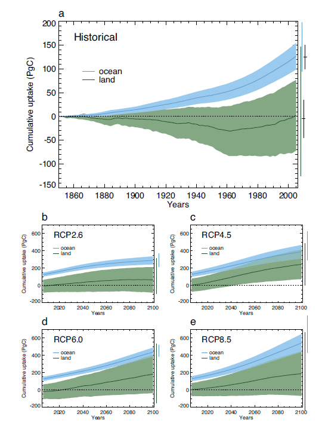

<content-header icon="air_co2_change" title="Climate 101: Changes in Air and Water Chemistry"></content-header>

<!-- https://www.flickr.com/photos/bigcypressnps/31417516465/ -->

Increasing levels of carbon dioxide (CO2) in the atmosphere can affect plants directly by stimulating photosynthesis and reducing loss of water by reducing the opening of the small pores in the leaves. These changes can lead to changes in the amount of leaf, root and below ground microbial biomass, resulting in changes to ecosystem functioning. Additional effects include relief of water and low light stresses, relief of nutrient stress, and delay of senescence that prolongs the growing season. However, because species respond differently to climate change, some will increase in abundance while others will decrease.

## Ocean acidification

A portion (30-40%) of CO2 emitted to the atmosphere dissolves in the ocean, reducing surface ocean pH and carbonate ion concentrations (ocean acidification). When carbon dioxide enters the ocean, it combines with seawater to produce carbonic acid, which increases the acidity of the water, lowering its pH. The pH of seawater is slightly basic, pH>7. Ocean acidification involves the pH shifting towards a neutral pH and not necessarily shifting to acidic conditions (<7). Based on models it is virtually certain that the increased storage of carbon by the ocean will increase acidification in the future.

<!-- https://www.flickr.com/photos/bigcypressnps/31752098275/ -->

The current rate of ocean acidification is at least 100 times faster than any time period over the last few hundred thousands years. It becomes more difficult for marine creatures to make their calcium carbonate shells and skeletons as the availability of carbonate ions decreases. Increases in CO2 levels in the ocean coupled with elevated ocean temperature have a compounded effect on marine life and the ocean ecosystem. Impacts could have a ripple effect through the entire marine food web.

<figcaption>
Figure 2: Cumulative land and ocean carbon uptake simulated for the historical period 1850–2005 (top) and for the four RCP scenarios up to 2100 (b–e). Mean (thick line) and 1 standard deviation (shaded). Vertical bars on the right show the full model range as well as standard deviation. Black bars show observationally derived estimates for 2005.IPCC AR5. 2014. WGI report. Chapter 6. Carbon and Other Biogeochemical Cycles. Page 525, Figure 6.24.
<a href="http://www.ipcc.ch/pdf/assessment-report/ar5/wg1/WG1AR5_Chapter06_FINAL.pdf" target="_blank" rel="noopener noreferrer">http://www.ipcc.ch/pdf/assessment-report/ar5/wg1/WG1AR5_Chapter06_FINAL.pdf</a>
</figcaption>

Carbon dioxide uptake by land and ocean increases in the future under all four of the IPCC AR5 RCPs.

### How will changes in air and water chemistry impact Florida?

[Learn more about impacts from changes in water chemistry in Florida.](/impacts/florida/co2)

### What's next?

[Learn more about climate models and how they are used to project future climate conditions.](/impacts/climate101/models)
