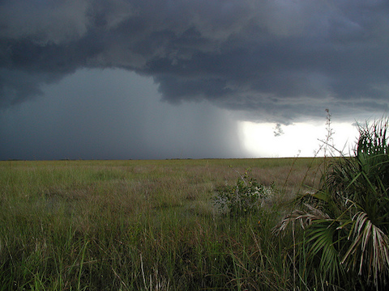
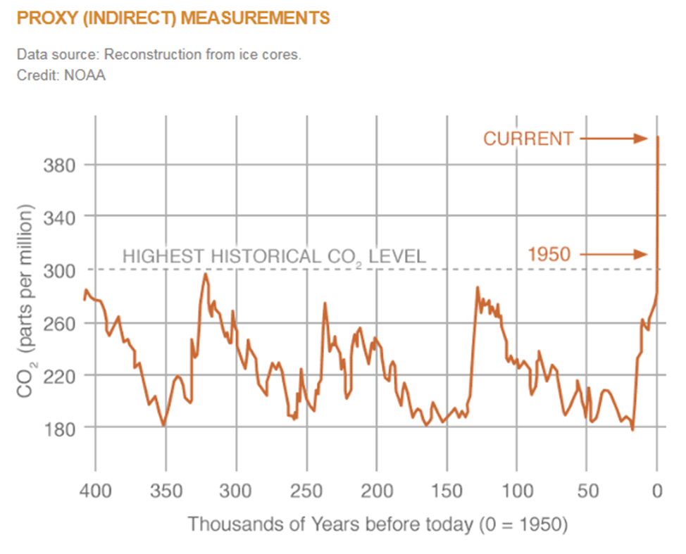

<content-header icon="climate_101" title="Climate 101"></content-header>

In recent decades, changes in the global climate impacted natural and human systems on all continents and across the oceans. Evidence of impacts from climate change is strongest and most comprehensive for natural systems.

<!-- https://www.flickr.com/photos/evergladesnps/9257922150/ -->

### The main changes expected for North America include:

- [sea level rise](/impacts/climate101/slr)
- [rising temperatures](/impacts/climate101/temperature)
- [regional increases or decreases in precipitation](/impacts/climate101/precipitation)
- changes in the frequency and severity of extreme weather events

Increased knowledge of the risks of climate change can be a starting point for understanding the opportunities for possible solutions.

## Climate vs. Weather

**Weather** varies from hour to hour and from day to day. People generally think of weather as the combination of temperature, humidity, precipitation, cloudiness, visibility, and wind.

**Climate** is defined as the average of weather over several decades or longer. Scientists study the Earth's climate in a very similar way to weather, but with an emphasis on longer time scales.

<figcaption>Everglades summer thunderstorm.  Photo: NPS.</figcaption>
<!-- https://www.flickr.com/photos/evergladesnps/9257940598/ -->

While climate can be considered at local or regional scales, scientists also study the global climate, averaging climate across the planet. Components of Earth’s climate system include the atmosphere and oceans, the land, ice, and biosphere (plant and animal life), as well as cities and other parts of the "built environment“.

Scientists study climate to look for trends or cycles of variability, such as the changes in wind patterns, ocean surface temperatures and precipitation over the equatorial Pacific that result in El Niño and La Niña. Researchers also work to place cycles or other phenomena into the bigger picture of possible longer term or more permanent climate changes.

## Forecasts vs. Projections

Most weather forecasts are based on models, which incorporate observations of air pressure, temperature, humidity and winds to produce the best estimate of current and near-term future conditions in the atmosphere. Forecasts answer questions such as “What will the temperature be like this week?”, “Will it rain tomorrow?”, “How much rain will we have?”. The accuracy of weather forecasts depend on both the model and on the forecaster's skill. Seasonal forecasts, tend to use statistical relationships between large-scale climate signals such as El Niño and La Niña and precipitation and temperature to predict what the weather will be like in one to six months time.

Climate projections take a much longer-term view.  These projections try to answer questions like how much warmer will the Earth be 50 to 100 years from now? How much more precipitation will there be? How much will sea level rise? Climate projections are made using global climate models. Unlike weather forecast models, climate models are probabilistic, indicating areas with higher chances to be warmer or cooler and wetter or drier than usual. Climate models are based on global patterns in the ocean and atmosphere.

[Learn more about climate models and how they are used to estimate changes in temperature and precipitation.](/impacts/climate101/models)

## Increasing Carbon Dioxide in the Atmosphere

<figcaption>CO2 levels during the last three glacial cycles, as reconstructed from ice cores.</figcaption>

One of the leading causes of climate change is increasing levels of atmospheric carbon dioxide (CO2). Carbon dioxide is a heat-trapping gas, which is released through natural processes such as respiration and volcanic eruptions, as well as through human activities such as deforestation and burning fossil fuels.

Carbon dioxide causes about 20% of the Earth’s greenhouse (warming) effect; others include water vapor (50%), clouds (25%), and other small particles and gases (5%).

The current concentration of carbon dioxide in the atmosphere is much higher than it has been at any other time, as far back as 400,000 years. Since 1970 carbon dioxide in the atmosphere has risen 24 percent. Carbon dioxide remains in the atmosphere for centuries so the impacts of emissions today will linger long into the future.

[Learn more about how increased levels of carbon dioxide are affecting ecosystems.](/impacts/climate101/co2)

### What's next?

[Learn about Sea Level Rise.](/impacts/climate101/slr)
