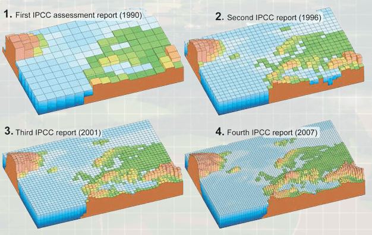
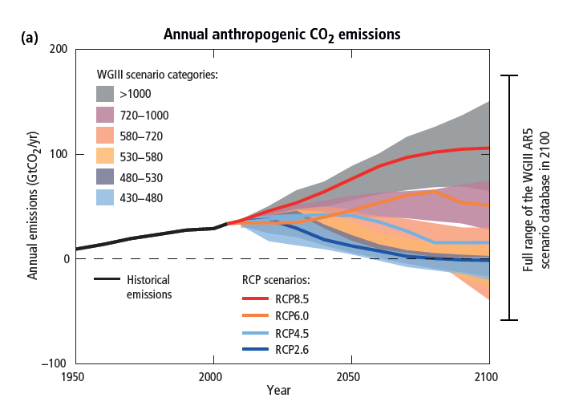

<content-header icon="climate_models" title="Climate 101: Climate Models"></content-header>

Climate models, also known as general circulation models (GCMs), are very similar to weather forecast models, but with many added physical processes.

Climate models include elements such as ocean circulations, sea and glacial ice, land cover and soil moisture, and human emissions of greenhouse gases and other pollutants to better simulate long-term climate variability and change.

For climate projections over periods of decades to centuries and longer, the model is started from a statistical mean state and spontaneously develops its own weather and climate. The accuracy of equations that describe the behavior of the climate system are evaluated by putting them into models and evaluating the model results, validating them against past observations.

The predictive capability of any model will rely somewhat on the size of the grid cell. In general, the amount of detail and information increases as grid cells get smaller, thus increasing the predictive capability of the model. Over the last four decades, both increased grid resolution and more complexity has increased the skill and capabilities of climate models. However, finer grid resolution alone will not remove uncertainties in projected regional or global climate changes. Much of this uncertainty is driven by the many complicated processes that affect the climate, such as clouds or climate-biosphere interaction, which are difficult to perfectly simulate.

<figcaption class="left">Figure 1: Resolution of the climate models presented in the first four IPCC reports.  National Academy of Sciences. 2012. Climate Modeling 101. 
<a href="http://nas-sites.org/climate-change/climatemodeling/page_3_2.php" target="_blank" rel="noopener noreferrer">http://nas-sites.org/climate-change/climatemodeling/page_3_2.php</a></figcaption>

## Carbon Dioxide Emission Models

Many climate models have been developed to perform climate projections. Specifically, simulating climate change in response to the emission of greenhouse gases and aerosols is the focus of many climate models.

Four new scenarios, called Representative Concentration Pathways (RCPs) were defined in IPCC’s Fifth Assessment Report (AR5; IPCC 2014) and describe four different 21st century pathways of greenhouse gas (GHG) emissions and atmospheric concentrations, air pollutant emissions and land use. The RCPs include one mitigation scenario leading to a very low forcing level (RCP2.6), two stabilization scenarios (RCP4.5 and RCP6), and one scenario with very high greenhouse gas emissions (RCP8.5). The RCPs are based on a combination of integrated assessment models, simple climate models, atmospheric chemistry and global carbon cycle models. While the RCPs span a wide range of total radiative forcing values, they do not cover the full range of known and potential emissions. For the RCP6.0 and RCP8.5 scenarios, radiative forcing does not peak by year 2100 but continues increasing; for RCP4.5 it stabilizes by 2100, and for RCP2.6 it has already peaked and declined (IPCC 2014).

The Intergovernmental Panel on Climate Change (IPCC) is an international body for assessing the science related to climate change. http://www.ipcc.ch/

<figcaption class="left">
Figure 2: (a) Emissions of carbon dioxide (CO2) alone in the Representative Concentration Pathways (RCPs) (lines) and the associated scenario categories used in WGIII (coloured areas show 5 to 95% range). The WGIII scenario categories summarize the wide range of emission scenarios published in the scientific literature and are defined on the basis of CO2-eq concentration levels (in ppm) in 2100.  IPCC AR5. 2014. Summary for Policymakers Synthesis Report. Page 9, Figure SPM.5.  
<a href="https://www.ipcc.ch/pdf/assessment-report/ar5/syr/SYR_AR5_FINAL_full.pdf" target="_blank" rel="noopener noreferrer">https://www.ipcc.ch/pdf/assessment-report/ar5/syr/SYR_AR5_FINAL_full.pdf</a>
</figcaption>

### What's next?

Great work - you've made it through Climate 101!

[Learn about impacts of climate change in Florida.](/impacts/florida)
