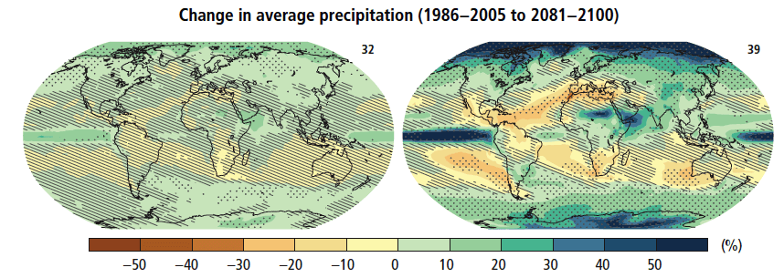
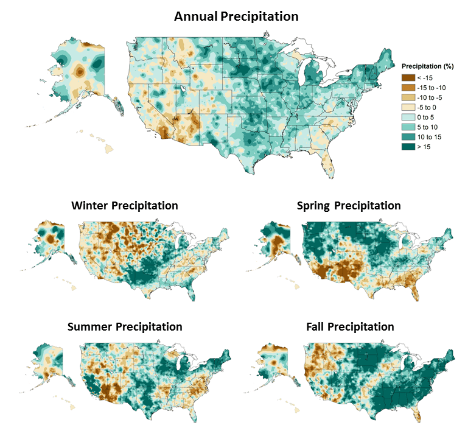

<content-header icon="precipitation_change" title="Climate 101: Changes in Precipitation"></content-header>

Potential temperature and precipitation changes will not be uniform across the earth’s surface.

<!-- https://www.flickr.com/photos/bigcypressnps/33293376003/ -->

Various regions, such as high latitudes, are predicted to experience far more warming than others, such as tropical latitudes. Drier mid-latitude and subtropical regions are projected to receive less rainfall, while wetter mid-latitude regions are expected to have an increase in precipitation. Extreme precipitation events are expected to increase in frequency and intensity over most land masses.

It is virtually certain that as global mean temperatures increase there will be more frequent hot and fewer cold temperature extremes over most land areas on daily and seasonal timescales. It is also very likely that heat waves will occur with a higher frequency and duration while, occasional cold winter extremes will continue to occur (IPCC 2014).

<figcaption class="left">
Figure 1: Change in average precipitation based on multi-model mean projections for
2081–2100 relative to 1986–2005 under the RCP2.6 (left) and RCP8.5 (right) scenarios. The number of models used to calculate the multi-model mean is indicated in the upper right corner of each panel. Stippling (i.e., dots) shows regions where the projected change is large compared to natural internal variability and where at least 90% of models agree on the sign of change. Hatching (i.e., diagonal lines) shows regions where the projected change is less than one standard deviation of the natural internal variability.
IPCC AR5. 2014. Synthesis Report. Page 12, Figure SPM.7.b.
<a href="https://www.ipcc.ch/pdf/assessment-report/ar5/syr/SYR_AR5_FINAL_full.pdf"  target="_blank" rel="noopener noreferrer">https://www.ipcc.ch/pdf/assessment-report/ar5/syr/SYR_AR5_FINAL_full.pdf</a>
</figcaption>

## Is the climate already changing?

Models of the US, comparing averages from 1901-1960 with averages from 1986-2016, show changes in both annual and seasonal measurements of precipitation.

<figcaption class="left">
Figure 2: Annual and seasonal changes in precipitation over the United States. Changes are the average for present-day (1986–2015) minus the average for the first half of the last century (1901–1960 for the contiguous United States, 1925–1960 for Alaska and Hawai‘i) divided by the average for the first half of the century. (Figure source: [top panel] adapted from Peterson et al. 2013,78 © American Meteorological Society. Used with permission; [bottom four panels] NOAA NCEI, data source: nCLIMDiv].  Figure 7.1.
</figcaption>

### How are changes in precipitation likely to impact Florida?

[Learn more about how precipitation may change in Florida.](/impacts/florida/precipitation)

### What's next?

[Learn more about changes in air and water chemistry due to increasing atmospheric carbon dioxide.](/impacts/climate101/co2)
