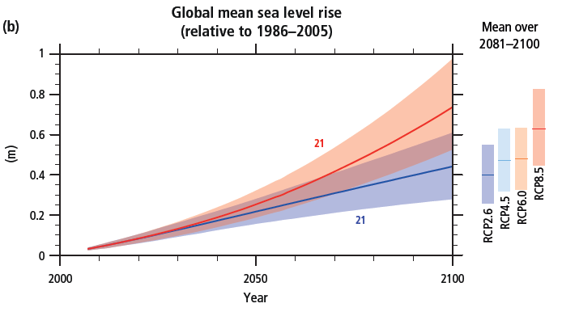

<content-header icon="sea_level_rise" title="Climate 101: Sea Level Rise"></content-header>

<!-- https://www.flickr.com/photos/evergladesnps/9103294900/ -->

Oceanic warming and sea level rise are expected as a result of rising greenhouse gas (GHG) levels and global temperatures. Climate scenarios, called Representative Concentration Pathways (RCPs), describe different 21st century pathways of greenhouse gas emissions and atmospheric concentrations, air pollutant emissions and land use.

Based on these scenarios, ocean warming is projected to be most pronounced in the surface waters of tropical and Northern Hemisphere subtropical regions. Estimates of ocean warming by the end of the 21st century are 0.6°C (RCP2.6) to 2.0°C (RCP8.5) for the top one hundred meters (IPCC 2014).

<figcaption class="left">Figure 1: Global mean sea level rise (b) from 2006 to 2100 as determined by multi-model simulations. All changes are relative to 1986–2005. Time series of projections and a measure of uncertainty (shading) are shown for scenarios RCP2.6 (blue) and RCP8.5 (red). The mean and associated uncertainties averaged over 2081–2100 are given for all RCP scenarios as coloured vertical bars at the right hand side of each panel. The number of Coupled Model Intercomparison Project Phase 5 (CMIP5) models used to calculate the multi-model mean is indicated. 
IPCC AR5. 2014. Summary for Policymakers Synthesis Report. Page 9, Figure SPM.6.
<a href="https://www.ipcc.ch/pdf/assessment-report/ar5/syr/SYR_AR5_FINAL_full.pdf"  target="_blank" rel="noopener noreferrer">https://www.ipcc.ch/pdf/assessment-report/ar5/syr/SYR_AR5_FINAL_full.pdf</a>
</figcaption>

### How will sea level rise impact Florida?

[Learn more about sea level rise impacts in Florida.](/impacts/florida/slr)

### What's next?

[Learn about changes in temperature.](/impacts/climate101/temperature)
